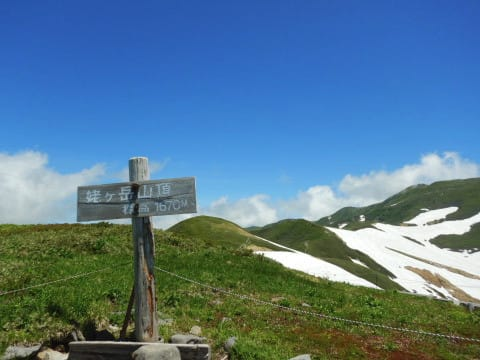
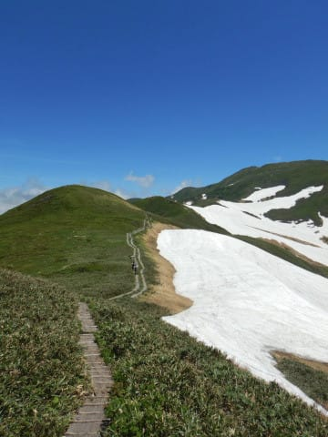
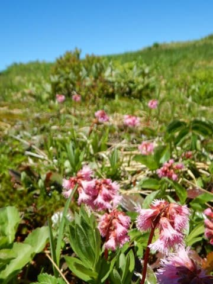
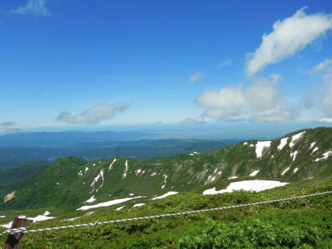
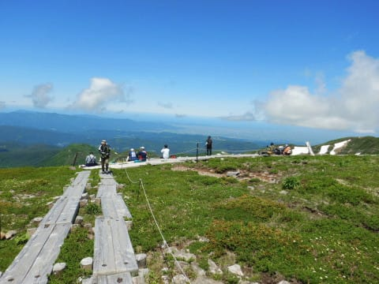
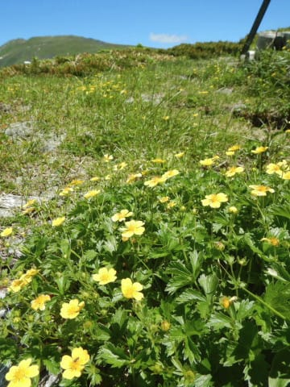
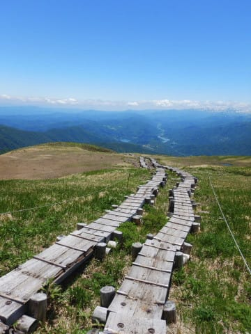
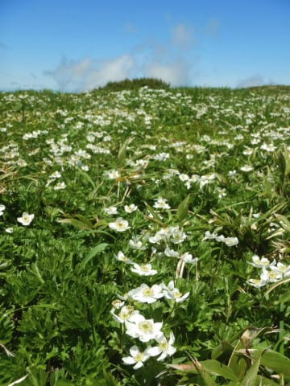
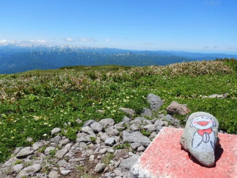

# 月山詳細レポートは明日までお待ちを（懇願）…今日も帰宅はご無体時間（涙）

📅 投稿日時: 2020-06-23 02:46:23

🏷️ カテゴリ: [日記](cc4b5682fb7b8b144980957a978653fb0.md)

えー．

金曜夜～土曜朝．

睡眠時間1時間で500km運転して一日中月山で滑り，

その晩車中泊．

そして，日曜も，

Tバー営業終了まで滑り，500km運転して

日付変更線を超えて帰宅，

さらにその後Blog書いて深夜2時に就寝と…

うーむ．

さすがに今日は，朝起きて仕事に行くのが

ちょいとつらい感じでした．

あぁ…しばらくスキーしていない間に，

身体がなまったものよ…(涙）

最後にスキーをしてから実に3か月弱，

ほとんど運動しておらず．

この週末，実に久々に運動したので．

ハイクアップの時に使ったふくらはぎの筋肉

とかも筋肉痛（涙）

というのに．

今日もいろいろご無体で，帰宅は深夜（泣）

ちょっと月山レポートを書いている

気力＆体力が無いので，

日曜の月山スキーの詳細レポートは

また明日！

ちなみに，日曜のお昼．

お昼ご飯を食べに，姥ヶ岳山頂まで

ちょっとお散歩してきたので．

その時の写真を載せて，この場を

ごまかしておきます…

　

　

　

　

　

## 💬 コメント一覧

### 💬 コメント by (西館)
**タイトル**: Unknown
**投稿日**: 2020-06-23 05:50:03

Sさん写真お上手ですね。

月山にも春到来ですね。

でも、Sさんてば今週末も再び遥々お出かけしてしまう気がするのは私だけでは無いと思う。

### 💬 コメント by (yama)
**タイトル**: Unknown
**投稿日**: 2020-06-23 11:03:19

ピンクはイワカガミ、黄色はミヤマキンポウゲ、白色は白山イチゲでしょうか?シーズン最後を飾るのに相応しい天気と花に彩られました。

### 💬 コメント by (西館)
**タイトル**: 板尾さんこんにちは
**投稿日**: 2020-06-24 03:03:05

我が定宿のリーダーMASHさんが言いました、1本の板でシーズン超すなんてやっぱ無理だよと。MASHさんは大回り用、小回り用、荒れた時用の3セット持ち込まれています。 

そうなんですよ、いろいろ考えると、長板、短板、太板の3本必要なんですよね。（相棒君は学生なので長板とパークでアイテムに挑戦する用の板の2セットにするそうです。）

と言うわけで、近日中に5本いっちゃいそうです。

ちなみに我が家は各自、超小回り用板（99cmのスピン用板）、ジャンプ用板（フリースキー板）、そして思い出用板（12年間使ったし20000m達成した板）の3セットが各自あって、Sさんの一人で8本保持に迫る勢いです。

konsuke様にいっぱいステッカー頂いたし、ま、いっか（って、何がいいんだろ）。

定宿スキーロッカーにずらずら～っと20000ｍ並べるんだいっ！

でも、レディース用板って選択がちょー少ないんですよね。なので12年間履いた思い出用板もメンズで重かったのでした。しかも重たいHART。

FISHERに乗りたいんですけど、FISHERにはレディース無いんです、なので長板が身長＋10cmになって、無謀ではないのか私の足前でと自問自答中です。昔は身長＋10cmが標準装備だったし、今の板は性能が良いので大丈夫な気もするんですけど。

相棒君は2シーズン落ちの171cmだって。いいなぁ男の人は選択の幅が広くて。デパートに行くとメンズ売り場は1フロアしか無くて他フロアは全部レディース用売り場じゃないですか、でも私はその恩恵を1度も受けたことが無くて、スキー以外でもバイクも、人力バイクでも、ランニングもトライアスロンも、少ない選択で耐えているっすよ。

あ、そうそう短板もFISHERのthe Curv がＳさんの試乗レポ以外でもどの口コミを見ても良くて、2本ともFISHERにしちゃいそうです。

ちなみにＳさんの板はそれぞれ何センチですか？参考にしたいので教えてくださいませ。

### 💬 コメント by (Skier_S)
**タイトル**: シーズン終了！！
**投稿日**: 2020-06-24 03:38:09

＞yamaさま

イワカガミとミヤマキンバイはそうだと思います…

白いのはよく分かりません(汗)．

日曜はいい天気で，土曜に帰らなくて良かったと思いました(笑)．

＞西館さま

いや…もう今週末は行きません(笑)．

シーズン終了の儀式をやってきたし，月山はやっぱり交通費が高すぎ＆

遠すぎなので…

そして，西館さんほど滑る人は，1シーズンを1セットの板で過ごすのは

勿体ないです．

で，特にレディースの板にこだわらなくてもいいと思います…

FISCHERなら，RC4 SCのRacetrackか，The Curv DTXなら，それほど重くないし…（私のSX比）

160cmくらいなら十分履きこなせるんじゃないですか？

the CurvはDTXの方が圧倒的に軽いのでおススメしておきます…

私は，ショートのSXは165cm，ロングのX-Raceは古いほうが175cm，

新しいほうが182cmです．

