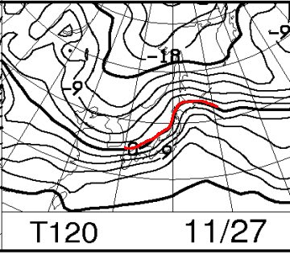

# 今日はスキーに行けなかったよ…（涙）．

📅 投稿日時: 2016-11-24 00:11:18

えー．

本日．

行けませんでした．

ええ．行けませんでしたよ．

スキーには…（泣）．

家族の風邪は，快方に向かっているんですけど．

本日は一日，洗濯掃除買い物炊事をこなしましたよ．

…ホントはせめてナイターだけにでも，Yetiに

行きたかったのだけど．

今日のYetiはそんなに混まなかったんじゃないかな～．

天気があんまり良くなかったから…

そして，気温も冷えたし．

板も走ったんじゃないかな～．

そこそこ楽しめたんじゃないかな～…

あぁ…滑りに行きたかった…

ええ．

でも．

そこは私も大人ですから，←ホントか？？？

我慢しましたよ…

まぁ．

アサマ2000とかかぐらとかがオープンしてたら．

かなり悔しかったと思うけど．

まだYetiしかオープンしてないという，

本来ならスキーヤー殺しのはずのシーズンスタート遅れが，

悔しさを50%減にしてくれましたね…

良かったんだか悪かったんだか…

でも．

そうです．

ついに，寒気がやってきてます！

今日の早朝から，山の上ではしっかりと

雪が降ってます！

（志賀高原第3トンネル付近）

…あー．

みなさん，勘違いしないでくださいね．

私が休日にスキーに行かないで看病するという，

極めて珍しいことをしたから雪になった

というわけでは，決してありませんから．

誤解無きよう．

んで．

この冷え込みのおかげで，

熊の湯も明日のオープンが確定したようです！！

（[熊の湯Facebook](https://www.facebook.com/kumanoyulift/photos/a.518169964892436.113102.167231266652976/1263785113664247/?type=3&permPage=1)より）

アサマ2000はまだ26日オープン「予定」のままで，

確定ではないようですが…

（[アサマ2000Facebook](https://www.facebook.com/asama2000park/photos/a.544794985545947.144515.544741572217955/1601774303181338/?type=3&permPage=1)より）

でも，24，25日の冷えっぷりを考えると．

26日のオープンは間違いないでしょう！

ということで…

先週土日，23日と．

休み3日続けてスキーに行けてなかったので．

その憂さを晴らすべく．

今週末は，土日1泊2日でアサマ2000へ行く予定です～！

26日土曜は，予想より冷えて，そして晴れるので．

午前中はかなりいい感じで滑れそう…

しかし．

27日の日曜．

以前からの予想は変わらず…

ありゃ（涙）．

だ，ダメか…

ただ．

27日．上手くいけば，午前中は雨が降らずに

もってくれるかも…

皆さんの日ごろの行いが素晴らしければ．

午前中までは，天気がもつはずっ！！

…いや．私はあれですよ．

先週末も今日も，スキーに行かず．

風邪でダウンしている家族のために，料理やら

洗濯やら買い物やらこなすという．

ありえないほど良い行いをしているので．

27日は，昼まではいいコンディションになるはずっ！！

27日，天気が悪かったら．

それはきっと，

みなさんの日ごろの行いが悪かったはず…

と．

今回は自信をもって言い切れるのだ！←いや，家族が風邪でダウンしたら，看病するのが普通だから…

## 💬 コメント一覧

### 💬 コメント by (z)
**タイトル**: いい生活万歳
**投稿日**: 2016-11-24 09:51:27

いいブログです、何より妻子が大事V(^_^)V

年年歳歳お馴染み懐かしの熊の湯雪ライブも雪深深、リフトもまた動きスキーヤー影も1、2人

そして今週末は新雪を楽しんで下さい、祈!!! 焦らずに安全に

### 💬 コメント by (yama)
**タイトル**: 風邪
**投稿日**: 2016-11-24 19:20:58

風邪でやはり行けませんでした。咳が出るがそんなに体温は上がらないので我慢していました。今日は医者に行って薬をもらいだいぶ楽になりました。症状がS様と同じようです。今日の雪を見ると昨シーズン、S様がスキーをしないでダイヤで娘さんと遊んでいるのを思い出します。3日に志賀高原で会いましょう？

### 💬 コメント by (Skier_S)
**タイトル**: 家族が大事
**投稿日**: 2016-11-25 02:27:33

＞zさま

コメントありがとうございます～！

妻子あってこそのスキー生活ですから，大事にしないと…

熊の湯もかぐらも，ライブカメラは雪がいっぱいになってきましたね．

今週末のアサマ2000もいいコンディションになりそうです．

楽しんできます～！

＞yamaさま

あら…

私と同じ症状ですか．

私の場合，2週間ほど咳が続きました…

1週間ほどひどい感じの咳が続き，

かなり参りましたが，もう完全復活です！

早く治るよう祈ってます…

3日に焼額で会いましょう！

