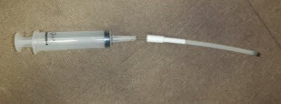
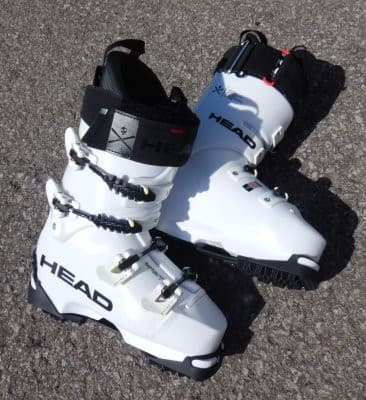

# 物欲選手権に敗れ，HEAD RAPTOR WCR3をエキップさんで仕上げてもらった

📅 投稿日時: 2021-07-11 05:12:53

🏷️ カテゴリ: [スキー雑談](c1f9d2cb7478308da16419928ea3945e9.md)

ということで．

結局，GWに長岡のエキップさんまで

REXXAMブーツを直しに

行ったついでに，物欲選手権が勃発し，

ついつい[またHEADブーツを買ってしまった](e6a52cddc9fb3687dc986e6188d1a1b7a.md)

わけですが…

「なんでもっと早くからエキップさんの

　ブーツを知らなかったのか…」

と後悔しているほど気に入ってしまって

いる私．

物欲を止めるブレーキも効かず，

即断即決でおススメのHEADの

WCR3を買ってしまったのでした…

で．

このブーツも当然，エキップさんにしっかり

加工してもらったわけですが．

一度人の足型を見たら，大体覚えている

という鈴木社長．

私の足に合うであろう加工がすでに

決まっているのか，まずはいきなり

タングのボリューム増しにかかりました…

タングに厚みのある布を貼り，

タングの厚みを増すのですが…

足首が細い私には，1枚では足りず，

2枚重ねで調整．

これで履いてみると…

確かに，足首のフィット感が

バツグンに増しました！

そして，大体の足型をとって，

シェルの当たるところの出し＆

削りにかかります．

ちょうどREXXAMブーツの当たりだしも

やった直後だったので．

REXXAMブーツでどこを加工したかも

参考に，性能やホールド感に

効くところに影響がないよう，

しっかりシェル出ししてもらいました…

（加工する場所にうっすらマークしてある）

今回は，インソールはREXXAM購入時に

作ったやつを流用することにしたので，

新規のインソール作成は無し．

REXXAMの時は，シェルの仕上げ加工の

待ち時間にインソールを作ったけど，

今回は2時間ほどのシェル加工の間は

ひたすら待ち時間．

…この待ち時間がヤバいんだよな…

今回，板とヘルメットを追加で買って

しまったのも，この待ち時間のせいです…

で．シェル加工がおわったら，

試し履きをしてみますが…

初めて作ったREXXAMの時と違い，

足型が分かってきた2度目の今回は，

一発でシェル加工が決まりました！

やはり相変わらず手ごわいらしい

私の足型．

調整に苦労したようですが，

シェル出し後の足入れが一発で

決まったのは，さすが…！

当たりが無いのに，タングのボリュームを

かなり増した効果があり，

フィット感が強いブーツになりました…

でも．

このブーツはこれでは終わらない．

最近のHEADブーツは，Riquid Fitという

グリースみたいな液体をインナーに

入れることでインナーのフィット感を

さらに上げることができるんです！

液を入れる量で，フィット感も変わるし．

この液体は流動性を保ったままで

かたまらないので．

多少の足型の変化には追随してくれます．

ブーツを履いた状態で，インナーの

液体注入口のチューブにホースを挿して…

こんな器具で液体を注入します．

液を入れる順番は，外から先と

決まっているようで，まずは外側から

液体を注入して．

次は内側を注入！

液体を入れる量は，どのくらいの

フィット感が欲しいかで好きな量を

入れれば良いようですが，

私は片方でカートリッジ1本，

両足で計2本入れてみました．

これで，ただでさえフィット感が

高いブーツだったのに，さらに

ブーツと足の一体感がアップ！

…滑る前から，これは凄そうな

感じ…

で．

液体を入れた後は，液を注入する

チューブを…

こんな感じで折り返しておけばOK．

特に封をしたりする必要はなく，

逆止弁が入っているので，液体は

漏れてきません．

封をしなくていいので，液体は後で

好きな時に足すこともできるし，

逆にこんな器具で抜くこともできる

ようです…

シーズン途中でインナーブーツが

つぶれてきたら，適当に足してみようかな…

で．

後は最後の仕上げ，カント調整です．

エキップさん，このカント調整が

絶妙なんですよね…

フラットな台じゃなく，微妙に足先が

下がった台に立って，スタンスも腸骨の

幅にぴったり合わせて立って．

カントを調整していきます…

カント調整で，結構膝の位置が変わり

ますね…

ってなことで．

自分の足にバッチリあったブーツの

完成！

GWにさっそく滑ってみているので．

また後程，履いてみたインプレッションは

レポートしてみますが．

期待を裏切らない…

というより，予想以上にいいブーツでした！

そうそう，

HEADのタングボリューム増し．

布2枚張りが調子よかったので．

インナーがつぶれ始めてきて

REXXAMの方も，タングの布を

1枚から2枚に増やしてもらい，

フィット感アップしてもらいました…

ちょっとインナーがつぶれ始めて，

フィット感が緩んでいたREXXAMも，

これでかなりフィット感アップ！

その他，フットベッドのかかと部分の

アップとか，REXXAMにもいろいろ

微調整を入れてもらったんですが．

一度買ったブーツは無料で調整

してもらえるわけで．

ここまでやってタダってのは，

むしろ申し訳ない…

とりあえず．

何度も繰り返し書きますが．

[長岡のエキップさん](http://www.equipe.jp/)，遠くまで行く価値は

あるショップです…

PS．エキップさんでのブーツ購入，相談は事前に

電話予約した方が確実です．

（お客さん一人に時間がかかるので…）

TEL.0258-23-8166

PS2．ブーツ購入に際し，自分の滑りのビデオが

あると，より完璧にブーツの選択と調整を

してもらえます！

特に，滑りを後ろから撮ったビデオがあると

良いようです．

## 💬 コメント一覧

### 💬 コメント by (アリス)
**タイトル**: フィットブーツは最高
**投稿日**: 2021-07-11 21:53:37

S様

ご無沙汰しております。

長年悩んでいた足への違和感が解消されて、さらにスキーが楽しくなりましたね♪

素晴らしいショップ＆技術者との出会いがスキー人生に影響しますね♪

以前にGokuさんが言っていましたよね、Sさんブーツ替えたら滑り替わった・・・と。

私自身もRAPTORを使用していますが、このブーツって極端なデザイン変更はないみたいですね。踵にクッションゴムがないので、すり減ったら買い替えです・・・カバー付けません♪

### 💬 コメント by (m00308)
**タイトル**: さっそくエキップ長岡さんの予約できました
**投稿日**: 2021-07-12 19:23:24

Skier_Sさま

早々のお返事ありがとうございました。

アドバイス通りエキップ長岡さんに電話してみたらとても気さくな方で、

さっそく予約をして、今週ブーツを買いに行ってきます。ドキドキ・ワクワクです。

これからもブログ拝見させていただきます。

ありがとうございました。

### 💬 コメント by (なんちゃってレーサー)
**タイトル**: 親切なお店ですね
**投稿日**: 2021-07-12 23:31:21

タングまで調整してくれるお店はなかなかないので良いお店ですね．

雪上で試したレポートもお待ちしております．

できたら，FISCHERのロングターン板との組み合わせで．

### 💬 コメント by (Skier_S)
**タイトル**: これからは山登りシーズン
**投稿日**: 2021-07-13 04:15:54

＞アリスさま

いや，ホントに今シーズンはニューブーツで滑りが変わりました…

エキップさんとその仲間に出会って，スキーに対する考えが

かなり変わった1シーズンでした．

RAPTOR，そうなんですよ．ソールが交換可能じゃないし，裏がツルツルで滑るので，

ソールプロテクターは必須ですね．

実は物欲選手権で，二つ目のソールプロテクターを購入してしまいました．

＞m00308さま

そうなんですよ～！

エキップの鈴木社長，気さくなうえにいろんな相談に乗ってくれる

いい人なんですよ～！！

ブーツの調整はいくらでもやってくれるので，購入時の一度だけではなく，

何度も行きたくなるお店です．

＞なんちゃってレーサ―さま

そうなんですよ．

このお店，FISCHERブーツにREXXAMタングとか，かなり特殊な

対応をしてくれます．

また雪上レポートする予定ですので，お楽しみに～！

### 💬 コメント by (西舘)
**タイトル**: Unknown
**投稿日**: 2021-07-14 07:29:31

結局、エキップさんに閉店予定をかなり超過して滞在しちゃったのですね。

そりゃやばいわ。というか、諦めるしかないですね。

我が家も予定よりも1時間以上長くいたのでした。

### 💬 コメント by (Skier_S)
**タイトル**: ＞西舘さま
**投稿日**: 2021-07-15 02:40:07

エキップさんを出たのは，夜10時近かったです…

午後5時着でブーツ2足加工してもらいましたから（笑）．

遅くまで作業してもらって申し訳なかったです…

エキップさん，ついつい長居しちゃいますよね．

### 💬 コメント by (よっさん)
**タイトル**: Unknown
**投稿日**: 2022-06-02 13:32:05

お初です。

20-21からのラプターシリーズのカント調整はどうやってやってるんでしょうか？？

### 💬 コメント by (Skier_S)
**タイトル**: ＞よっさんさま
**投稿日**: 2022-06-03 01:42:38

コメントありがとうございます~！

カント調整は，普通にネジを緩めてヒンジ部分の金具を回して調整していましたが…

あと，私の場合はフットベッドの傾斜とかも微調整してもらいました！

### 💬 コメント by (よっさん)
**タイトル**: Unknown
**投稿日**: 2022-06-03 18:38:42

返答ありがとうございます！

20-21からのRAPTOR WCR はカントの調整パーツみたいなのが付属されてませんでしたっけ？それを交換してカント調整すると思ってました…💦

フレックス調整用ビスも使って150にしてる感じでしょうか？？

### 💬 コメント by (Skier_S)
**タイトル**: ＞よっさんさま
**投稿日**: 2022-06-04 00:25:45

カント調整パーツは入れ替えず，回して調整していたと思います…

アキレス腱のビスは1本だけで140で使ってます．

さすがに150はちょっときついかと思いまして（笑）

### 💬 コメント by (よっさん)
**タイトル**: Unknown
**投稿日**: 2022-06-04 16:34:44

ありがとうございます！

ちなみに、カント調整用とフレックス調整用の付属品ですが、ご不要でしたらお譲りいただけませんでしょうか？

### 💬 コメント by (Skier_S)
**タイトル**: ＞よっさんさま
**投稿日**: 2022-06-06 04:00:19

すみません．

今後の調整にも使うかもしれないので…

申し訳ないですが，自分で使うようにキープさせておいてください．

ゴメンナサイ…

