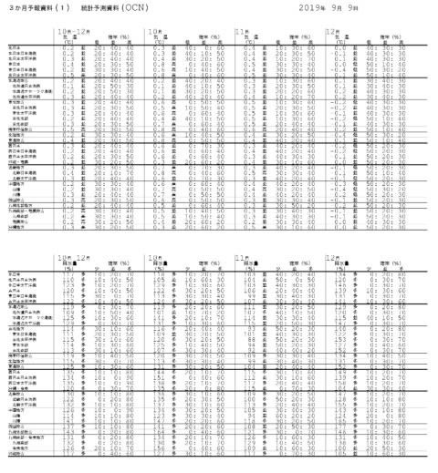
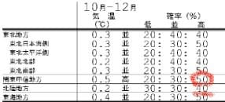
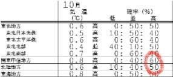
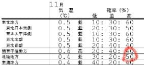
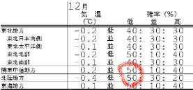
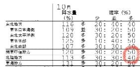
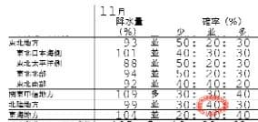
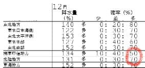
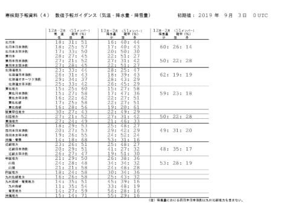
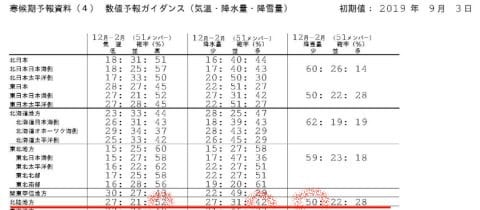

# そろそろスキーシーズン！この冬は冷えるのか？3か月長期予報図を読み解いてみた

📅 投稿日時: 2019-09-22 02:03:52

🏷️ カテゴリ: [スキー天気予想](c6554f5c3c106093b511a8daae23757e8.md)

えー．

もう9月も下旬に入ったので．

Yetiが例年通りのオープンならば，

もうスキーシーズンまで1か月を

切るこの時期．

（ライバル狭山スキー場が脱落した今シーズン，

　例年よりYetiオープンが遅くなる可能性も高いですが…）

このBlogを読んでいる皆さんは，

ほぼ100％がスキーヤーだと思うので←ホントか？

　このBlog，スキー記事より車の記事の方が読者が多いんだけど…

スキーヤーのはずの読者の皆様に

おかれましては．

果たして．

来る2020シーズンは冷えるのか…？？

そして，スキー場に雪は

たっぷり積もるのか…？？

…というところが気になって，

夜も寝られなくなる頃だと

思います←いや．この時期にもう

　そこまで気になるって人は，そうそういないから

だもんで．

9月中旬に発表された

[3か月統計予測資料，QXVX41](https://www.sunny-spot.net/chart/QXVX41.pdf)

…こいつを読み解いて．

この10月から12月までの期間，

果たして冷えるのか？？

雪が降りそうなのか…？？？

ってところを，占ってみようかと

思います～！

まず．

この資料から．

10月－12月の，3か月間の気温傾向予想を

見てみると．

うううーーむ．

志賀が含まれる関東甲信地方．

赤丸で記したように，気温が

平年より高くなる確率が50％で．

どちらかというと，気温が高く

なりそうな感じ…（涙）

ただ，志賀は信州とはいえ．

東京や千葉が含まれる関東甲信より，

北陸地方の方が実態に

近いと思うので．

北陸地方の方を見てみると…

赤い下線で書いたように

気温が平年より高くなる

確率が40％．

…まぁ，平年より高くなり気味，

という程度でしょうか．

で．

次に．

10月の一か月間だけを抜き出した

気温傾向を見てみると．

…これは，かなり気温が高く

なりそうな予想ですね…（涙）

関東甲信は60%，北陸は50%の確率で

平年より気温が高くなりそうで．

…関東甲信が平年より寒くなる確率は0%

という極端な予想（涙）

これは．

10月は間違いなく，平年より暖かくなりますね…

…でも，いい．

10月に冷えると，12月の本当に雪が

降ってほしい時期に冷えない

ということが良くあるので．

10月は，まだ冷えなくていい．

ってことで．

次は11月を見てみると…

11月は，北陸で気温が高くなる確率が50%と．

これまた暖かくなりそうな気配ですが…

しかし，10月と違うのは．

北陸で気温が低くなる確率が，30%もあるのだ！

…11月は，あったかいか冷えるかの

どちらかの可能性が高く，

平年並みになる確率が低い…

という予想ですね．

一体どちらに転ぶのか…

ものすごく気になるところ．

そして．

そろそろシーズン本番，

肝心な12月を見てみると…

をを！！

これは．

関東甲信，北陸とも．

平年より冷える確率が50%じゃないですか！！

これは，12月は冷えそう！！！

うむ．

12月が冷えてくれるのは，理想的…

で．

次は，降水量を見てみると．

10月は降水量が多そうですが…

まぁ，この時期の降水量は

雪にならないので，

あんまり関係ないですね…

11月あたりになると，

山ではさすがに雪になってくるので，

降水量が気になり始めますが…

うーむ．

11月は，大体平年並みの降水量に

収まりそう…

そして．

最も気になる12月の降水量は…？？？

と，見てみると．

ををを！！

北陸地方の降水量が多い確率が70%！？？

これは…

この12月の北陸地方は，

冷えるし降水量が多い

ということになりそう…っ！！！

この12月は，期待できそう…！！！

…と，思ってしまいますが．

あくまでこれは今の時点での予想．

昨シーズンは，一か月長期予想が

外れまくった経緯もあるので．

9月現在での12月の予想は，

占いと同程度の信頼性

と思っておくのが吉です．

で．

さらについでに，スキーのトップシーズン

となる，12月から2月の予想図，

[QLVX63	寒・暖候期予報資料　数値予報ガイダンス](https://www.sunny-spot.net/chart/QLVX63.pdf)

ってのを見てみますが．

この予想図を詳しく見てみると．

12月から2月の北陸地方．

左側の赤丸で囲ったように，

平年より気温が高くなる確率が52%．

このトップシーズンは，

ちょっと平年より気温が上がりそうです…（涙）

とはいえ，この時期は平年より

多少気温が高くても雪になるので．

むやみやたらとこの時期に冷えるより，

3～4月に冷えた方が，シーズンが

長くなるのでいいんです．

この時期に無理に冷えなくても

いいんです．

気にすべきのは，降水量．

この図の真ん中にある

降水量予想を見てみると．

平年より多くなる確率が42％．

…うむ．

これは

雪がいっぱい積もるということか…！

と，期待してしまいそうだけど．

この図の一番右端の積雪量を見ると．

平年より積雪が少ない割合が50％！！！！（激涙）

…

…

なぜ．

なぜ，降水量が多そうなのに，

積雪が少ない予想なのか…

…このシーズン．

ドサドサ雪のパウダーに巡り合う

確率は，例年より低くなりそう

です…（泣）

…

ってな感じで．

ざっくりまとめると．

　12月はそこそこ冷えて雪が多そうだけど．

　1，2月はそれほど冷えず，雪も

　ドサドサは降らなさそう…

という，このスキーシーズンの

長期予想でしたが．

まだわからない．

一か月予想でも大きく外れるので．

こんな3か月を超える予想が

当たる可能性は，それほど高くない．

だもんで．

信心深いこのBlogの読者の皆様に

おかれましては．

日ごろの言動にくれぐれも気を付けて．

今シーズン，スキー場に雪がどっさり

積もるシーズンになるように，

祈り．

そして，例の踊りを踊りましょう…

## 💬 コメント一覧

### 💬 コメント by (はなげ親分)
**タイトル**: Unknown
**投稿日**: 2019-09-22 06:38:36

例の踊り・・・

一心不乱に踊ると、魂がすーっとどこか遠くにいく時があるんです。

ちょっと危ないんで、シニアはパワー３割減でよろしいでしょうか・・・

### 💬 コメント by (カンタロス)
**タイトル**: Unknown
**投稿日**: 2019-09-22 06:55:50

例年、この時期はワックスをかけますが、(じぶんのだけ3本)奥さんには、呆れられてます(笑)

あげく、今年は雪少ない少ないんじゃない？と言われます(涙)

### 💬 コメント by (カンタロス)
**タイトル**: Unknown
**投稿日**: 2019-09-22 10:27:48

Sさまの予想したように、イエティ25日オープンな

感じですね。

超早割シーズン券締め切りがオープン２週間前の傾向が見て取れるため、超早割の締め切り日（11日）から

2週間後の25日の可能性大と私も予測します。

ヒエヒエダンスを全力で踊りましょう。

### 💬 コメント by (Skier_S)
**タイトル**: 今シーズンは長く滑れるシーズンになってほしい
**投稿日**: 2019-09-23 00:17:44

＞はなげ親分さま

魂がスーッとどこかに遠くに行くとき…

そうです．

それは，神に近づいている一瞬です！

そこで手を抜かず，神と一体化してみましょう(危ない)

＞カンタロスさま

もうワックスがけ始めるんですね…

私は10月に入ってからです．

しかし，Yetiのスタートが18日を想定して準備しているのですが，

できれば遅れずにいてほしいところ．

…なぜなら今年は，10月22日が祭日なので（知らない人が多そうですが…）

ここでも滑れると嬉しいので．

とりあえず，このシーズンは冷えるように，祈って踊りましょう！

### 💬 コメント by (Goku)
**タイトル**: Unknown
**投稿日**: 2019-09-23 07:02:03

最低でも１２月第３週にはヤケビ２ゴンが動いてほしいですね。

私の場合、膝が治るのかが一番の問題ですが・・・

### 💬 コメント by (しんちゃん)
**タイトル**: 踊り続けておきます
**投稿日**: 2019-09-23 22:37:40

普通なら、雪よ降れ・寒くなれと祈るのですが・・・

そう、志賀への忠誠心高い方々は踊るんですよね(笑)

例の踊りを踊り続けておきます。

（まだ肩が上がりきらないのでうまく踊れませんが(笑)）

### 💬 コメント by (Skier_S)
**タイトル**: ＞Gokuさま
**投稿日**: 2019-09-24 00:52:54

今日はお世話になりました～！

12時半くらいに帰宅しました(笑)．

また10月にお会いしましょう！

### 💬 コメント by (Skier_S)
**タイトル**: ＞しんちゃんさま
**投稿日**: 2019-09-24 00:54:21

そうなんです．

忠誠心の証に，踊らないといけないのです(笑)．

腕，まだ上がりきらないのですね…

スキーシーズンまでに，可動域拡大頑張ってください！

