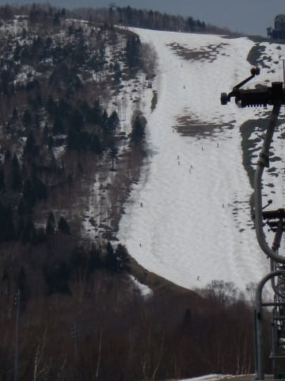
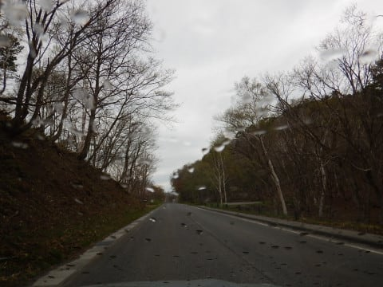
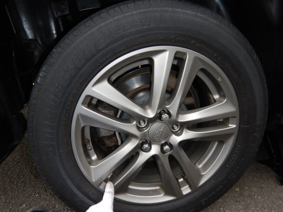
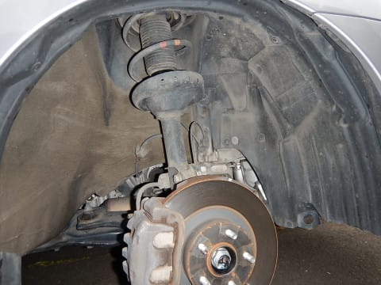
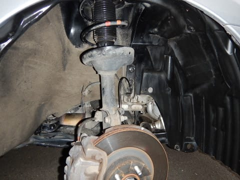
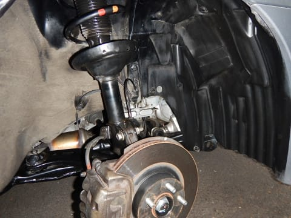

# 3日夜から4日の雨で，志賀高原は…奥志賀高原4日で終了・熊の湯も明日から緩斜面のみ（涙）

📅 投稿日時: 2018-05-03 21:02:55

ということで．

昨日は朝から昼まで，奥志賀で滑ってたわけですが．

その後，K奈川県の自宅に戻り．

夕方に帰宅後，小雨の降る夜に

必死にタイヤ交換をやって…

いつも通り汚れた下回りを…

必死に磨いて…

ピカピカにする営みまでやってしまい…

それからなぜか夜中の11時に出発して．

車を500㎞ほど夜通し運転して．

関西某所の妻の実家にやってきてます…

4連休の渋滞を避けるための夜中移動だったわけですが．

朝，奥志賀で滑り始めてからK奈川県→関西某所と，

運転距離計800㎞．

その間に，半日スキーして，タイヤ交換して…

活動時間25時間．

死ぬかと思いました…←いや，普通の人はこんな無謀はしないから

ってことで．

今日の昼間は死んだように寝てたわけですが．

起きてから，[奥志賀高原の情報](https://www.facebook.com/okushiga.kogen/posts/998795336937441)を見ると…

なんということかっっ！！

奥志賀，本日は第3，第4のみで営業したようですが．

本日で営業終了

のようです．

エキスパートと第1緩斜面は切れたけど．

第3，第4だけだったらもう少し営業できるのでは…？

と思うのですが…（涙）

本日奥志賀滑った方がいましたら，

レポートお願いします～！

そして．

熊の湯も．

本日で山頂からの滑走は終了．

明日からは下の緩斜面のみになるようです…（泣）

なんということだ…

横手，渋は営業できる限り営業する，

と言ってますが．

どうなることやら…

ってことで．

このGW．

残念すぎます…（泣）．

明日は意味もなく冷え込むんですが．

全く意味がない（激涙）．

ホントならこのGW．

ひたすら焼額の第1ゴンドラの早朝を

滑り倒している予定だったのに…

残念…

残念だよ…

## 💬 コメント一覧

### 💬 コメント by (Goku)
**タイトル**: Unknown
**投稿日**: 2018-05-03 21:24:48

ＧＷ恒例の強行日程お疲れ様です。

私は結局ＧＷは１日しか滑れませんでした(T_T)

明日からK県に行くので、入れ違いですね(笑)

### 💬 コメント by (Skier_S)
**タイトル**: Gokuさま
**投稿日**: 2018-05-03 21:29:14

ホントはこのGW，9連休中8日間志賀高原に

こもる予定だったのですが…

雪不足により，急遽関西某所によることに

しました．

しかし，いつも通りかなりご無体日程に

なりましたが…(笑)．

ホントは5日にまた志賀高原に戻るつもりでしたが，

現在どうするか考え中です…

### 💬 コメント by (yumi)
**タイトル**: 今季最後の奥ゴン✨
**投稿日**: 2018-05-03 22:02:12

Ｓさぁ～ん🚀🚀🚀

今日もしつこく滑って来ましたぁ～

奥ゴンも風が強くていつ止まるかって感じ💧でしたよ。

・・・でも、止まったら、どうやって降りるんだぁ⁉️って思いながら。。。

バーンは、こんな可哀想な第３ゲレンデ見たこと無い💧💧💧でした。

今シーズンは昨日の、おててふりふりで最後になりましたね。

また、来シーズンも宜しく😃✌️です🎵

ちなみに私達は５日、gokuさんが思い出させてくれた、アライリゾートで滑ってまぁ～す✌️

家から一時間位で行けるみたいです🚗💨

北陸回りなら、意外と近いのでは❓

### 💬 コメント by (黄色い人)
**タイトル**: 奥志賀
**投稿日**: 2018-05-03 22:38:00

いいえ今日は朝一だけ動いていた第２リフトもすぐ運休になったのでそのまま帰宅しました。しかし一度帰宅してタイヤを履き替えてそのまま５００ｋｍって・・・

### 💬 コメント by (Skier_S)
**タイトル**: あしたはかぐら！
**投稿日**: 2018-05-04 19:57:11

＞yumiさま

奥志賀ラスト滑って来たのですね．

第3，おとといまでかなりまともだったのに

そんなにかわいそうになったのですね…

しかし，アライですか．

一日券シーズン中は6000円と，

すごいお高いスキー場のイメージがありますが…

私は5日はかぐらの予定です～

…混みそうですが．

＞黄色い人さま

あら…

第3，第4は滑らず，そのまま帰宅だったのですね．

私のご無体移動はいつものパターンです(笑)

これからも，550㎞移動してスキーして，

その後K奈川県に戻るという

活動時間24時間近いパターンです(笑)

### 💬 コメント by (yumi)
**タイトル**: 小耳情報🆕👂
**投稿日**: 2018-05-04 22:17:20

Ｓさぁ～ん🎊🎊🎊

アライは春の料金で3800円ですよ～✨（gokuさん情報）

おまけに、ガラガラらしいです。（クチコミ情報）

雪❄️も有るらしいです。（クチコミ情報）

ちなみに、今日は奥志賀は雪❄️が降りました。

けっこう、降ったみたいです。（奥志賀のスパイ情報）

今頃、遅い🐌💨💨

### 💬 コメント by (Skier_S)
**タイトル**: yumiさま
**投稿日**: 2018-05-07 00:07:28

アライ，春料金はそんなに安いんですね！

雪はたっぷりあったんでしょうか…

私も昔，5月下旬にアライに行った思い出が

あります…

その時はてっぺんのクワッドだけしか

滑れませんでしたが，5月最終週まで

スキーができる積雪量に感動した

思い出があります…

またどんなだったか教えてください～！

### 💬 コメント by (yumi)
**タイトル**: 朝一はごきげん😃⤴️⤴️
**投稿日**: 2018-05-07 18:10:48

Ｓさぁ～ん💨💨💫

アライリゾート、５日のゲレンデはキレイでしたよ✨

今日の☔️でヤバイ😵💦カモ⁉️🦆ですが・・・

### 💬 コメント by (Skier_S)
**タイトル**: yumiさま
**投稿日**: 2018-05-08 04:04:12

レポートありがとうございます～！

結構雪があったのですね…

奥志賀より100億倍良かったのですか！

そして，高級レストラン以外の

リーズナブルな食事もあったんですか！？？

うーむ．

うちから遠いのが問題ですが．

春スキー料金になったら，

一度行ってみてもいいかも…

レポートありがとうございました！

