# 2013年11月　フィリピン・オスロブ　子連れでジンベエを見るぞっ！　その16

📅 投稿日時: 2014-07-26 00:35:05

🏷️ カテゴリ: [ダイビング日記](ce3a7a8d424d112fce83ee85c81a0e344.md)

えー．

普段は夏モード時の読者数は，スキーシーズンの時の

半分くらいなのですが．

…なぜか最近，冬モードの1/3ほどに読者数が減ってしまっている

今日この頃．←徒然「スキーヤー」日記なのに，ダイビング日記が続いているってところに問題があるのでは？

皆様いかがお過ごしでしょうか．

それでも，続けるオスロブ旅行記．

継続は力なり！←このネタも継続している…

ってことで，その16です．

----

って感じで，私にとってはこれ1本だけの，

本日のダイビングは終了！

ダイビングを終えたダイバーを乗せて，

ボートはルビ・リゾートへ戻ります…

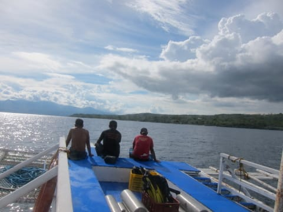

といっても，スミロンからわずか20分で，

リゾートに着いちゃいます．

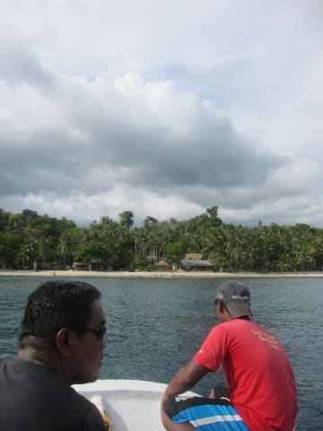

バンカーボートから降りて，小舟に乗って…

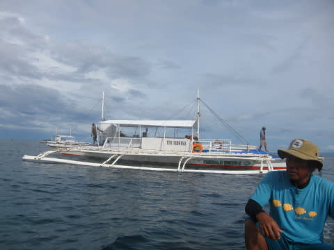

浅瀬を歩いて，ダイビングショップへ戻ります．

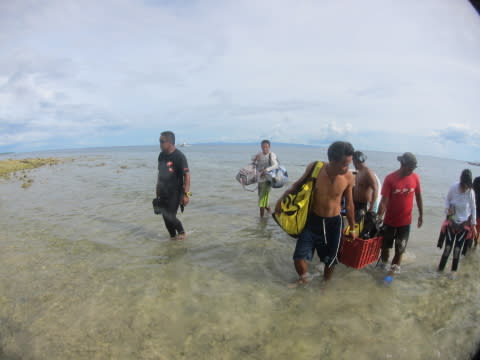

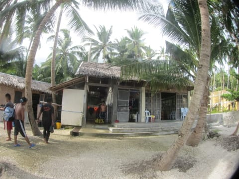

ダイビングショップの機材洗い場はこんな感じで…

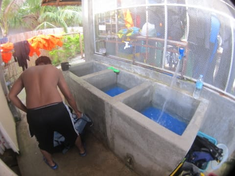

洗い場の横の，金属ネットで囲まれたスペースに

器材を干しておけます．

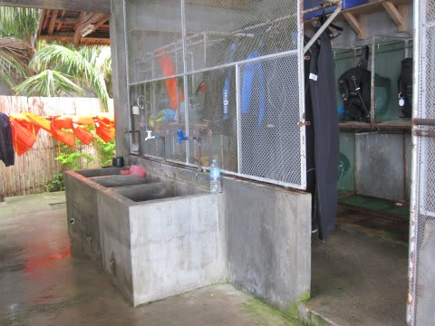

器材を片づけたら，お部屋へ戻りますか…

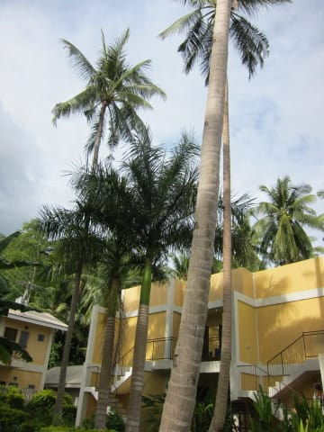

部屋でシャワーを浴びて，ひと休みした後は，

みんな集まって，食堂でログづけタイム！

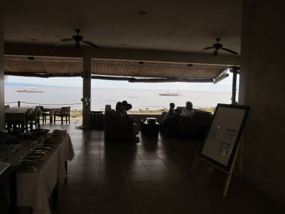

娘もスタンプを押して…

ログづけしてましたね～

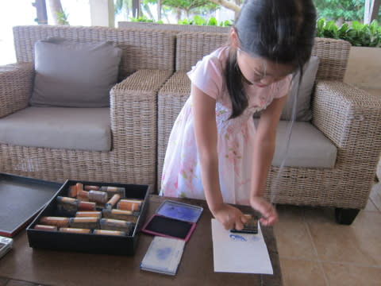

今日見た，ジンベエとカクレクマノミを

描いたようです…

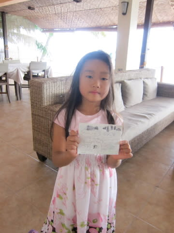

それから，ジンベエに会えた祝杯のビールを飲みつつ

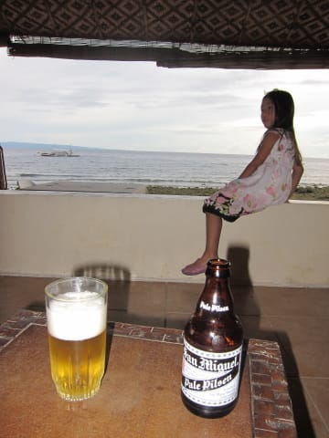

食堂前のビーチをうろつき．

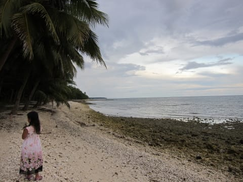

日が沈んでいくのを眺めます…

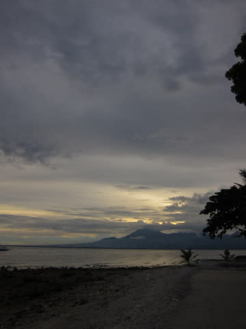

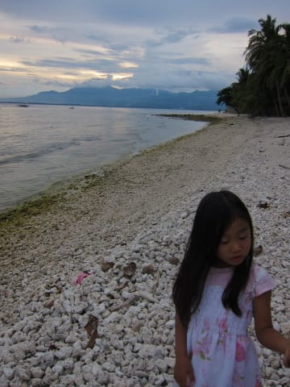

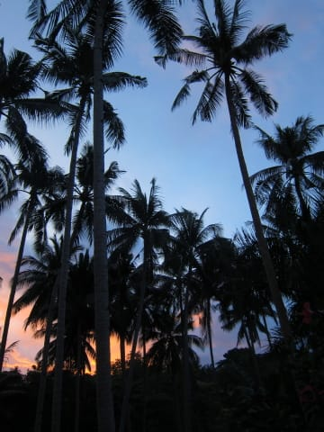

タイのホテルみたいに，プールがあるような

リゾート感はないけど．

静かで落ち着いた感じのビーチですね…

夕日が沈みきったら，食堂で夕食です．

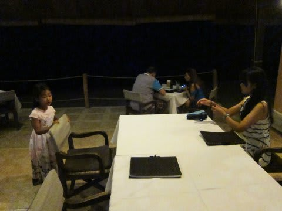

ホテルの夕食．

メニューはそんなに豊富ではなかったけど．

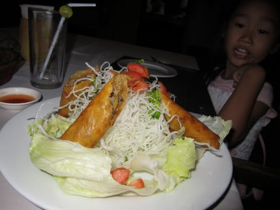

フレンチや中華っぽい，結構手が込んだ料理で．

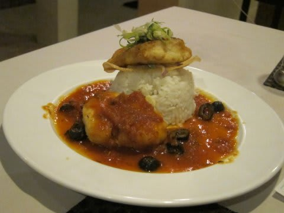

まぁ，合格レベルかな．

ってことで．

食事の後は，ビーチを眺めながらくつろいだりして…

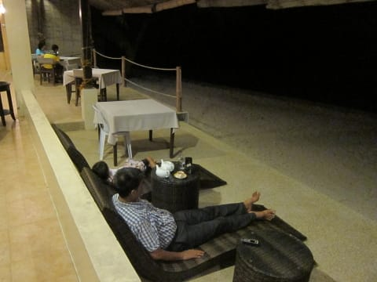

家族みんなで，ジンベエをたっぷり満喫できた

充実の一日を振り返りつつ，

満足の夜を過ごしたのでした…．
