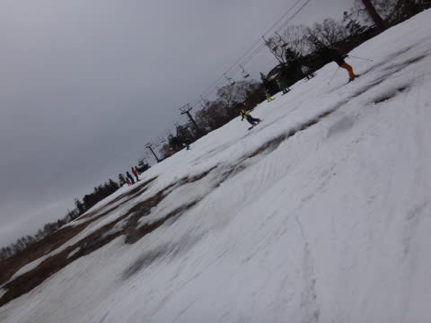

# 5月6日，金曜のかぐらスキー場のゲレンデ状況は…ガラガラ，リフト飛び乗り！雪は薄くなったけど楽しめたよ

📅 投稿日時: 2016-05-06 22:59:48

というわけで．

3連休は関西某所へ出かけていたため，

Blog記事も簡易モードでしたが．

昨日，500km以上運転して帰宅したばかりというのに．

また本日朝3時起きで，日帰りかぐらへ行って

きました～！←アホだ

で．この土日に「かぐらに行こうかな～…」

って人も多いと思うので．

取り急ぎ，ゲレンデレポートをば…

あ，ちなみに．

土曜のかぐらは，昼頃まで時々雨．

気温は+5度前後と低めなので，暖かめの恰好をしていった方がいいかな…

日曜は，曇り→晴れ．日が陰ると寒いけど，

日が当たるとポカポカ陽気…って感じの天気かな．

ってことで．

かぐらも，残るはメインゲレンデのみとなり．

駐車場から滑れるゲレンデまでの移動は

ロープウェー→みつまた高速リフト→Pislabのマット滑走→ゴンドラ

…という．

地球からイスカンダル並みのはるか長い旅路が待っている本日．

まず，ロープウェーを降りてから…

さっそく，みつまた高速リフトまでの距離を

歩く派と，Pislabを滑る派に分かれてますね～．

物は試しと，Pislab初チャレンジっ！！

この，赤丸の中にスプリンクラーが仕込まれていて，

かなりびしょ濡れになります…

うむ．

Pislab．

エッジが効かなくて怖いよ

かなりゆっくり滑らないと，ブレーキが利かない感じ…（恐怖）

そして，みつまた高速リフトから降りたら…

今度は，ゴンドラまでPislab滑走が待っています．

…ここは，下りリフト乗車などという

オプションは準備されていないようで…

Pislabを滑っていくしかありません．

ゴンドラ乗り場近辺は，わずかに雪がPislabマットの

上に乗ってましたが．

Pislabから雪の上に移った時，

「あぁ…スキーって，雪の上を滑るものだよね…（感動）」

という思いを禁じ得ないです…やっぱり．

で．

次は，ゴンドラに乗るわけですが…

ゴンドラコース，雪，全く無いね（涙）

…ということで，

駐車場からはるばる40分．

ようやっとやってきました，かぐらゲレンデへ…（遠かった…）

朝イチのかぐらゲレンデは…

をを！

雪だ！雪だっ！←Pislabを滑った人はわかると思うけど，雪の滑走感覚に感動してしまう

それも，結構シマシマな雪だっ！

気温は結構低めで．

スキーヤーなのに寒さに弱いという

欠点を持つ私は，ウェアのジャケットを着ないと寒いくらい…

今日は時折日が射すものの，基本的に曇りだったので．

高温や日差しで雪がひどく融けてしまうことはなく，

終日板が滑る雪で，良かったですね～っ！

で．

朝イチのコースはフラットで，幅も十分なので…

久しぶりだっ！

久しぶりの大回りだっ！

朝イチは人も少ないし…

雪不足のこの時期，ホントに久しぶりに，

気持ちよく大回りした気がするっ！！

ふはははははっ！

そうだよ！

スキーって，こんな斜面をかっ飛ばすものだったんだ…（感動…）

…でも．

あれ？

ちょっと上の方…

土が出てませんか？

上から見るとこんな感じで…

ついに．

メインバーンも真ん中に穴が開いちゃってます（涙）．

でも．

朝のうちは，この部分以外は気持ちよいフラットで，

快適に飛ばせます！

そして，朝のうちはリフト飛び乗り状態！

いや，さすがGWの谷間！

激込み覚悟のかぐらが，こんなに空いているとは…っ！！

…さすがに，午前10時を過ぎると人が増えて来ましたが…

それでもせいぜいこの程度で．

人が少ないので，昼近くになっても

ゲレンデはそれほどひどいコブコブには

ならず．

さらに，一番混んでも，リフト搬器

2-3台待ち程度で，ほぼ飛び乗り！

ゲレンデも，昼前は最大このくらい人がいたけど…

でも，昼でも一番最後の落ち込みがこのくらいの

荒れ方で，まだ大回り可能っ！

そして…

今日は午前券で帰る人が多かったのか，午後になると…

リフト搬器に空きが出てくるほど，ガラガラにっ！！

ゲレンデの人も減ってきましたよ～！

…ただ．

ゲレンデの人が減ってきたのには，やはりわけがあって…

ありゃ？

ありゃりゃ？？

…いや．

コースのほとんどは大丈夫なんですが．

メインバーンの，リフトをくぐってしばらく下の

当たりが，コース幅いっぱい雪が薄くなってきていて．

幅いっぱい，コブの底が抜けてくる状況に…（涙）

距離にして10m程度のエリアなので，

そこさえ通過すれば，あとは大丈夫なんですが…

でも，この10mのエリアは，コース幅いっぱい

茶色くなってきてました…（泣）．

でも．

そこと，メインバーンのとりつき部分にあいた穴以外は…

予想よりたっぷり雪がありましたね～．

ってことで．

人が少なかったからか，夕方のリフトストップになっても，

そこそこの深さのコブになったものの，どうしようもない

全面コブ祭りってほどすごいコブにはならず．

今日も，しっかりラストリフトまで滑って帰ったのでした～！

あ，ちなみに．

帰りはゴンドラくだり乗車のあと．

みつまた高速リフトもくだり乗車可能なので．

このようなレッドカーペット上を歩いて，

下りリフト乗り場まで行って．

さらに，リフトを降りてから，ロープウェー乗り場

まで歩けば，帰りはPislabを滑らずとも帰れますよ～！！

ってことで．

予想よりガラガラで，かなり楽しめた

本日のかぐらでしたが．

この週末，また混むのかなぁ…
