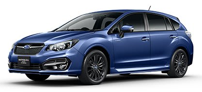

# スバル　インプレッサスポーツハイブリッドに乗ってみた…試乗インプレッション

📅 投稿日時: 2015-09-18 02:59:14

🏷️ カテゴリ: [車試乗](c07dec5709d34bd74e1f6cb9c8291061b.md)

えー．

パラオ旅行記もまだ終わってませんが．

旅行記ばっかり続くと飽きると思うので，

ちょっとここらで，違うネタを…

この夏に発売された，スバルのインプレッサスポーツハイブリッド．

わがBRレガシィ君のオイル交換のついでに試乗してきましたので，

レポートをば…

この，インプレッサスポーツハイブリッド．

基本的に，XVハイブリッドと同じ仕様で．

わずかに低い車高と，制御プログラムを変更しての，

多少の燃費改善を図った以外ほぼ同じ…ということですが．

その実力は，いかに？？

（スバルHPより借用）

とりあえず，乗り込んでみましょうか．

スタートボタンを押すと…

あっさり，エンジンがかかります．

エンジンが冷えてたからなのかな？

普通はエンジン始動せず，走り出してから

始動するかと思ったんだけど…

そして，走り出してみると…

車内は比較的静か．

ホンダのフィットやシャトルで感じる，

モーター駆動や回生の際の音は全く感じず，

エンジン音も結構しっかり遮音されている感じ．

このあたりは，高級感がありますね．

で，しばらく走ってみたところ…

あら？意外と柔らかい足だな．

突き上げ感は弱いけど．

逆に，かっちりした感じが弱いかな．

で．バッテリー重量分，車重が重いからか，

比較的ゆったりと，大きめにロールする

感じを受けます．

わが愛車，BRレガシィほどの大きなロール感は

無いけど…

このクラスの「スポーツ」と銘打つ車としては，

割とゆったりした感じの挙動です．

エンジンは，低回転でモーターアシストが効き，

低速トルクがアップしたような走り．

リニアトロニック（CVT)の組み合わせも相まって，

エンジン回転数がそれほど上がらず加速していきます．

ただ，どっかんアシストではないので，

アクセルを踏み込んで，回転数が高くなる領域では

モーターアシスト感は全く無く，

「もう少し頑張れ」感が…

でも，街中を流すとか，アクセル開度がそれほど

大きくない領域，2000回転以下でワインディングを

走っているようなシチュエーションでは，

比較的低いエンジン回転数をキープしたまま走れて，

楽です．

…ただ，やっぱり「スポーツ」と銘打つからには，

大きなアクセル開度でのぐぐぐっという加速を

期待してしまうところですが．

…残念ながら，そういう領域でのパンチ感は

全くありません．

XVみたいなクロカンっぽい車だと，

緩加速時，トルク感を感じ，

「予想より良く走るな」

と思ったけど…

インプレッサ『スポーツ』としては，

やはり，そういうフルパワーの

パンチ感が欲しいところ．

あと．

以前のXVの試乗とちょっと変わったな，と思ったのが．

スタート時，モーターでの発進から，エンジンがかかるまでの

遅延時間．

燃費を良くするためなのか，エンジンがかかる

までの時間がちょっと長くなったように感じますが…

…気のせいかな？？

モーターで発進してしばらく後，エンジンがかかり，

そこからエンジンパワーがプラスされる…

という感じで，加速が2段階．

ここも，惜しい．

という感じで．

足もステアリングも，エンジンの感じも，

どちらかと言えばガシガシ攻めるというより，

そこそこのスピードでゆったりと続く

道を気持ちよく走れる，

というような，乗り心地に降ったゆるめの感じ．

乗り心地は比較的いいんだけど…

うーーーむ．

XVのような車高の高い車だと思えば，

「クロカン的な車としては，良く走るじゃないか！」

という感じを受けるけど．

インプレッサ「スポーツ」と思うと，もう少し頑張れ，

という感じになってしまうなぁ…

ということで．

インプレッサスポーツハイブリッド．

インプレッサの5ドアハッチである『インプレッサスポーツ』

のハイブリッドであって，

「インプレッサ」の「スポーツハイブリッド」ではない，

ということは重々承知しておきながら．

うむ．

スポーツという名前が，過剰な期待を抱かせてるよな…

同じような味付けの車が，その車の期待値（スポーツタイプ的

ルックスか，クロカン的ルックスか）で，全く違う

印象を与えてしまうんだなぁ…

と，感じずにいられない，今回の試乗だったのでした．
