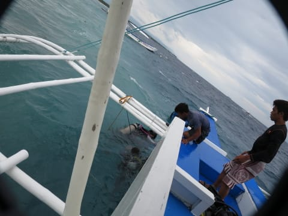

# 2015年8月　子連れでモアルボアルでダイビングその4…1本目はお留守番

📅 投稿日時: 2015-10-23 01:05:34

えー．

ダイビング旅行記というのに．

書き出しに，スキーのネタに行くあたりが，

この時期のこのBlogらしさであるのですが．

…今シーズンの志賀高原．

熊の湯が，ボード解禁になったのに続き．

なんと．[奥志賀もボード解禁](http://www.okushiga.jp/news_and_events/info/post-444.php)になったようですね…！

＃Komuさん，情報ありがとうございます

うーむ．

スキーヤーだけだったので，あっという間にコブだらけに

なってしまう奥志賀ですが．

ボーダーが増えると，コブができにくくなるのかも？？

…って感じで．

スキーネタに続いて．

ダイビングネタへ，Go!

--

ということで．

荒れ気味の，フィリピンの海へ繰り出しましたが…

海が荒れているので，そんなに遠くまで行くこともままならず．

ボートで走ること，わずか15分で，ポイントへ到着です．

ポイントに到着して，みんな潜りに行く準備を始めますが…

夫婦2人のうち，どちらかが船に残って

娘の面倒を見なくてはならない我が家．

さて，一体，どっちが1本目に行くのか！？

…という，いつもの夫婦間での精神戦が繰り広げられるわけですが．

我が家の力関係を反映し．

やはり，1本目は妻が潜りに行くことに…

ってことで．

娘と船の上に残ってお留守番の私は．

潜りに行く皆を，うらやましそうな目で見送ります．

私「行ってらっしゃい…」（自分が潜ってない時に，大物見たりしませんように！）←心の狭い男

ダイバーを見送ったあと．

波が高く，とても泳げそうにないような，

かなり残念な状況なので．

さて，何をしましょうか…

ってことで，船の上でひたすらお絵かきタイム．

…これは，蟹さん？

なかなか前衛的なカニだな…

…しかし．

ホントに船に強い娘でよかった…

普通，これだけの波で揺れる船の上で，

お絵かきなんてしてたら，すぐ酔うよ…

って感じで．

お絵かきすること，ひたすら45分．

ようやっと，ダイバーが戻ってきました…

## 💬 コメント一覧

### 💬 コメント by (はなげ親分)
**タイトル**: ７シーズンぶりに
**投稿日**: 2015-10-23 01:39:13

あのヤマケイのスキー雑誌　skier　が復活したそうです！

復活ついでにヤケビの早朝スキー・・・

S様のダークサイドパワーでなんとかなりませんでしょうか？

### 💬 コメント by (Skier_S)
**タイトル**: はなげ親分さま
**投稿日**: 2015-10-23 02:07:52

あら！skier，復活ですか～．

スキーヤー自体が減ってるはずなのに，

読者が戻ってきたんでしょうか…？？

ヤケビの4月の早朝スキーも復活してほしいところ．

ダークサイドパワーで何とかなればよいのですが…

残念ながら，なんともなりません（残念）．

