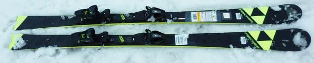
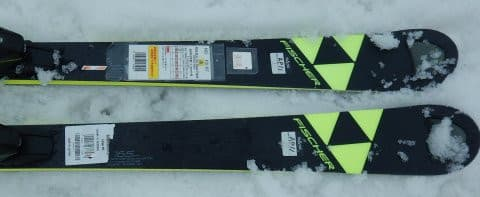
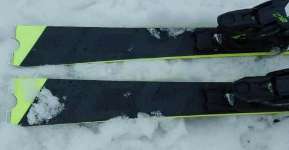
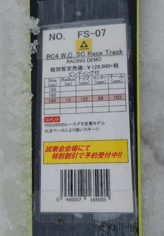
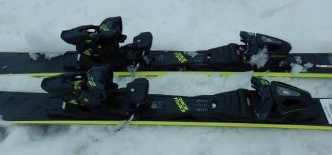

# 2020シーズンモデルのスキー板，試乗レポートラスト！…FISCHER編その4

📅 投稿日時: 2019-06-25 01:00:52

🏷️ カテゴリ: [スキー板試乗](c0bd8048615710cee890e403a36cc9a2b.md)

ということで．

土曜は，志賀高原までタケノコ狩りに，

日帰りで行ってきたわけですが．

帰宅後，死ぬほど眠くて．

もう，Blogも書かずに，

いつもより早めの12時ごろに，

倒れたように寝てしまったわけで…

翌日の日曜．

私にとっては超長時間睡眠と言える，

8時間ほど眠って．

朝8時過ぎに起き，Blogを書いたものの．

…先週までの激務の疲れのせいか，

なぜか30分後には再び倒れたように寝てしまい．

そのまま午後5時まで寝てしまった

という…

トータル睡眠時間16時間．

いや．

やっぱり，疲れてたんだな…

そして．午後5時に起きたばかりというのに．

午後10時にはまた気を失ったように寝てしまい．

実質5時間くらいしか起きて

ませんでした（涙）．

…その後，朝3時ごろに起きてBlogを書いたけど．

再び朝まで熟睡．

30時間の間に，23時間も寝てたという…

それだけ寝たにもかかわらず．

今日，移動中の電車で熟睡を

かまし．

それでもまだまだ眠いんですが（涙）．

ほっといたら，まだ何時間でも眠れそうです．

…スキーシーズンの疲れが，今になって

出てきてるのかな？？

ってなことで．

今シーズンも疲れを溜めながら（？）

いろいろなスキー板を試乗したわけですが．

今回が，今シーズンの試乗レポートのラストです．

今日レポートするのは，フィッシャーの板．

では，どうぞ～！

○FISCHER RC4 Worldcup SC Racetrack 165cm

基礎小回り．

この板，[前回](eae8a1cc9ea1e51e240a6b17a4cde658a.md)に続き，2度目の試乗になりますが．

RC4 SCはプレート違いで2種類あって．

こちらがRacetrackのついた，優しいほうの

モデルになります．

もう1種類は，ガッツリしたCurve Boosterプレートが付いた

Yellow Base．この試乗レポートは[こちら](e5d105a5bbbde12449269933a16f0e462.md)参照．

基本的には，R=13と小回りベースのこの板．

滑ってみると…

やっぱり，Yellow Baseよりは軽快に感じます．

重さが結構軽く感じるし，グリップもマイルド．

谷回りで簡単に板が動かせます．

重い雪でも，簡単に板をずらして行くことが

できます．

山回りでのグリップの強烈さというより，

ある程度動かしやすいグリップ感．

とはいえ，山回りでかかとを雪面に押し込んで

行くように動いていくと，

ガッツリエッジが食い込んでいきます．

しっかり切れて，小さく回っていきます．

かかと気味荷重で抑えて行けば，

カービングで小さめの半径で切って

行けるし，

あまりガッツリ食い込ませなければ，

適宜動かしやすい感じで．

さらに，板をずらして行った時の

コントロール性も高いです．

ずれも切れも行けて，ズラシの中の操作性も

いいので．

滑りの自由度が高く，いろんな小技が使える，

かなり乗りやすい板だと思います．

ガンガンにトップスピードで滑ると

わずかに物足りなさが顔を出すけど．

でも，強烈グリップのガチ競技用SL板に

比べれば…というレベル．

低速でもきれいに滑りたい，指導員みたいな人で，

そこそこのスピードで，切ってもずらしても

滑っていきたい…

って人には，いい感じのオールラウンド性の高い

板ではないでしょうか．
