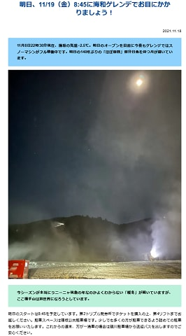
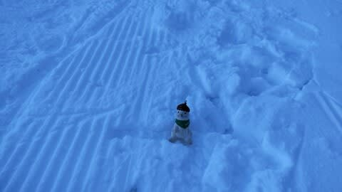

# 横手山、本日無事オープン！！

📅 投稿日時: 2021-11-19 08:59:45

えー

すみません．

ちょっとバタバタしてて更新遅れました…

ってなことで、18日は人工降雪機が

打てないだろうなぁ…

と予想していたけど．

18日の夜に入ってから冷え込んで，

横手は人工降雪機が打てたようですね…！！

気温的にはきわどいところだけど…

([横手山ホームページ](https://yokoteyama2307.com/news/16492/)より)

とりあえず，本日横手山は無事オープン

したようです！！

ついに志賀高原もシーズンインです！

## 💬 コメント一覧

### 💬 コメント by (ikkun)
**タイトル**: Unknown
**投稿日**: 2021-11-21 19:15:35

いよいよですね 海和さんと三郎さんのデモ滑走があったみたいですね

また三郎さんに教えて頂けるかなぁ？

### 💬 コメント by (Skier_S)
**タイトル**: >ikkunさま
**投稿日**: 2021-11-22 01:38:58

横手オープン日は，海和さんと渡部三郎さんが来てたみたいですね…

渡部三郎さんに教えてもらえたとは羨ましいです．

