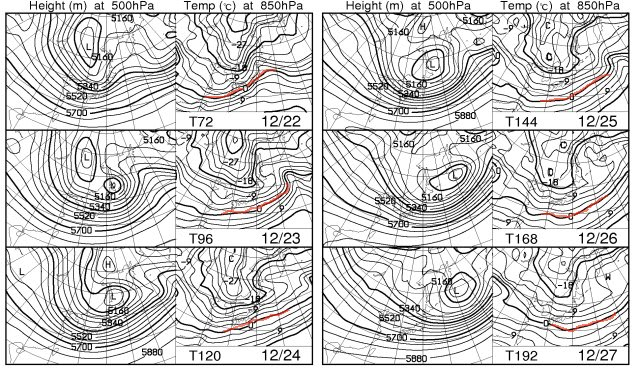

# クリスマス寒波が来る！23日から27日まですごい積もるよ！

📅 投稿日時: 2011-12-21 01:12:15

さてさてさてさて．

待ちに待った寒波が．

待ちに待った積雪が．

来ますよ～っ！！！！

新潟近辺…ってか，日本海に近いところは，これからしばらくはずっと

雪が降り続けます．

信州は…

21，22日は雪になりますが，それほどの積雪はなさそう．

22日はちょっと気温高めかな．

でも，山沿いでは雪です．雨になることはないのでご安心を．

左上，22日の図の赤線で示した，850hpaでの0度線．

山沿いでは雪になるこの線が，日本より南にありますので

山では雨になる心配は要りませんね～．

…って感じで．

21，22日は新潟では雪になりそうですが．信州はそれほどの

積雪にならなさそう．

しかし．

しかし．

しかーーーし．

22日の夜から，来ます．冷えます．ぐぐぐっと．

で…23日の祭日は，かなりの積雪になりそうですよ～っ！

赤く記した500hpaの-30度の寒気．これが信州ぐらいまで降りてきてます．

これは，結構な大雪になる目安．

これは，来ますね．

…しかし．山はすごい荒れ気味かな．

もしかすると，23日は強風で止まるリフトが出てくるかも…

そのあとは，27日まで降り続けますっ！

23～27日の5日間でかなり積もりそうですね．

見ての通り，23～27日まで，きれいな西高東低の天気図が

続いてます．

網掛けの降水域も，日本海側にのみかかっているという，

典型的な冬型ですね～．

FXXN519の図の下側にある，500hpa高度経過．

冷えて雪になる目安，5340mが北緯35度近くまで降りてくる時期が

22日から27日くらいまで続いてますね．

＃赤印をつけた部分．12月9日近辺と17日近辺も赤くなってますが，

＃この日は結構冷えて雪が積もったことは記憶に新しいかと．

今回の寒波で，ほぼ全てのスキー場が全面オープンできるでしょう．

とりあえず，一安心．

この3連休は，ゲレンデ状況は改善！

＃でも，天気は悪いよ

年末年始はとりあえず安心できそうです．

## 💬 コメント一覧

### 💬 コメント by (コロネ)
**タイトル**: 寒そうだ～
**投稿日**: 2011-12-21 15:06:06

こんにちは。 

お正月に晴天を期待します。

ところで志賀高原エリアですと、 

私はサンバレーが結構好きです。 

コンパクトながら、整地もコブも

滑りがいがあって… 

焼額山もダイヤモンドの方に 

滑って行くコースは好きです、混んでなければ… 

ジャイアントは連絡で仕方なしに… 

今年も正月休みに泊まりに行けたら 

いいなーと思ってます。 

宿多いから、ギリギリでもどこかしら

取れるんですよねー

### 💬 コメント by (Skier_S)
**タイトル**: コメント気づきませんでした…
**投稿日**: 2011-12-26 23:20:35

すいません．コメント気づくのに遅くてレスポンス遅くなりました．

3連休は寒かったですよ～っ！！

志賀は，サンバレーはナイターが好きでした．

クワッド1本，ナイターで滑れるのがお気に入りだったんですが，今はペアしかナイターで

滑れないんですよね…

私はひたすら焼額のゴンドラを愛してます（笑）．

正月休み，焼額を滑っていればどこかで私を見かけるかもしれません…

