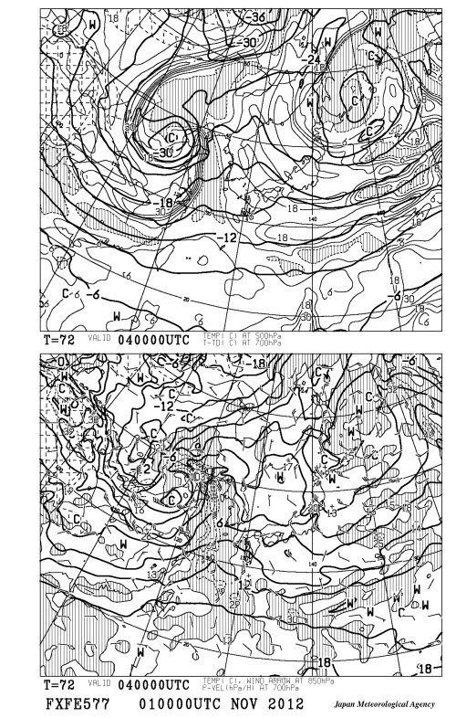

# イエティのこの週末は…晴天でしょう

📅 投稿日時: 2012-11-02 01:07:38

えー．

知らなかったんですが．

[井山敬介選手](http://ameblo.jp/ksuk3/entry-11377510723.html)，SALOMONからNORDICAにマテリアルチェンジしたんですね…

柏木選手，井山選手と，SALOMONチームのチャンピオン経験者が

流出していってますなぁ．

さてさて．

土日の天気ですが．

土日のどちらとも，

イエティは天気よさそうですね．

FXFE577を見ても．

リッジ場だし．

北西の風向き的にも．

空気の湿数的にも．

雲はかからないかな．

土曜の方が気温が低そうなので．

雪質は土曜の方がましかな？

日曜は気温が上がるので，ちょいと雪はわるくなるか…

＃あれは『雪』なのか？…という疑問が無くは無い(笑）

とりあえず，私は土曜に行くと思います…

もしかすると，ナイターに出没かも．
