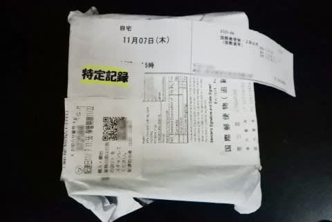
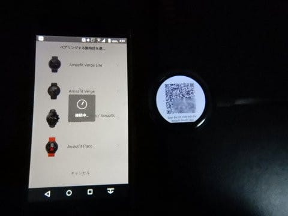

# スマートウォッチ，Amazfit PACEを買ってみた　その3…開梱の儀，そして起動と初期設定

📅 投稿日時: 2020-05-13 02:08:49

えー．

4月17日に閉鎖してから，そろそろ1か月が

経とうという，かぐらスキー場．

本日，ライブカメラを見てみましたが…

うーむ．

まだまだ雪がありますね～！！

（[かぐらスキー場ライブカメラページ](https://live.monitorbox.jp/site/kagura/90/#d1)より）

圧雪車の整備を入れて無くて，これだけ

雪が残ってるのか…

ちなみに，昨シーズンの同じ時期，

2019年5月11日は雪が多い年で，

さすがにバーンに穴が開いてませんね…

この年は，志賀もGWの最後まで

たっぷり滑れたいい年でした…

2シーズン前の2018年5月12日は，

雪が少なめの年というのもあり…

整備が入ってない今年より，

穴が大きく開いてますね…

3シーズン前の2017年5月13日は，

異常に雪が多かった年だったので，

この年はまだまだトップシーズンかと

思うほどに雪が残ってますが…

異常少雪だった2016年5月15日は…

もう全然ダメな感じですね（笑）．

ってなことで．

スタートは雪が無く，悲惨だった今シーズンだけど．

過去4年と比較すると，

今年より少ない年が2回，多い年が2回なので．

志賀高原以外でも，春の残雪は大体平年並みに

落ち着いているようですね…

奇跡の4月，すごかったんだなぁ…

かぐらはもう滑れないけど．

月山に期待…っ！！

ってなことで，本題へ．

[前回レポートしたように](ee08698196e276d6c47312dbced43bf34.md)，

待つこと約1か月で到着した，Amazfit PACE．

さっそく開封しましょう～！！

うーむ．

8000円ちょいの品物としては，

割と凝ったパッケージですね…

透明フタから，本体のみが

きれいに見えるようになってます．

蓋を開けて，まずは本体と

ご対面！

本体の乗っているトレーをどかすと…

箱の下に，付属品が入ってますね．

本体には，画面表示を模したシールが

貼ってあるので…

こいつを剥がしちゃいましょう．

梱包に入っていたものを並べると．

　・本体

　・充電ケーブル

　・充電用アタッチメント

　・説明書

だけというシンプルさです…

残念ながら，説明書には日本語がありませんが，

まぁ，「詳しくはWebで」ってことで，

ほとんど何も書かれてない薄っぺらい

説明書なので，無くてもいいくらいです．

黒色バンドの本体は，極めてシンプル．

でも，裏返すと…

バンドの裏がオレンジで．

なんで見えなくなる裏側に

オシャレしてるんだろう…

という素朴な疑問（笑）．

本体裏側には，USB経由でデータ通信と

充電するための金属端子があり．

赤矢印で記した部分に，心拍数センサーが

見えますね…

本体の大きさは，大体Amazfit GTRと

同じくらいかな…

横から見ると，裏がラウンドしている分

右側のAmazfit PACEの方が小さく見えますが．

一番厚いところは，Amazfit GTRとAmazfit PACEで

全く同じくらい．

充電する場合には，付属してきた

この充電用アダプターを…

本体の裏側に，こんな感じで嵌めます．

この充電用アダプター，

ツメでパチンとはめ込むのですが，

角度をうまく合わせないときれいに

はまらないので，

マグネットで勝手に良い角度でくっついて

くれる，Amazfit GTRの方がいい感じ…

充電ケーブルをUSBに差し込むと，

充電開始！！

そして，本体横にある物理ボタンを長押しすると…

をを！！

起動画面が始まりました！！

うーむ．

オリジナル軽量OSのAmazfit GTRと違い．

LinuxベースのAmazfit PACE．

起動は結構時間がかかりますね…

で，1-2分ほど待つと起動が完了して．

本体にQRコードが表示されます…

私はすでに，Amazfit GTRのために

スマホにAmazfitアプリをインストールしてあるので，

スマホアプリを起動し，「デバイスの追加」を

選び，機種を選択します．

一番下に，Amazfit PACEが出てますので，

これを選べばOK！

そうすると，QRコードの撮影画面に

なるので，こいつでQRコードを

読み取れば…

勝手にBluetoothのペアリングまでやってくれます．

スマホ画面の「ペア設定する」を押して，

時計本体の「レ」マークをタップすれば

Bluetoothの接続も完了！

…これで，Amazfit PACEとスマホの

連携準備完了となり，

スマホアプリからはAmazfit GTRとPACEが

選べるようになりました…！！

…ただ．

注意事項として．

スマホとのBluetooth連携は，同時に1台の時計としか

できないです…

Amazfit PACEをアクティブ化すると，

Amazfit GTRはBluetooth接続が切れて，

非アクティブとなります．

同時に複数台の時計と接続できるようにすると，

例えば下の画面で，歩数や睡眠時間などの

行動記録．

どっちの時計のデータを表示すればいいか

分からなくなるからってのが，その理由かな…

（これはアプリが古いバージョン．今は見た目が変わってます）

ただ，一つのアプリで切り替えれば2台の時計を

ちゃんと使い分けられますし．

スキーで滑ったログ等の運動記録は，

繋ぎ替えてからスマホに同期させれば，

時計2台分のログの両方とも，ちゃんと

スマホに保存できます…

ってなことで．

この，8000円ちょいのスマートウォッチ．

無事スマホとリンクできましたが．

果たして使い物になるのか？？

使ってみたレポート，次回に続く！
