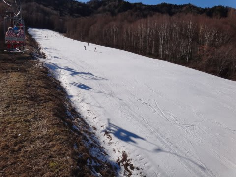
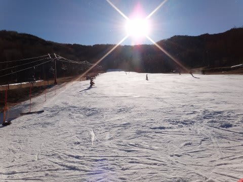
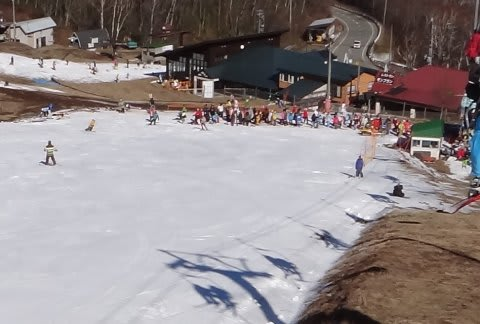

# 12月4日の八千穂高原スキー場速報…オープン2日目の状況

📅 投稿日時: 2011-12-05 00:34:28

今日は，土曜にオープンした八千穂高原へ行ってきました…

路面に雪もなく．夏タイヤで問題のない状況．

昨日の雨でゲレンデの雪が溶けちゃったかなぁ．

と思いましたが．

長さ約500mの緩斜面のペアリフト一本分．

コース幅ほぼいっぱいに，雪が十分ついてました．

をを！

昨日の荒天を考えると，考えられないグッドコンディションっ！

快晴なれど，気温は十分低く．

朝から夕方まで，しっかり締まった固めのバーン．

（夕方までこんな感じで荒れないまま！）

リフト待ちは午前中に最大10分弱まで行ったかと．

平均3-5分くらいかな？

予想より待ちましたが．

この時期としては，土も出ていない，夕方まで

全く荒れないきれいなフラットバーンで，

かなり恵まれた状況でしたね～．
