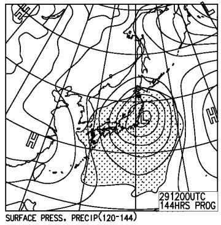

# そろそろ気になる…この年末の志賀高原のゲレンデコンディションは？

📅 投稿日時: 2014-12-25 02:53:44

えー．

年末年始休，9連休の人も多いと思いますが．

その中で，9日間ひたすらスキー場にこもる人もいると思いますが．

さらに，その中で，9日間，ひたすら志賀高原で過ごす方も

いるかと思いますが．←そんなやついるか！（ツッコミ）

そーゆー皆さんにとって．

先日23日の，最高のコンディションは，

年末年始までもつのか…

とゆーことが，たいへん気になるところ．

とりあえず，12月31日までの天気図をもとに，

この年末のゲレンデコンディションを予想してみましょう～

まずは．

まだ，この週末まで2日間あるわけですが．

その間は…

ふむ．

ふむむ．

…これは．

冷えて，雪になりますね．

25，26日の両日とも．

上に示した，500hpa図に赤く印した，-30度の寒気の線．

これが，北陸近辺まで下がってますし．

そして，25日の地上天気図は…

こんな感じで，見事に本州は縦縞の冬型天気図．

…これは，志賀も北風になり．

25日，26日と．

冷えたいい雪が積もりそう！

で．

この週末，休みが始まる27日の土曜には…

うむ．

こんな感じで，850hpaの0度線は見事に南まで下がっているし．

矢印で記したように，風も北よりだし．

25日～27日朝までは，雪が積もりそうで．

27日朝は，パフパフパウダーかな！

で，27日は，昼頃から晴れそう．

27日はねらい目だな！

そして．

27日夜9時の地上天気図は，こんな感じで…

すっぽり高気圧に覆われるので．

27日昼頃から，28日にかけては，晴天になりそうですね…

…これは．

27，28日は．

かなりいい感じになりそう！！！

絶好のスキー日和になる予感…！

…ただし．

ただしですね～．

28日夜9時の，850hpa気温図は…

うむ？？

なんだか，0度線．矢印で記したように．

北に上がっちゃいそうなんですが…

そして．

問題は．

29日，だ．

うむむ？？

うむむむむむ！？？

…850hpaの0度線が，矢印で記したようにかなり北に上がる

どころか，志賀高原には+3度の線がかかっているんですが…

これは．

昼間に降れば…

…

ここに書きたくない何かが．

空から落ちてくる可能性が…

そう．

個体ではなく．液体のまま，落ちてくる可能性が…（涙）．

そして．

29日の地上天気図をみると．

どかーーーん！！

日本は完全に降水域に覆われてます．

降ります．

29日は確実に降ります．

ってことは．

ということは．

…29日は，危険だ…

だけど，

そのあと，30，31日はこんな感じで，

850hpa0℃線も南に下がり，

志賀高原には-6～-9℃の線がかかっているので．

志賀高原は，朝はマイナス10℃以下まで下がります．

冷えますよ～．

そして…

地上天気図もこんな感じで，完全な冬型なので．

降ります．

30，31日，ともに雪になりそう．

なので．29日に溶けたゲレンデは，そのあと冷えてアイスバーンになりますが．

このアイスバーン，30，31日の積雪で隠れてくれそう…

30日は，下地が隠れきらないで，下地の硬いのがコンニチハしそうですが．

31日には，うまいこと隠れてくれるかな～．

ってことで．

まとめると．

27日：朝まで雪が降るけど．昼ごろから晴れ．冷え冷えの

　いい雪が積もって，朝はパフパフパウダーねらい目．

　終日雪質はいいけど，午後はちょっとぼこぼこに

　なっていくか…

28日：終日晴れ．朝のうちは気温は冷えており，最高シマシマ圧雪バーン！！

　昼間はちょっと気温が上がるけど，雪質はいいまま．

　午後まで比較的いいコンディションで滑れそう．

29日：……みなさん，日ごろの行いに気を付けましょう．

　朝から雲が多く．現時点の予想では，昼頃から何かが降ってきます．

　日ごろの行いが良ければ，湿雪．

　行いが悪ければ…

　…

　夜まで，液体が空から落ちつづけるでしょう．

30日：朝はアイスバーンorカリカリザラザラした感じの雪の上に新雪．

　終日雪．かなり降りそう．太陽は拝めない．

　視界も悪く，ゲレンデコンディションもアイスバーンと

　新雪の吹き溜まりが入り乱れた，難しいコンディションかと…

31日：朝から新雪．朝はパフパフパウダーねらい目かな？

　うまくいけば，この日には新雪でアイスバーンは隠れきって

　くれるか…

　とりあえず，この日も終日雪が降り続け，太陽は拝めない．

　午後に向かって，コースは荒れ荒れになるパターン．

という感じかな…

しかし．

なんだか．

しばらくありえないくらい冷えてドサドサ

降ったかと思うと，突然の雨…というパターンが

続いている気がするんですが．

とりあえず．

29日の天気が．

恐れている状況にならないよう．

スキーヤーのみんな．

全身全霊，全力を込めて．

祈るのだっ！！！！！！

## 💬 コメント一覧

### 💬 コメント by (TUKA)
**タイトル**: 天気図
**投稿日**: 2014-12-26 18:19:19

はじめまして。こんにちは。

いつもブログを楽しく拝見させていただいています。

僕もスキーをやっているので、天気図を使った

降雪予報を特に参考にさせてもらっています。

志賀高原ではほとんど滑りませんが、他のスキー場でも正直、その辺のネットの天気予報より的中率

かなり高いです！

そこで僕も降雪予報を少し勉強しようと思い、

Skier_Sさんが使っている天気図の画像？をどこで

入手しているのか教えていただけないでしょうか。

気象庁のHP等見たのですが見つかりませんでした。。

よろしくお願いいたします。

### 💬 コメント by (Skier_S)
**タイトル**: TUKAさま
**投稿日**: 2014-12-26 21:31:56

はいはい～！

いつも愛読ありがとうございます．

この天気図ですが，専門天気図で検索すると

いくつかヒットします．

一番確実なのは，日本気象の「地球気」

http://n-kishou.com/ee/exp/exp.html

でしょうか．

このうちの一部が，HBCのサイト

http://www.hbc.co.jp/weather/pro-weather.html

にあります．

いっぱい天気図がありますが，私がいつも

示しているのは

FXFEシリーズ，FXXN519，FZCX50，FEFE19

あたりです．

天気図の読み方で，わからないところがあれば

また聞いてください～

### 💬 コメント by (TUKA)
**タイトル**: Unknown
**投稿日**: 2014-12-26 21:51:48

ご返信ありがとうございます。

これから天気図を勉強していきたいと思いますので

またわからないことがあったらよろしくお願いいたします。

### 💬 コメント by (Skier_S)
**タイトル**: TUKAさま
**投稿日**: 2014-12-26 22:01:53

なんでもお気楽にお尋ねください（＾＾

本文中には書いていない，細かなノウハウやら

経験やらがいろいろありますので…

http://blog.goo.ne.jp/skier_nobu/s/%B9%E2%C1%D8%C5%B7%B5%A4%BF%DE

に，私が昔書いた文章があったりします．

ご参考までに…

