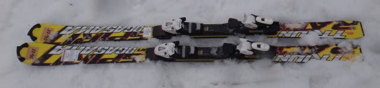
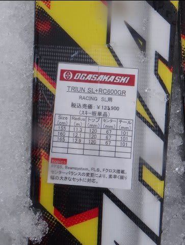
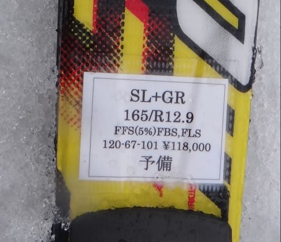
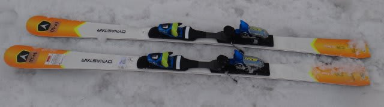
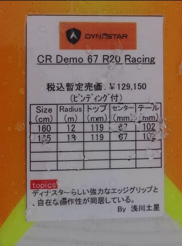

# お待たせ！2014シーズンモデルのスキー試乗レポートその11…OGASAKA＆DYNASTAR編

📅 投稿日時: 2013-04-24 00:31:10

🏷️ カテゴリ: [スキー板試乗](c0bd8048615710cee890e403a36cc9a2b.md)

えーー．

…「試乗レポート，忘れてるんじゃないか？？」

って思われてたかもしれませんが．

＃もしかすると，誰もそんなこと思ってないのかも…．

…とりあえず，復活です．

今日はオガサカのSL板と，Dynastarの小回り板です．

では，どうぞ～

---

OGASKA

TRIUN SL + RC600GR 165cm

SL競技用．

同じ小回り板ですが，TC-SGとはえらい違いです．

かなりしっかり，トップからテールまできっちりエッジグリップします．

張りが強く，板のトップのエッジが利いて曲がっていく感じです．

OGASAKAらしくない，エッジで曲がっていく板ですね～．

荷重ポイントは拇指球で，最近の板では珍しい，前より荷重な板です．

TC-SGより，こっちのほうがずーっとオートマチック性は強い感じ．

張りが強いので，スピード耐性は十分強いです．

意外と荒れた斜面でもコントロールしやすかったですね～．

TC-SGより，こっちのほうがゲレンデ履きでいけるかも？？

DYNASTAR 

CR DEMO 67 R20 Racing 165cm

小回り基礎用．

去年のSpeed GROOVEの，プレートを変えただけとの話ですが…

ちなみに，この1モデル下にDEMO 70って板があります．

70とか67って数字は，センター太さらしいですね…

この板は，ねっとりした踏み応えで，たわんで曲がっていく板です．

しっかりしたエッジグリップ．

フレックスは強いけど，すっとたわみ，たわみ量コントロールで

回転弧をコントロールできます．

ただ，R20プレートが重いのか，なんだか去年の板よりずっと重くなった気が…

そのため，不整地でちょっと足にずっしり来て，飛ばされたときの

コントロール性がちょっとつらい感じ．

整地だと安定性が良いんですけどね～．
