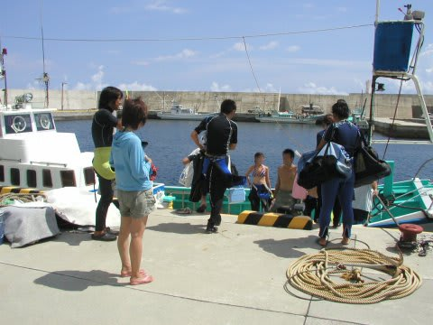
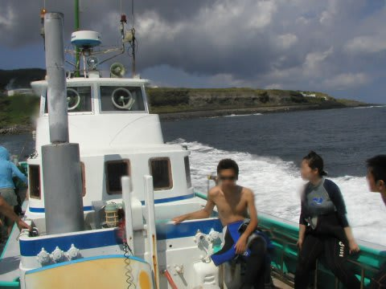
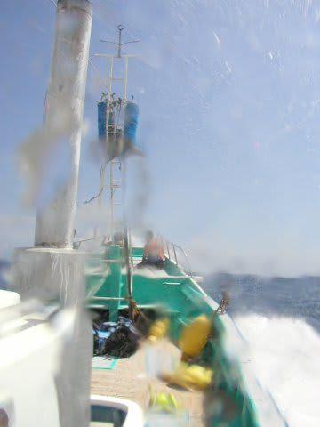
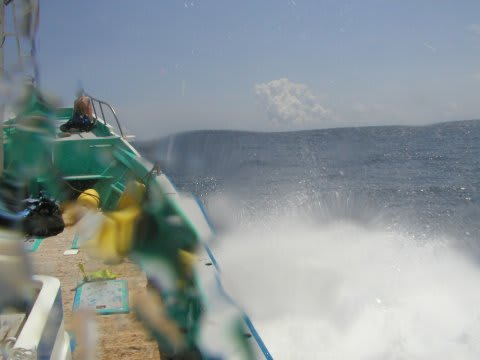
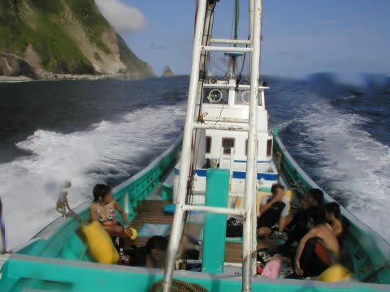
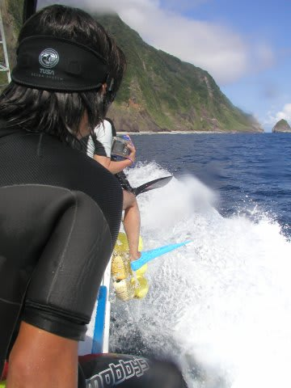

# 2007年8月　三宅島ドルフィンスイム＆ダイビング旅行記　その4

📅 投稿日時: 2013-09-12 02:36:11

🏷️ カテゴリ: [ダイビング日記](ce3a7a8d424d112fce83ee85c81a0e344.md)

えー．

実は本日．

すでにタオへ到着しております…

現在、ホテルでくつろいでます

どーでもいいけど．

「飛行機に乗ったら，飛行機のお弁当食べるんだ～！」

と．

今回も機内食をたいへんたいへん楽しみにしていた娘．

…おまえ，今回もそうだけど，いつも機内食ちょっとだけ食べて

「おいしくない」

ってほとんど残すじゃないか！

…何でいつもそんなに機内食楽しみにしてるの？

とりあえず．

明日からタオダイビングですが．

…今日は，引き続き三宅島ダイビングレポート行きます…

---

ってことで．

お弁当を食べた後，また車で港に向かい，

今度は，午後のドルフィンスイムの船に乗り込みます．

船は，漁船スタイルの結構大きめの和船．

デッキに屋根がないので，ゲストは直射日光の下で

過ごさねばなりませんが，一応トイレもついてます．

今回のゲストは8人ほど．

ドルフィンスイムは，三宅島の隣，御蔵島の周辺で行うわけですが．

三宅島から御蔵島までは，船で45分～1時間程度外洋を行かねばならず…

これが，結構ゆれます．

…船に弱い人はちょっときついでしょうね(笑）．

御蔵島滞在ならば，こんな苦労せずにドルフィンスイムが

出来るんですが．

御蔵島はなにぶん小さな島なので宿泊施設も少なく，

あっという間にいっぱいになってしまうので，よっぽど

早くから狙って予約しないと，御蔵島ステイは難しいです．

で，波しぶきを浴びて，びしょぬれになりながら御蔵島に到着．

かなり波が高かった…．

ドルフィンスイムの目的地，御蔵島に近づくと，

外洋に比べて波は収まってきます．

で．

御蔵島に近づくと，船長から手順の説明があります．

まず，イルカを探しているときは，見つかったらすぐに

飛び込めるよう全員右側の船べりに座ること．

見つかったら，イルカを右側に見るように走り，ころはよし

というところで「飛び込め」の合図を出すので，ほかの人に

ぶつからないように飛び込む．

合図で飛び込めなかったら，適当なタイミングで勝手に

飛び込まないで，指示を待つこと．

イルカのすぐそばではなく，イルカの行く先を読んで，

ちょうど飛び込んだところに，船の前からイルカが

泳いでくるような位置に落とすので，船の斜め前，

舳先方向にひたすら泳ぐこと．後ろに行くとスクリューに

巻き込まれるので，後ろには行かない．

イルカがどこに行ったか分からなかったら，船を見れば

どちらに行ったか指示している（こともある）．

船はイルカをみんなの方に追い込むように動く．

イルカが離れていったら，一旦船に上がる．

その際は，指示するのでみんな固まって．

写真撮影は，フラッシュ禁止．

…といった感じでしょうか．

今回，参加者全員がダイバーだったと言うこともあり，

「全員ダイバー？じゃぁ，いいよね」と，スキンダイブに

対する基本説明は無かったけど…

普段はなにか説明あるのかな？

では，説明も終わったし．

いざ，ドルフィンスイム本番へ！

## 💬 コメント一覧

### 💬 コメント by (伽羅。)
**タイトル**: ジンベエ
**投稿日**: 2013-09-12 05:14:26

タオ、今ジンベエ出てるみたいですね！

会えると良いですね♪

### 💬 コメント by (Skier_S)
**タイトル**: 伽羅さま
**投稿日**: 2013-09-12 22:56:56

今日は1日目のダイビングしてきました～

波が高くて近海しか潜れず，

ちょいと残念な感じのダイビングでした…

明日も波は高そうです(涙）

昨日潜った人たちは，午前中ジンベエ見れたそうで…

一日早く来れば（涙）

