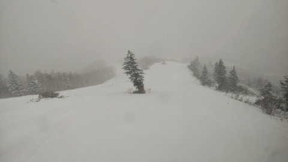

# え？4月17日(月)の志賀高原は積雪10cm！？…でもすごい重い雪だったみたい

📅 投稿日時: 2023-04-18 03:02:41

本日も，いつものおこみん特派員から

写真が送られてきましたが…

昨日の記事の最後に，

　そして，月曜はかなり冷えてくれそう！！

　…でも，雪はパラパラ程度で，積もるほど

　降ってくれなさそうだし

と，書いていたけど．

意外と積もりましたね

積もるほど降ってくれなさそうどころか．

この時期としてはおこみんが埋もれるほど，

まぁまぁの量積もったようで…

だいたい10cmくらいかな？？

あさイチの気温は-2℃と，そこまで寒くない

ものの…

このしばらくで言えば結構な冷え込み！

周りの景色も，冬に戻ったみたいに

見えますね！！

ただ，この日は午前中ずっと雪が降り続いた

みたいで，それもかなり湿った重い雪だったので…

一見バーンはまともに見えるけど，

曲がるのがつらいレベルの，鬼のように重い雪

だったみたいです（涙）

そして，下地はかなり硬かったみたいで．

硬いアイスバーンの上に死ぬほど重い雪が

乗った，かなり残念な感じの，楽しめない

バーンだったようですね…

まぁ．

でも．

雪が減っていくよりずっとマシ．

明日の朝はこの雪が圧雪されていいコンディションに

なるんじゃないかな？？？

…ただ．

明日は気温が上がりそうで…

ヘタすると，午後にパラパラ雨が降るかも（泣）

その後は，19，20，21日と高温が続き…

20日の850hpa図は，水色の+15℃線が志賀高原に

かかるという，

「真夏か！？？？」

という激烈高温になります（強烈涙）

ってか，このBlogで志賀の天気予想をしている

時期に，志賀高原に+15℃なんて線がかかった

ことはないぞ！？？

で．

超高温の20日から21日のあとは…

なんと，22日の週末から，水色矢印で

示すように，平年より4～6℃低い冷え冷えに

なりそう…！！！

…ただ，冷えるだけで雪は降らなさそうですが…

とりあえず，20～21日の高温を乗り切れば，

この週末は何とかなりそうかな？？

とりあえず．

昨日速報した，日曜の焼額山の雪の状況を

もう少しお伝えすると…

今，滑れるのはパノラマコースとパノラマイン，

そしてGSコースですが…

パノラマコース側は，山頂部分の雪の量は

申し分なし！！

まだしばらくはもちそうです…

途中の落ち込みの壁の部分も，まだ真っ白．

ただ，急斜面の終わりかけの部分に

数か所草の頭が見えてきているところも

ありますが…

まだ，土が出てくる気配はなし．

4ロマ降り場より下の，サウスコース

部分も，まだ全面真っ白に見えますが…

ここは，実はそろそろところどころ

ブッシュエリアが出て来ていて，

数か所だけ雪が薄いところもでて

きました…

そして，パノラマコース側から

1ゴンへ戻る廊下部分．

ここは，かなり幅が狭くなってます（涙）

まだイーストコースの雪が残って

いるので，そこから雪を出して繋いで

いるようです．

イーストコースの雪のストックが

どれだけあるのかな…

ヤバいのは，第3高速リフトをくぐって

東館に向かう当たり．

写真だと一見真っ白ですが…

真ん中あたり，雪が薄くなって透明に

なってきているところが…

これは結構やばい．

どこかから雪を持って来て埋めないと，

ポッコリ穴が開いちゃう感じ…

で，今度はGSコース側．

こっちも山頂は積雪十分で，ブッシュの気配も

ありませんし…

GSコースのメイン部分も，一部雪が薄く

なってきてますが，もう少し行けそうな感じ．

ただ，ヤバいのは…

突き当たって右に落ち込む部分．

ここはコース幅半分に雪が寄せられてますが…

それでも，雪を寄せた部分の雪も薄く

なってきていて…

人が滑ると，結構下地が出てきてます（泣）

いや…

この部分は，斜面が急で，人が滑ると雪が

削れちゃうので，どこかから雪をもって

こないと…

ここが一番ヤバいです．

でも．

その下も，まだ雪は結構残っていて．

最後の迂回コースの部分，一見雪が

少なそうに見えますが．

ここは，オリンピックコースからおろして

きた雪が積まれていて…

向こうに雪が削られて地面がむき出しの

オリンピックコースが見えますが．

この，オリンピックコースからの雪や

いろんなところの雪を寄せていけば，

もう少し営業は行けそう…

ってなことで．

一部雪が減ったところはあるものの，

今日もちょっと雪が積もったことも

あるし．

今週はそんなにひどい雨もなさそうだし．

いろんなところの雪を寄せれば，今週末は

行けそうかな～．

というか．

今週末と言わず，GWまでもってほしいけど…

うーん．

やっぱりそのためには，+10℃で水が凍るようにするか，

GWを2週間繰り上げて，4月23日頃にGWが終わる

ようにするしかないのかな…←どっちも無理な相談だから
