# 11月30日夜からの寒気が弱まってるよ（涙）…そして2022/11/26(土)のイエティ詳細ゲレンデレポート！

📅 投稿日時: 2022-11-28 00:53:46

🏷️ カテゴリ: [2023スキー滑走日記](cd943df30cfcc3d0896469e2ff98720cd.md)

ってなことで．

今週末も冷え込みが足りず，あらたに

オープンするスキー場が無かったわけ

ですが．

一応，予想通り11月30日から寒気が

下りてくるので，12月1，2日と

冷え込んでくれそうな感じなんですが…

たいへん悲しいことに．

日を追うにつれ，この寒気の予想が

だんだん弱まってきました（泣）

最新の予想では，水色の矢印で示す

12月1，2日に，平年よりちょっとだけ冷える

程度の予想にレベルダウンしてしまい

ました（激泣）

なんてこった…（涙）

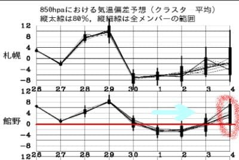

この，ちょろっとだけ冷え込む期間．

12月1日の850hpa気温は，赤い0℃線が

太平洋まで下がってくれていて．

そこそこの冷え込みになりそうなんですが…

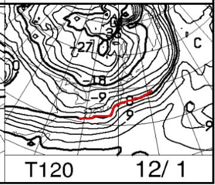

12月4日の850hpa図を見ると…

赤い0℃線はまた日本海側まで

押し戻されていて．

標高の低いところでは，降れば雨の

気温に見えます…（涙）

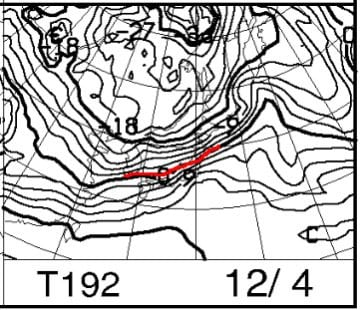

うがーーー！

冷え込みは一瞬で，また4日にはすぐ

気温が上がっちゃうのか…！！

…と，嘆いていたところ．

[気象庁の週間予報解説資料](https://n-kishou.com/ee/image4/lfax/skaisetu_202211271000.pdf)を見てみると．

下側のずらっと並んでいる天気図が，

12月4日の予想のばらつきを示す図なんですが．

（厳密には，アンサンブル予想（ENS）のグループ平均）

どの予想も，赤丸で囲ったところに低気圧が

予想されていて．

南岸低気圧が近づいて気温が上がる

天気を予想しています…

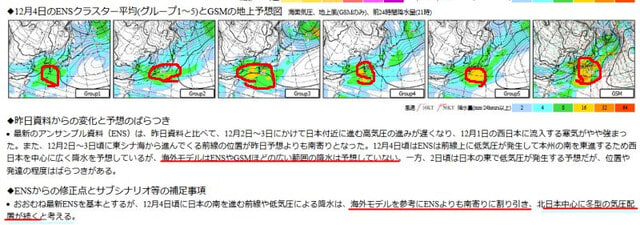

ただ，赤線を引いてあるところを読むと，

12月4日は，

「海外モデルは（気象庁予想の）ENSやGSMほどの

広い範囲の降水は予想していない」

と書いてあり．さらに，

「海外モデルを参考にENSより南寄りに

割り引き，北日本中心に冬型の気圧配置が

続く」

と書かれてます！！！

…これは．

要するに．

気象庁のコンピュータ予想では12月4日は

気温が上がることになっているけど，

実際はそこまで上がらないはず

という，職人の読み込み技が現れてます！

…ってなことなので．

おそらく12月4日は，下の図の赤丸で囲った

予想よりは気温が冷え気味になりそう…！

ちょっと一安心…

しかし，これは

「気象庁のコンピュータ予想では

こうなんだけどな～．

海外のコンピュータ予想は違うから，

そっちに寄せるか」と，

気象庁の人が気象庁のコンピュータ予想を

信じなかった

ということを暴露してますね(笑)

ってなことで，とりあえず10月30日から，

12月4日を超えて冷え込みは続くんじゃないか…

という予想ですが．

ただ，この冷え込みが当初の予想より弱い

ことは間違いなく．

天気図（[FXXN519](https://www.hbc.co.jp/tecweather/FXXN519.pdf))をさらに見ると…

12月4日の500hpa高度図．

なぜ，12月に入っているのにこんな立派な

サブハイが居座っているんだ？？？

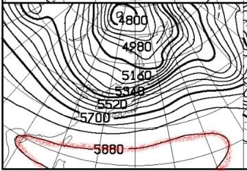

この，5880mの等高度線．

これが北緯30度より北に上がると，

初夏の陽気になる目安なんですが…

下の図を見ると，11月28日ごろには

北緯30度(30N)に近づいてます(泣）

これ…冬のサブハイの位置じゃない…(涙)

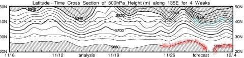

ただ，上の図の水色の5400mの線．

こいつが40Nより南に下がると，

そこそこの冷え込みの目安なので．

11月30，12月1，2日あたりは40Nより

下に行っていて．

ここはボチボチ冷え込みそう…

でも．

このサブハイ（5880m線で囲われている夏の空気）が

まだ居座っているようでは…

冬の空気（5400m線）が南下できず．

それほど強い冷え込みにならなさそう（泣）

果たして．

このサブハイはいつまで居座るのか？？？

もう12月だから，早く本格的な冬の天気図に

なってほしい…

ってなことで．

スキー場がオープンしてくれないと

「いつ雪が降るんだ～！！！」

と気になって，長々と天気図解説を書いて

しまうので．

もう，記事がかなりの長さに…

それにも関わらず，ここからさらに，

土曜のイエティの詳細レポートです！！

まず…

土曜あさイチはどしゃ降り．

8時ごろから，ホントのどしゃ降りでした．

ただ，9時を過ぎるとちょっと弱まったので，

9時過ぎに滑走開始！

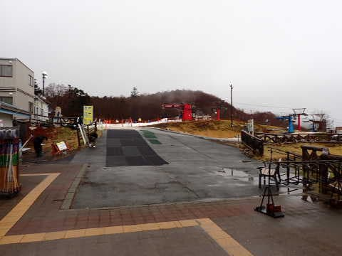

雨が降ってたこともあり，ゲレンデは

ガラガラ！！

雨で雪がザブザブかと思ったら，硫安が

しっかり効いていて，むちゃくちゃ板が

走るいい雪でした！

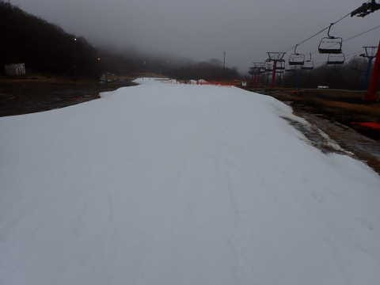

そして，10時過ぎまではコース上の

人は極めて少なく．

スピードも出るし，コース幅も広がったし．

ゴーグルに水滴がついて見にくく，

全身濡れることを我慢すれば，

今シーズン1番気持ちよく滑れました！！

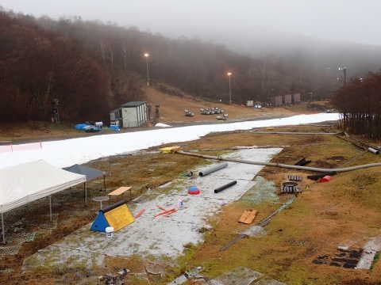

ただ．

臨時にコース横にパークができていて，

一部コース幅がちょっと制限されてました…

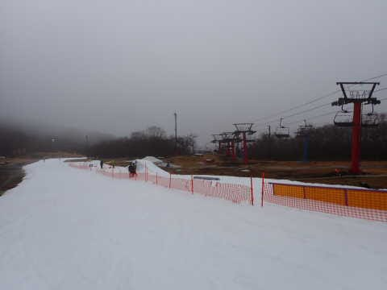

でも．

コース幅も結構広がったし．

板も走ってくれたので．

この日の朝は，かなりスピードを出して

気持ちよく滑れましたよ～！

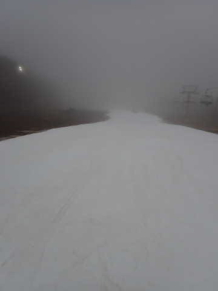

…でも．

10時過ぎには雨が止んで…

そうすると，人が徐々に増えてきて．

10時20分ごろからリフト待ちが出始め…

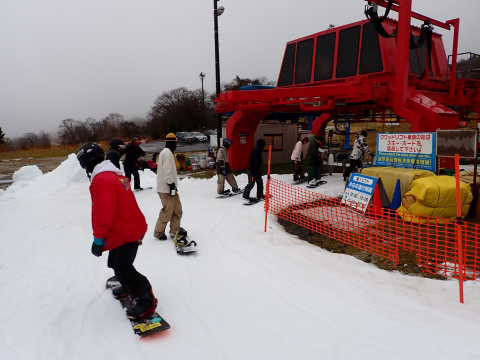

コース上の人もかなり増えてきました（涙）

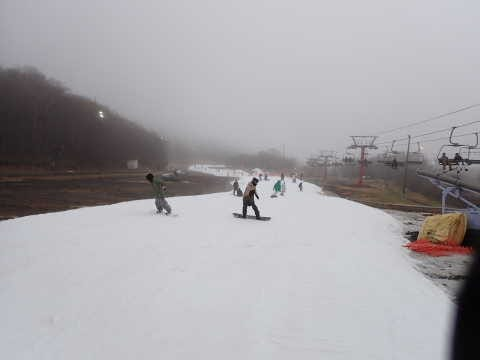

11時ごろには一気にリフト待ちも伸び．

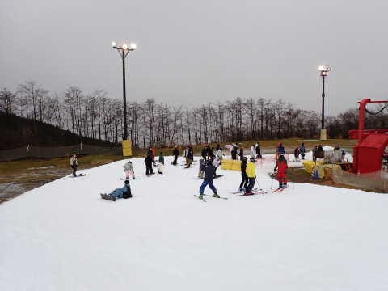

リフト待ちも伸びてきたので，

12時前には，ペアリフトも動き出し

リフト2台体制に．

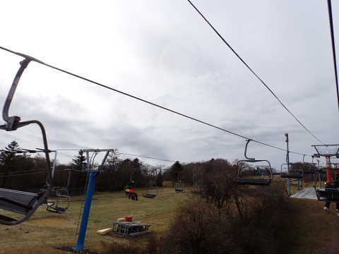

リフト2台でコース上に人が送られ

るようになってしまったので…

11時半ごろのコースは，もう快適に

滑るのは難しい混雑具合に…（泣）

あぁ…雨，やまなくて良かったのに…

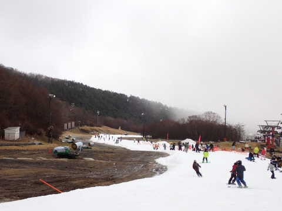

そして．

午後1時ごろには，曇り空ながらも

富士山が見えるほどに視界も良く，

時々青空も見えるほどになり…

そのせいで，さらに混雑度アップ！！

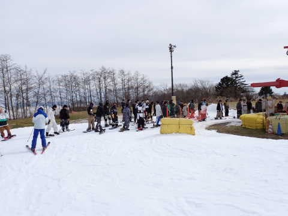

もう，ゲレンデ上は完全に普通の土日と

同じレベルの混雑になってきましたね…（泣）

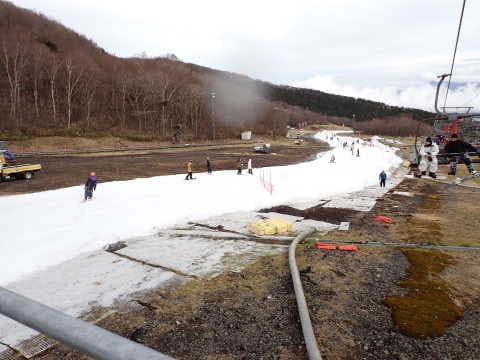

でも．

この日は夕方に向かって，さらに人が

増えていき…

一番人が多かったのは，16時近くの

コース整備クローズ直前じゃないかな？？

リフト待ちは5分を越えてきたかと…

ただ，ペアリフトは待ち数組で

乗れたので，リフト待ちはそこまで

苦になりません．

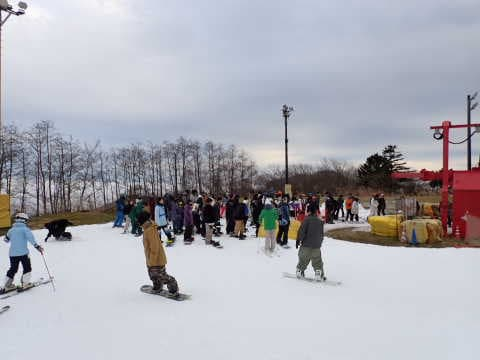

ただ，朝のガラガラを知ってしまうと，

もう，この人口密度で滑るのは…

とりあえず，午前は天気が悪かった本日．

15:30からのナイター券で滑ろうって

人が多かったのかな？？

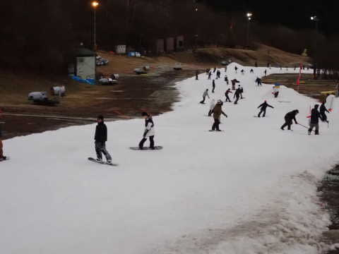

ってなことで．

16時頃，さらに駐車場の車が増えて

いくのを見て．

「これは，ナイターの方が昼間より混むな…」

と思い．

今日は午前中で満足なガラガラバーンを

十分滑れたのもあり，16時のコース整備

クローズで切り上げたのでした…

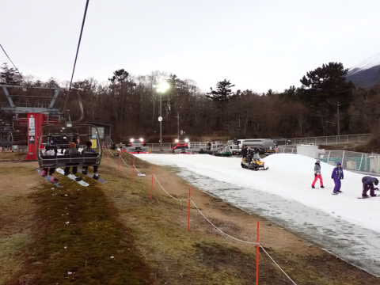

…しかし．

まさか12月最終週までイエティで滑ることに

なるとは思わなかった…

来週は，予定通り焼額がオープンすることを

祈るばかり…←踊るばかりの間違いでは？
