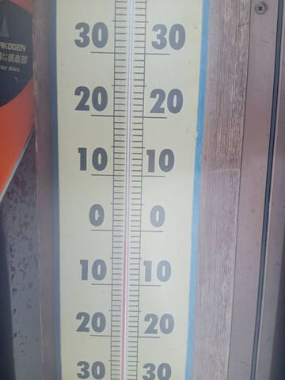

# 2025/3/9(日)の志賀高原スキー場詳細レポート！…午前は雪降りだったけど雪はいい感じ！午後から晴れて3月にしては最高コンディション！

📅 投稿日時: 2025-03-12 00:36:10

🏷️ カテゴリ: [2025スキー滑走日記](cacd3fbf84d4a679ee61a5894c3f95e14.md)

えー．

本日11日(火)の志賀高原ですが．午前中は

降らず，夜遅くから明日12日にかけて，

液体が降ると思ったところ．

予想はちょっとズレて，今日は朝9時過ぎ

くらいから志賀高原でも空から液体が

降ってきたようです…(涙)

幸い，それほどひどい雨じゃなかったようで，

さらに11時くらいからはウエアに着くと

すぐ融けてウェアがしっとりするような

湿った重い雪ではあるものの，

雨は雪に変わり．

その後2時くらいまで雪が降り続けたようで…

気温も昼過ぎにはマイナスになってみたい

です．

気温がマイナスになったので，雨でぬれた

下地は硬くなって，午後は硬い下地のうえに

しっとりした雪が乗ったゲレンデ状況だった

ようです…

ってな感じで．昨日の月曜とうって変わって，

かなり残念な天気だった，今日の志賀高原

だったわけですが．

ただ，今日，予想外の液体が降ったからか，

明日は気温が上がるものの，液体は降ら

なさそうな予想になってきました…！！

おそらく12日水曜は曇り～晴れ，

13日木曜は晴れそうな感じ．

でも，積雪がないからバーンはかなり

硬めのアイスバーン状態かも…

うーん．

14日金曜も晴れそうだから…

この週末の土曜はカリカリコロコロバーン

の可能性が？？

ただ．

日曜の朝は，液体じゃなく固体が降って

くれそうな気配が出てきたので…

日曜はちょっと雪が回復するかも？？

ただ．午後に液体に変わる可能性も

残っているので．

まだまだ安心はできないです…

でも，その後17日の月曜には雪が積もって

くれそうで，そのあと冷えるので…

20日の祭日にはゲレンデは良くなってるかも？？

ということで．

今週末の志賀高原は，あんまりいい感じでは

なさそうですが…

かなりいい感じだった，おとといの日曜日の

志賀高原．

今更ですが，詳細レポートです！！

…まず．

いつも通り，朝イチ8:30の通常営業開始前に

焼額第１ゴンドラに並びますが．

今日はいつもより列が短めですね…

3月に入って，お客さんが減ったのかな？

そして，朝イチゴンドラで山頂に上がると

朝の気温は-8℃と，予想の-10℃近くまで

下がってます…！

…が．

　たぶん朝イチは曇り

という予想はちょっと外れて…

朝から雪が降ってますね（泣）

それも山頂付近はちょっと視界が

悪くなるくらいガスが出てる感じ…（涙）

でも，

　プチ低気圧の位置によっては，

　もしかすると前日の夜に数cmの

　積雪があるかもしれないけど，

という予想の部分は当たった

ともいえるのか…

硬いバーンの上に昨晩ちょっと積もった

雪が圧雪されて，しっかりとした下地に

エッジが効く雪が乗った，いい感じの

圧雪バーンなんですが！！！

…これは…

朝イチは天気が悪かったのは惜しいものの．

トップシーズンの柔らか圧雪とはまた

違った，スピードが乗ってガンガン傾ける，

快楽の圧雪バーンではないか！！！！

視界が悪いのはコース上部だけで，

下に降りてくるとちゃんと見えるし…

いや！！！

この締まったハイスピード圧雪バーン，

楽しいよ！！！

…しかし．

なんということか…！！

今日も朝イチから，故障のために第2高速

リフト運休っ！！！！

白樺コースと唐松コースはコース閉鎖に

なってます（涙）

うーん．

ここしばらく，2高が故障で数日運転できず．

1ゴンも数日止まり．

今日もまた，2高が動かないのか…！！

とがっくり来ていたところ．

「試運転しているので，もうじき動きます～！」

ということで．

終日運休ではなさそうなので，ちょっと

安心…

しかし．

2高が動かず，一ノ瀬から人が流れて

来ないからか，今日の焼額はガラガラ！

雪がこんなにいいのに全然荒れず，

これはかなり楽しいよ…！！

と，

第1ゴンドラを気持ちよくグルグルして

いたら…

10時直前に第2高速が営業開始！

ほぼ一番で白樺コースに飛び込んだら，

貸し切りバーンで最高！

そして，オープンしたての唐松コースも，

朝10時過ぎなのにシマシマが残っていて…

第1ゴンドラをグルグルして楽しんだ後に，

また最高のシマシマバーンを楽しめる，

このシアワセ…！！！

ってなことで．

人もいなくて荒れてなくて，シアワセな

第2高速をグルグルしてましたが…

今日はまた訳ありで，ちょっと昼間に

焼額の重力圏を脱出し，一ノ瀬に顔を

出してみましたが…

一ノ瀬ファミリーの正面バーンは，

カリカリに凍った下地の上にモサモサの

雪が乗った，かなり楽しくないバーン

コンディションだったので，早々に

退散．

午後2時前に一ノ瀬ダイヤを通って

焼額への帰路にむかいますが…

あれ？？

なんだか，青空が見えてきましたよ！！

そして，焼額に着いたら…

見事に晴れてきましたよ～！！！

焼額は，雪もいいしフラットだし，

コースの人口密度も低くてゴンドラも

ガラガラだし…

いいんですか？？？

午後になってもこんなにフラットで，

さらに人がいなくて．

朝と変わらない，しっかり締まった

いい感じのハイスピードバーンを，

人を気にせず好き放題飛ばせます！！！

ぐおおお！！シアワセ！！

GSコースは，午後遅くになるとさすがに

ちょっと凸凹が出てきて，一部下地の

硬いのが出てたところもあったり…

急斜面のオリンピックコースは

コロコロが出てたりしたけど．

それ以外のコースは，最高なんですけど？？？

3月になって，こんなに天気がいい中を，

これだけいい雪質でガラガラで滑れて

いいんですか！！？？？

午前中はすっきり晴れじゃなかったのが

惜しいけど．

午後になって晴れてきてくれて．

午後までもこんないいコンディションが

続いてくれるとは…

今日は恵まれてる！！！

ってなことで．

日が傾くラストまで，今日はこんな感じで

全く荒れてないフラットなハイスピード

バーンを堪能できて…

まだあと2時間でも3時間でも滑っていたい…

と思いながらも．

残念ながら営業終了時間になってしまい．

泣く泣くスキー場を後にしたのでした…

いやーーーー．

良かった．

かなりいい感じになると予想したこの週末，

土曜はそこまでよくなかった感じだったけど．

日曜は予想より良かったよ…！！

今週末も，日曜は液体が降らずに

固体が降ってくれて，またいい週末に

なるように願いたいところ…

…そうです．

このBlog読者2億4000万人全員が力を合わせ，

久しぶりの冷え冷え踊りを休まず止まらず，

ひたすら週末まで踊り続けるのだ…！！←怪しい宗教みたいになってきた…

## 💬 コメント一覧

### 💬 コメント by (マルハバ)
**タイトル**: 一ノ瀬は昼頃でしたか・・
**投稿日**: 2025-03-12 07:21:36

もしかすると久々にお会いできるかな？と思っていましたが、早々に帰京せねばならず朝イチからダッシュで5台試乗して10時過ぎには上がってしまいました。

ただ、お会いできても「硬いニットキャップ」姿のSさんでは分からなかったかもしれませんが・・

### 💬 コメント by (レインボー77)
**タイトル**: Unknown
**投稿日**: 2025-03-12 13:57:29

水曜日の志賀高原情報

朝の蓮池+3℃。春うららのまったりした日、白樺、唐松は雪が食いついて快適勘違い5点。イーストも完璧5点。オリンピックもターンしやすく5点。GSも広々使えて5点。奥志賀の三高は私の要求が高いので4点かな。エキスパも噛んでくれてお代わり連続で5点。上手い人がいるなと思ったら、エス様の特派員でした。11時過ぎはバスを目指して、エキスパ横の迂回路をいかに速く抜けるかが楽しいけど、私はまだまだ未熟。最後キッズパークをかっ飛ばしていたら、いきなり妖怪板掴み！あまりに暖か過ぎて、妖怪がついに出現。そこから下のあまり踏まれていない所には、いーっぱい繁殖していましたよ。

### 💬 コメント by (レインボー77)
**タイトル**: Unknown
**投稿日**: 2025-03-12 13:59:18

そうそう、帰路(12時)の蓮池は+8℃、上林は+14℃でした。

### 💬 コメント by (Skier_S)
**タイトル**: 今日も雨だったのか…
**投稿日**: 2025-03-13 01:46:37

＞マルハバさま

あら…10時には上がっていたのですか．

そのころはまだ焼額を滑ってました…お会いできず残念です（涙）

＞レインボー77さま

午前中早いうちは良かったみたいですね～…

午後は雨になったようなので，いいタイミングでしたね！

…しかし，今日の雨で雪がやられてるので，明日のゲレンデ状況は良くなさそうですが…

