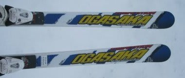
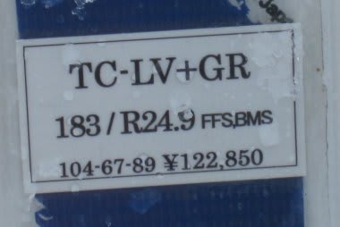
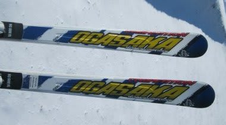
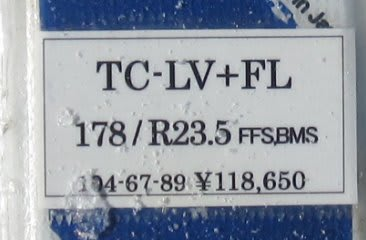

# 今度はロング板編！2012/2013シーズンモデルのスキー試乗レポート　OGASAKA編２

📅 投稿日時: 2012-05-18 23:40:55

🏷️ カテゴリ: [スキー板試乗](c0bd8048615710cee890e403a36cc9a2b.md)

ということで．

明日はかぐらにいくわけですが．

…込みそうですね～

とりあえず．

OGASAKAのスキー板試乗インプレッション続きます．

今度はロング用板！

---

TC-LV＋RC-600GR 183cm 

大回り基礎用．

強い．

強いよ．

あと，重い…

雪面に張り付く重さ．

そしてまっすぐ走る…

R=25 って，熊の湯で試すにはRが大きすぎるか．

GS-23よりよっぽど手ごわい．

かなり想定スピード域が高いようで，低速では

何にもできない感じ…．

ちょっと荒れた斜面で履くと怖いかな．

人がいないぴかぴかの整地で，トップスピードで

飛ばせばおそらくこの板の性格がわかる気が…

すいません．

この板の183cm，この雪の状況では，私に履きこなせ

ませんでした…

TC-LV + RC-600FL 178cm

大回り基礎用．

さっきの183cmがちょっと手ごわかったので．

長さが短いのを履いてみました…

プレートも弱めのをチョイス．

…これがTC-LVで一番短く，かつ一番弱いプレートがついた，

一番やさしいモデルなのね．

あー．これなら何とか扱えるかな．

R=23くらいらしいけど．

GS-23よりRが大きめに感じられるなぁ．

んで，GS-23より操作性は重め．安定感はあるな．

でも．

大回りスペシャルな感じがびんびん伝わってきます．

178cmでも，熊の湯の短いコース＆下部の緩斜面では，

その本領を発揮できない感じ．

結構しっかりしていて，たわませられない…

ただし，GRプレートのものよりはたわみます．

トップが内側に入ってターンする感じが，GS-23に比べると

ずっと弱いです．

うーん．とりあえず，TC-LV，かなりレベルの高い板でした．
