# 1月20，21日の志賀高原スキー場の天気は…土曜は曇り，午後は湿った雪．日曜は朝から湿った雪で，標高が低いと雨(涙)

📅 投稿日時: 2024-01-19 02:59:07

本来なら，水曜深夜に天気予想するはずが．

昨日はすっかり寝てしまったので，本日は

1日遅れの週末の志賀高原の天気予想です！

…の前に．

本日木曜の志賀高原，特派員から写真が

送られてきました～！

木曜の志賀高原は，午前中は日も差す

タイミングもあったようですが，

午前から時折雪がぱらつく志賀高原．

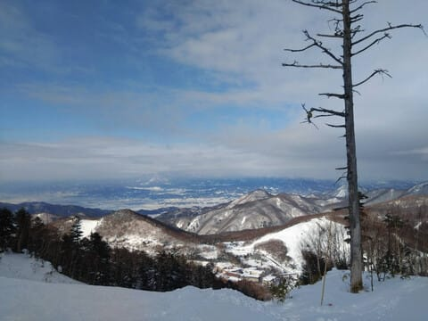

さすが平日はガラガラ！

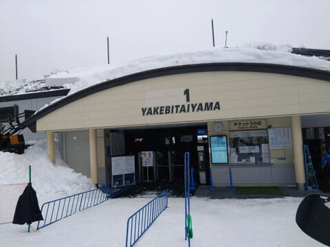

今日は気温が高かったらしく，午後は

ふもとでは雨っぽい雪がぱらついていた

ようで，ちょっとゲレンデの雪が

しっとりしてきてたようですが…

午後になると硬い下地が出てきたところも

あったみたいで．

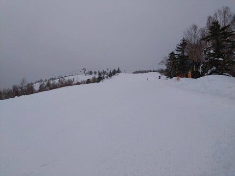

そして，午後3時を過ぎると，そこそこの

降りの雪になったようです…

と言っても，かなり気温が高いので，

ぎりぎり雪になった感じの，ウェアに

着くと濡れちゃう感じの雪だったようで…

山頂はまぁまぁの雪が積もったようですが，

ふもとの雪はかろうじて雪，という程度の

ベタベタ雪だったみたいです（ちょい涙）

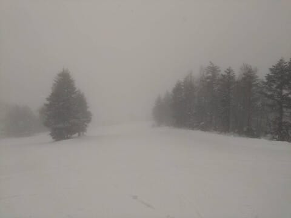

ってな感じで．

本日木曜は，かなり気温が高く，

ぎりぎり雨にならずに済んだ感じ

だったようですが…

1月中旬，トップシーズンの志賀高原と

考えるとちょいと残念な感じ（泣）

で．

明日の焼額山．第3高速リフトが動かず，

第4ロマンスが代わりに運転になるようですので，

ご注意を…！

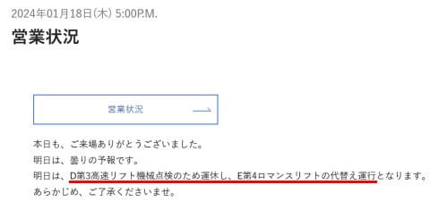

（[志賀高原焼額山スキー場ホームページ](https://www.princehotels.co.jp/ski/shiga/winter/)より）

ってなことで，本題へ．

いつもの専門天気図による，週末の

志賀高原の天気予想です～！

まず．

19日金曜夜9時の850hPa図ですが．

うーーーーん．

赤い0℃線が志賀高原ぎりぎりにある

感じ…

これは，1月としては異常な高温

ですね（涙）

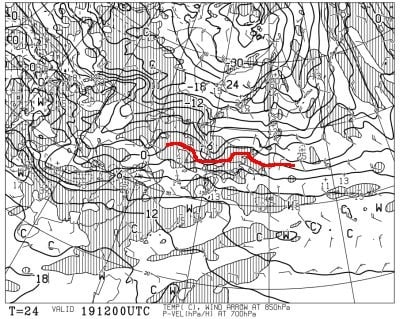

そして，同じく金曜の地上天気図を見ると…

この日は水色の降水域は本州にはかかって

おらず，曇り～晴れの感じ．

うーん．これで晴れると，南斜面の雪は

1月の雪と思えないほど緩みそう…（涙）

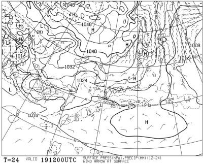

続いて，週末土曜の20日の850hPa気温を

見てみると．

うううーーーん．

この日も赤い0℃線は志賀高原にかかる程度で，

1月としてはかなりの高温ですね（涙）

まぁ，この気温なら志賀高原なら降っても

雪だと思いますが…

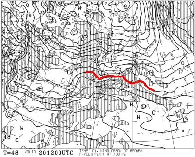

そして，土曜20日夜9時の地上天気図を

見ると．

うううーーーん．ぎりぎり志賀高原に

水色の降水域がかかるかどうかという程度

なので…

この日はリフト営業時間は降らずに

済むかな？

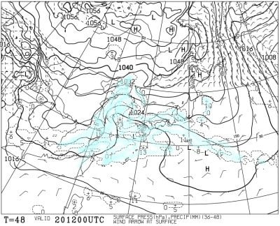

で，日曜21日の850hPa気温図を見ると．

うぎゃーーーーー！！！

赤い0℃線，志賀高原より北に

行っちゃってるよ！！？？

志賀高原に近づいてるのは+3℃線で．

…これだと，山頂付近は雪だけど…

焼額でもリフト乗り場近辺はヤバい．

そして，志賀でも西舘山より下の

スキー場は…液体が降る可能性が（涙）

ぎりぎり液体にならずに済むと信じたい…

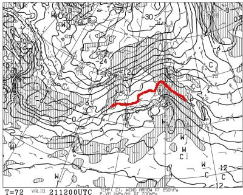

この気温だし，降らなきゃいいな…

と思いつつ，地上天気図を見ると…

ダメだ（涙）

本州全面，降水域でおおわれてます．

終日降りそうな感じです（泣）

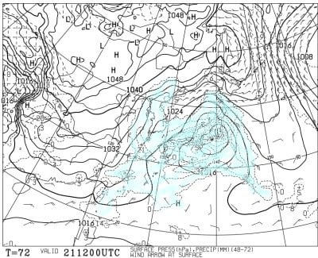

ってなことで．

まとめると．

19日(金)：朝イチは曇り空，

　あさイチの気温は-4℃程度と

　この時期にしては高め．

　あさイチのゲレンデは重めの雪が

　圧雪された，締まった感じの滑り

　良い圧雪バーン．ただ，場所によって

　コロコロが出て滑りにくいところも

　あるかも…

　昼間は気温がプラスを越えて上がり，

　日差しも出てくるので，

　南斜面のバーンは緩み3月のような

　湿った雪になっていく．

20日(土)；朝は晴れ～曇り．

　あさイチの気温は-4度程度，晴れると

　放射冷却でもう少し冷える．

　朝はトップシーズンの柔らかい

　シマシマではなく，昨日緩んだ雪が

　圧雪された，硬めのシマシマ．

　でも，あさイチは結構いい感じ．

　ただ，昼間は気温も上がり，

　プラス気温になるので

　雪はちょっとしっとりしていく．

　ただ，昼は曇り空なので19日ほど

　雪は緩まないか．

　午後はしっとりした雪が多少荒れる

　けど，新雪が積もった日に比べれば

　荒れ具合はマシ．

21日(日)；昨晩から重い雪が5～10cm

　ほど積もっているか？

　あさイチの気温は-1～-2℃程度と

　1月の志賀高原ではあってはならない

　高温（涙)

　あさイチのバーンは圧雪の上にうっすら

　重い新雪．

　朝から湿った雪がちらちらと降り続き，

　昼頃には標高が低いところはみぞれ～

　雨っぽくなりそう…

　ゴーグルに雪がついて見にくい感じ．

　ただ，降りはそこまで強くならない．

　パラパラ降る程度．

　早ければ昼過ぎ，遅くとも夕方には

　やむ．

　午後は重い雪が蹴散らされて荒れた

　3月下旬ころのバーンコンディションに

　なりそう．

　

…ってな感じでしょうか…

残念ながら，土曜はまだしも日曜は

微妙な感じの天気になりそう(涙)

…でも，ザーザーぶりの雨とかでは

ないので，そこまで雪が解けちゃうほどの

ひどいことはないのが救いか…

むしろ，雪不足で下地ができてなく，

いきなり地面の上に軽い雪が積もった

だけなので，すぐ削れて土が出てきちゃう

ゲレンデに，重めの湿った雪で下地ができる

いいチャンスなのかも…

そして，

この下地ができた後．

23，24日の火・水曜日でかなり冷えた

いい雪が結構降ってくれそうな予感…！！

　

パウダー狙う人は，24・25日あたりが

ねらい目ですよ～！！

## 💬 コメント一覧

### 💬 コメント by (レインボー76)
**タイトル**: Unknown
**投稿日**: 2024-01-19 13:11:44

金曜日の志賀高原情報

階段が嫌なので、今日も8時20分稼働のダイヤ上陸。

すぐに焼額2高へ。唐松はフラットで気持ちいい。だけど前日のベタ雪が氷って、下部は硬すぎる。

3高は運休なので、一路一ゴンへ。加速する分岐に従業員が立っているけど、何の意思表示もしないので、そのまま一ゴンに行くと、故障中。やる気のない(何も考えてない)従業員にあきれたけど、すぐにバスがあったので奥志賀へ。そのバスから降りる人たちに教えてあげれたからまあいいかと、腹立ちも収まりました。

ダウンヒルはいい感じだったけど、3壁からはコロコロとカチカチで膝に悪い。聞くと前日はそこがストップ雪になっていたそうで、それが固まったんでしょうね。

あとはほぼほぼエキスパ回し。人が少なくフラットで気持ち良すぎ。でもここも下部は膝に悪い。

失敗は、曇りの予報だったのに晴れて、ゴーグルの選択を誤ったこと。目がしょぼしょぼです。

### 💬 コメント by (アツシ)
**タイトル**: Unknown
**投稿日**: 2024-01-19 23:02:10

4ロマは3高の代替になりませんよ😅仕方ないのでイーストコース滑りたくてSGSも何本か滑りました。

### 💬 コメント by (Skier_S)
**タイトル**: ＞レインボー76さま
**投稿日**: 2024-01-19 23:03:42

下部はコロコロカチカチで雪質が悪くなったんですね…（涙）

今日も気温が上がったようなので，明日も朝のうちはコロコロが出るかも（涙）

そして，日曜は雨になる可能性が…

うーん．

明日土曜は焼額のナイターもなくなるし，日曜は天気が悪そうだし．

先週土曜も天気悪かったけど，どうも最近週末が恵まれない感じです（涙）

### 💬 コメント by (Skier‗S)
**タイトル**: ＞アツシさま
**投稿日**: 2024-01-20 21:19:56

3高ナイターがないのがつらい…

今日はナイター滑らず宿でじっとしています…

