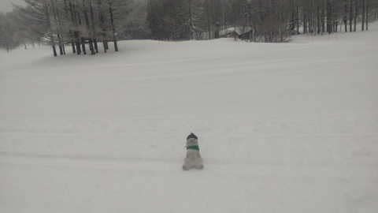
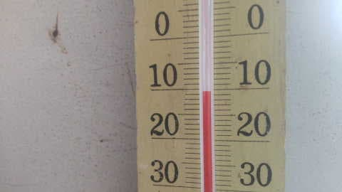
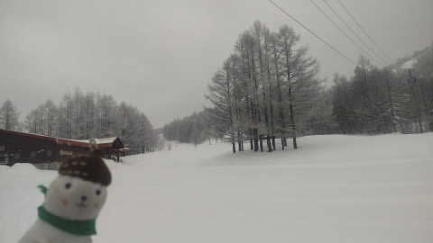

# 2月3日（金）の志賀高原は，積雪1-2cm程度で朝は小雪，昼には晴れ…そして私は今週末はスキーは諦めた

📅 投稿日時: 2023-02-04 02:20:01

えー．

本日も，志賀高原に忠誠心の高い

特派員たちから写真が送られて

きましたが…

今日は癒しのおこみん特派員写真も

送られてきました～！

あさイチは，うっすら積雪があった

ようで…

1-2cmくらいの積雪だったみたいですね．

でも，バーンはシマシマ圧雪！

気温もあさイチで-10℃と，いい感じの

冷え具合ですね～！

とはいえ，朝は雪がぱらつく天気で，

視界もそんなに良くなかったみたいで．

あさイチの気温-10℃は当てたけど．

積雪0の晴天の予想は外したか…（涙）

と，思ったら．

9:30過ぎには晴れて来て…

雲は多かったみたいですが．

それ以降はおおむね晴れたようです！

従業員不足でクローズしていた

寺小屋もオープンしたみたいで．

明日の土曜はたぶん朝から晴れそうだから…

コンディションいいんだろうなぁ…

そして．土曜の夜から日曜にかけては

数cmほど雪が積もるかも？

日曜は朝はちょっと雲が残るかもしれ

ないけど．

日曜も晴れそうだし…

コンディション良さそうだなぁ…

でも．

今日は今まで仕事してたくらいなので．

今週末はスキーに行けそうにありません（涙）

いや．

土日どっちかは滑りに行けるかと思ったのに…

本日金曜，またとんでもない宿題が

出てしまい．

今週末スキーに行くのは，ちょっとかなり多分

おそらくきっと無理な予感…

なんとか．

なんとか頑張って，日曜日帰りでも行きたいけど．

その場合は土曜徹夜になりそうで．

そこまでして日帰り600km運転して滑りに

行ったら死ぬな…

なぜ，天気が良さそうな週末に…（激涙）

とりあえず．

今週末，天気予想を裏切って，

志賀高原の天気が悪かったり，

ミサイルの雨が降るようなことがあったら…

それは私の呪いです

…皆さん，今週末のスキーを楽しんできて

ください…

## 💬 コメント一覧

### 💬 コメント by (アツシ)
**タイトル**: Unknown
**投稿日**: 2023-02-04 11:15:57

私も諸事情により今週末は滑りに行けなくなりました。仕事以外の理由で滑りに行けないのはいつ以来？志賀高原にそのような物騒なモノが降るかどうかはさておき、確実に雨は降りますよ。申し訳ありませんが。

### 💬 コメント by (レインボー75)
**タイトル**: Unknown
**投稿日**: 2023-02-04 13:52:23

土曜日の志賀高原情報

朝の蓮池-7℃。愛車が重体で手術中なので、今日も他車に便乗して奥志賀上陸。土日は8時から無料FTをしてくれるのがありがたい。しかも天気よし雪よし(腕悪し)。

どうやらエス様の呪いは志賀までは届かなかったようです。ふふん！

昼は高天の銀嶺。

そのあと恐ろしい呪いにかかろうとは、その時の満ち足りた私には。

午後はたまにはサンバレーまで行ってみようと、西舘経由で蓮池リフトに乗ったとたん、なんとリフト故障！どうやら誰かの強い怨念らしく回復の見込み無し。全ての気力が消え去り山の駅でお迎え待ちしております。でもいつ来てくれるのかなあ？

### 💬 コメント by (アリス)
**タイトル**: Unknown
**投稿日**: 2023-02-04 20:09:10

S様

こんばんは😃🌃

来週末の志賀高原復活を願っております。

昨日の寺子屋の食い荒らしがバーンが悔しくて、本日はファミリークワッド経由で一番に寺子屋へ🎵

本年度初めての寺子屋ピーカン、シマシマ、絶景をいただきました☺️

その後ヤケビへ🎵

天気も雪も申し分ないですね‼️

### 💬 コメント by (Skier_S)
**タイトル**: 今週末は最高っぽい…
**投稿日**: 2023-02-04 23:31:49

＞アツシさま

あら．

今週末滑りに行けない仲間ですね！

きっと明日は猛吹雪でどしゃ降りでミサイルが降ります！

＞レインボー75さま

昼過ぎまでは天気が良かったみたいですね～！

天気には怨念が届かなかったみたいですが，リフト故障はたぶん私の

怨念です…

＞アリスさま

志賀高原復活したい…

明日も朝は雲が多いかもしれないけど，晴れて冷えて最高の一日だと思いますよ！

