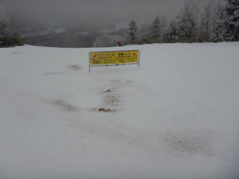
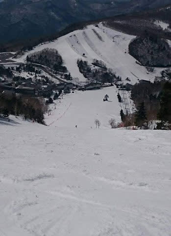

# 志賀高原スキー場は終わっちゃったけど，今年は奇跡の4月だったのか？…過去の同じ時期と積雪量を比べてみる

📅 投稿日時: 2020-04-21 00:39:31

🏷️ カテゴリ: [スキー雑談](c1f9d2cb7478308da16419928ea3945e9.md)

ということで．

残念ながら，志賀高原をはじめとする，

日本中のほとんどのスキー場の営業は

昨日で終わってしまったわけですが．

いや，志賀高原．

この4月でも，結構雪が残りましたよね…！

4月19日でこれなら，まぁ平年並みでしょうか．

雪解けが早いシーズンに比べれば，

雪が残った方ですね…！

激烈な雪不足でスタートした今シーズン．

12月下旬になっても，人工雪をつけた

コース以外，土が出ていて全く滑れない

状況で…

(12月21日の高天ヶ原）

焼額第1ゴンドラが動き出したのが，

年末休が始まる12月28日の昼ごろという，

例年にない遅さ（泣）．

そして，1月に突入しても積雪は少なく．

1月でもまだコースに土が出てくる状況（涙）

(1月3日の焼額)

そんな今シーズン．

2月になってもどしゃ降りで雪が解けたり，

「とてもGWまでもたないな…」

と，全員が思っていたところ．

奇跡の4月のおかげで．

4月19日の営業終了日になっても，

結構たっぷり雪が残ってたじゃないですか！！

焼額も，滑れるコースには土が

でてきてる感じはありませんし…

高天ヶ原も，モーグルバーン側含めて

まだ真っ白ですね．

一の瀬ファミリーも全然大丈夫．

一の瀬正面バーンもまだ雪はたっぷり

あるし，向かい側に見えるダイヤモンドも

全然土が出ておらず，まだまだ大丈夫な

感じですね…

パーフェクターも，この時期に

なっても土が出てないとは！

…3月に一度土が出かけたけど，

その後の奇跡の4月で，

3月より雪が増えてる気が…

それどころか．

営業終了しているサンバレーまで

真っ白だったみたいです…！！

…なんと．

今シーズンの途中までの雪不足を考えると．

4月20日近くでここまで滑れると，

誰が予想したでしょうか…！！

ちなみに，2シーズン前，2018シーズンの

同じ時期，4月21日を振り返ると…

焼額はすでにGSコースに穴が開きはじめ…

コースの下の方では雪寄せされてて．

さらに，サウスコースももう終わりげな

雰囲気を漂わせてます…

…今シーズンより，ずっとひどいですね．

このシーズンはシーズン中はそこそこ

積もったけど，3月4月が暖かく，

GWの初日で焼額が営業終了

しちゃったんですよね…

そして．

40年ぶりの雪不足と言われた2016シーズンを

振り返ると…

大体同じ時期の4月23，24日の週末では，

一の瀬ファミリー，終了(ちーん）

廊下状態で下半分が滑れましたが…

とても滑れるスキー場には見え

ませんね(笑)

高天ヶ原には何とか雪がついてるように

見えますが…

リフト降りてしばらく，こんなところを

滑らないといけない状況でした…

当初，

2016シーズンより雪が少ないんじゃないか…？？

と言われていた今シーズンですが．

4月19日の段階で，ここまで雪が残って

くれれば，上出来でしょう！！

しかし．

むしろ，中途半端に雪が残ってくれただけ．

「あぁ…まだ滑れるのに…勿体ない…っ！！」

という思いが残っちゃいましたね(涙)

とはいえ．

この積雪のおかげで，GW明けの緊急事態解除後，

スキー場に雪が残っている可能性が

残ってくれたので．

今シーズン，まだまだスキーシーズンは終わらんよ！！！

…ってなことで．

このBlog．

まだまだ冬モードが続きますので，

こうご期待っ！！

## 💬 コメント一覧

### 💬 コメント by (ゆーき)
**タイトル**: Unknown
**投稿日**: 2020-04-21 09:23:59

そうなんですよ、明らかに昨今と比べるとむしろ雪が残っている方、、、まぁ、昼前からストップ雪で、酷い感じでだったようですが、無念極まりないです。渋峠が再開したら行こうかなと思ってます、例年、渋峠のためだけには、行かないけど

### 💬 コメント by (gym)
**タイトル**: Unknown
**投稿日**: 2020-04-21 12:46:14

神様の意地悪～( ；∀；)

### 💬 コメント by (西館)
**タイトル**: 禁断症状炸裂中
**投稿日**: 2020-04-21 17:23:32

Ｓさん、他皆様、やっとかめだなも

愛知県も先週から自主的に体制突入で隔日出勤となり、出勤日は始発～終電勤務状態に。

今週からは、1回/4日勤務になり、忙しいんだか余裕なんだか訳分からん状態になっております。

白い粉を絶って４週間、もー辛いのなんのって。

例年だと、古墳巡りに大阪～奈良へ出没する時期なのにそれもできないし。

7月～10月は海シーズンですが、今年は30mライセンスを取ろうと思っていたのに、で、その話題でＳさんに教えて頂きたいことがあるのに、その話題もできるのかどうか。（ダイビングとスキーとどっち取る？、ダイビングするとしてもアドヴァンスは1年後にするかもなと思ったりして。でも年齢がなー、おばあちゃんになってもスキーはできるけど３０ｍ潜れる自信は無いよ。）

あー辛い－、辛い辛いいいぃぃぃ。

そろそろ足を洗わねば（インソールのことね）と思いつつ、見ると思い出して辛いの－。（でもブログは見てましたよ。光刺す写真は圧巻でした。）

せっせと残業して残業代は来シーズンのリフト・シーズン券代に。

バス代浮かせたり食費削減のお弁当持参で来シーズンの交通費・宿泊代のための小銭貯金してます、絶対に年収下がるから(ノД`)・゜・。 

でも私、頑張るぅ、あと３０週間待てば新シーズンが始まる！、ハズ！！（行くこと優先だから、新板は見送っています･･･。）

### 💬 コメント by (Northfox)
**タイトル**: Unknown
**投稿日**: 2020-04-21 22:18:33

最後にスキーを滑ってからもう1か月。

スキーに行けない、神田の街にも行けない、とストレス溜まります。

来シーズンがどうなるのか全く見通せないですが、良いシーズンになることを信じて備えようと思います。

### 💬 コメント by (Goku)
**タイトル**: Unknown
**投稿日**: 2020-04-21 23:11:21

なにもこんなシーズンに限って、４月にこんなに降るなんて・・・

GW後の横手・渋に期待しています。

### 💬 コメント by (Skier_S)
**タイトル**: 今週，また志賀高原に雪が積もりそう…
**投稿日**: 2020-04-22 04:23:14

＞ゆーきさま

今年は予想外に雪が残りましたね～…

私も，GW明けの横手＆渋に期待してます…！

＞gymさま

ホントに神様の意地悪に感じちゃいますが，

とりあえずGW明けの再開にまだ期待が持てるということで

前向きにとらえています(笑)．

＞西館さま

いや…ホントに辛いですね．

でも，元々シーズンオフには耐えなくてはならない辛さなんですが，

私はいつものシーズン終わりの儀式（ひどい思いをして月山を

滑って，「もういい」と自分に思わせること）をやってないので，

まだ気分的にシーズンが終わってません…

とりあえず，今からお金を貯めて来シーズンに期待しましょう！

…そして，メールで送ってくれた文章，そろそろ掲載させて

もらおうかと思ってます…

＞Northfoxさま

私もそろそろスキー断ちの禁断症状が出てきました．

身体を動かしてないので，なまりまくって死にそうです(涙）

来シーズンは，シーズンインからシーズン終わりまで，

たっぷりの雪で滑れることを期待しましょう…

＞Gokuさま

この1-2月ごろからずっと「奇跡の4月が来る！来るように祈る！！」

と言ってましたが，ホントに奇跡の4月になりましたね…

GW明けの横手・渋に期待しましょう…

