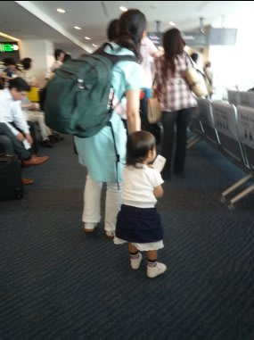
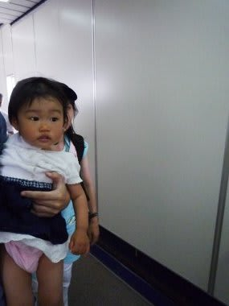
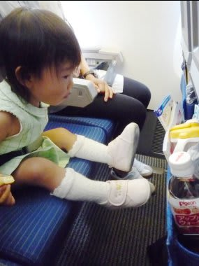
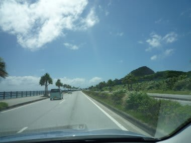

# 初の子連れダイビング旅行記＠2009年　その1　娘，初の飛行機長距離移動！

📅 投稿日時: 2012-07-12 00:57:58

というわけで．

初子連れダイビング出発の日がやってきたわけですね～．

で．出発の日は朝早くに家を出て，空港へ．

空港へ来たということは，その目的である飛行機へ搭乗しなくちゃならない

わけなんですが．

＃ここまで来て，飛行機に乗らないで帰るわけには行かないので．

果たして．

子供は2時間半の飛行機の時間，大泣きしたりしないのかっ！？？

時々いますよね．ずーーーーっと飛行機で泣いてる子供が．

私も，そんな子供と乗り合わせてしまったら，いやです．

…しかし．

今回は親の立場．

そういうシチュエーションに陥ったら，今度は親の立場として，

周囲のつらい視線に耐えねばなりません．

ベルトなどで固定されるのが大嫌いで，車のベビーシートに

乗せると，泣き叫ぶようなわが娘．

さて，こんな娘を飛行機に乗せて大丈夫なのかっ？？

…とりあえず．

ここまできたら引き返せない．

ボーディングブリッジを通って…

飛行機に乗せてみます．

あー．1歳児には席が準備されていないので，母親が抱っこして

乗せるわけですけど．

（母親に抱っこされる前，ちょっとシートに座ってみた娘)

…結果は．

飛行機に乗って抱っこされた瞬間から．

あっさり2時間半，ずっと寝続けてましたよ．わが娘．

自宅発が朝早かったので，眠かったみたいです…．

もう，離陸から着陸まで完全に熟睡．

…なんて親思いな娘なんでしょう．

ぜんぜん心配の必要なかった…

ということで．

とりあえず，出発前に心配した，第一関門はあっさりと無事クリヤー！

って感じで．昼ごろ那覇に降り立ち，まずはレンタカーを借りて，

向かうは美ら海水族館です．

普通なら，早朝便で飛んで朝のうちに到着した場合には，

午後からもう潜りに行くパターンなんですけどね～．

今回は初子連れダイビングというのもあって，まずは

様子見のゆっくりプラン．

で．

わずかでも旅費をケチろうと，レンタカーをコンパクトカーに

したので，コンパクトカーに大人4人＋ベビーシートのぎゅうづめ状態で

2時間…．

本部の美ら海水族館へ向かいます．

（続く)
