# 4月26日(土)，GW初日の志賀高原スキー場の特派員レポート！…終日晴れ，朝は気温が低く硬いバーンだけど，午前から緩んで午後は荒れたよ…

📅 投稿日時: 2025-04-27 02:48:23

🏷️ カテゴリ: [日記](cc4b5682fb7b8b144980957a978653fb0.md)

ってなことで．

今日は志賀高原に行かず，用事でちょっと

出かけた以外は，家で過ごして仕事やら

雑用やら娘の勉強を教えたりやら，

いろいろやって過ごしていたわけで．

年度初めの4月なので，訳のわからん

仕事が次々投げ込まれ，平日もかなり

バタバタしてたし．

3月1,2日の週末以来，仕事が休みの日は

すべて志賀高原に行っていて，

この2か月ほど，のんびり休んだ日は

一日もなかったので．

久しぶりに仕事にもスキーに行かず，ゆっくり

身体を休める日があっていいかな

と思ったけど．

家で志賀高原から送られてくる写真を見ていると…

うがーーーー！！！

ダメだ！！！

なんでこんな日に家で過ごさなきゃ

ならないんだ！！！

滑らせろーーー！！！

白い粉…

身体が白い粉を求めているっ！！！

…と．

白い粉の中毒患者のように，禁断症状で

のたうち回っていたのでした…

あぁ…

志賀高原が土砂降りになってるか，みそ汁か

コーンスープでも降りそそいでいれば，

諦めがついたんだけど…

そして明日も無茶苦茶滑りに行きたいけど，

GW中に模試があるらしい娘の勉強を見るため，

家で過ごします（泣）

受験生の親は辛い…

ってなことで．

私は身体を休めるより，どれだけ睡眠時間が

短かろうがどれだけ疲れていようが，

スキーに行かないとダメだということが

分かった本日．←他のみんなは当たり前のように

分かってるのに，本人は今まで気づいてなかったのか…？？

志賀高原はすっきり晴天で，晴れたわりには

ストップ雪にもならず，そこそこいい

コンディションだったようです…！！

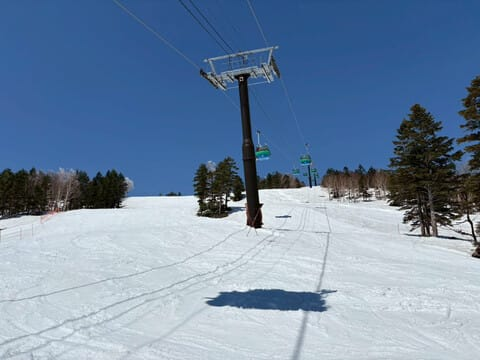

まず．

焼額山の早朝開始時の朝6時時点の気温は，

なんと-4℃！！

この時期としては，結構な冷え込みですね…！

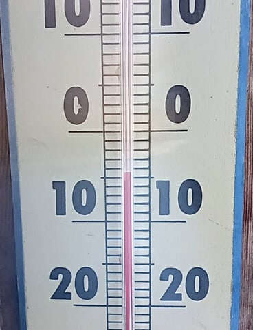

だもんで，朝イチのバーンはかなり硬い

ガチガチバーンだったようですが…

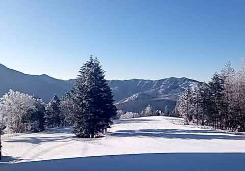

でも，朝からユルユルバーンなのに比べれば，

ガチガチバーンの方がまだいいかも…

うーん．

しっかり締まったハイスピードバーン，

うらやましい…！！

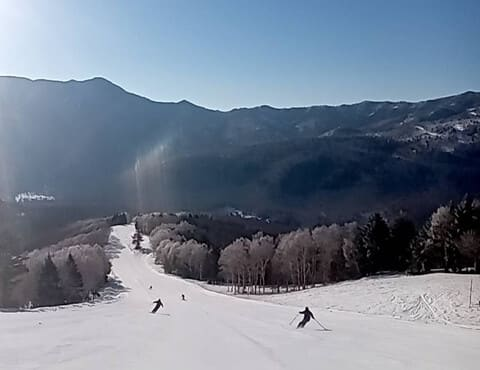

朝は木々が白くなるほどに冷え込んだ

この日ですが…

やはり日差しが強かったので，雪は

午前中から緩み始め…

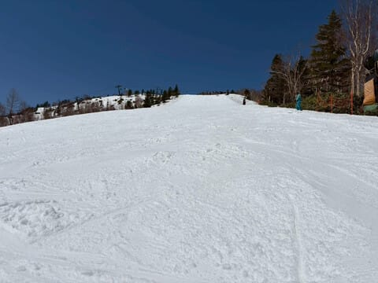

昼前は山頂付近はまだそこまで緩んで

無かったものの…

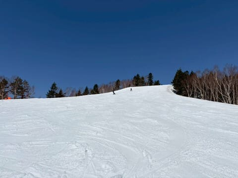

下の方に降りてくると，午前10時ごろには

結構緩み始めてきてたみたいです(泣）

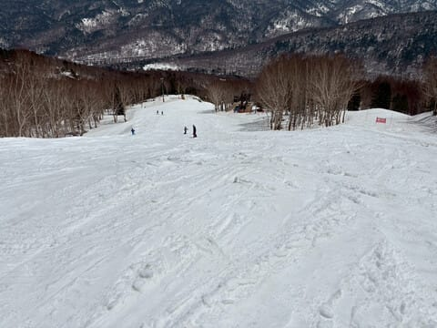

とはいえ，雪が緩み始めたとはいえ

GW初日と思えないほどガラガラで，さらに

気温もこの時期としては低めだったので，

比較的遅めの昼前までGSコースもフラットを

キープしていたし…

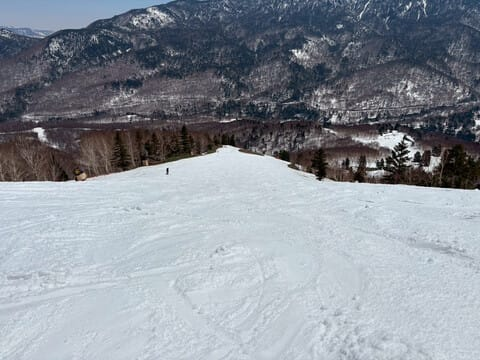

パノラマの壁も昼前の時間でこの程度の

荒れなので，4月末の昼間のバーンとしては

かなり上出来の感じですが．

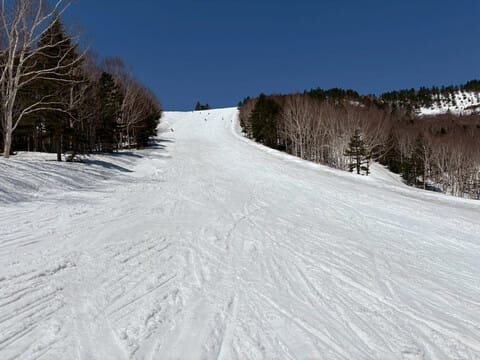

日差しも強く，まぁこの時期の晴れた日と

すれば気温は低めだったものの，午後は+5℃を

越えてきたので…

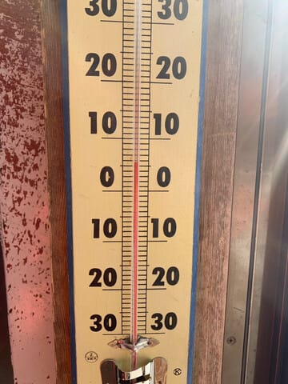

さすがに昼頃にはやはり雪がかなり重くなり，

バーンが荒れ始めてきたようで．

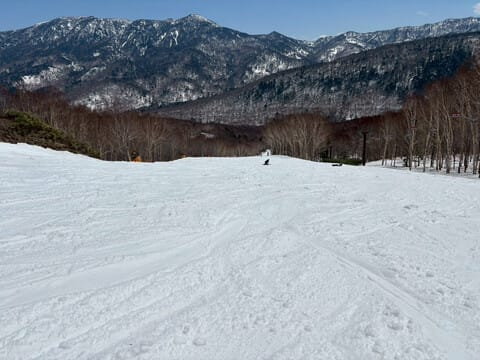

そして，午後には結構な凸凹バーンに

なっちゃった感じですね…

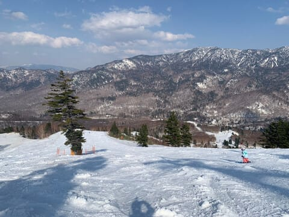

ただ，ここまで凸凹になったものの，

この時期としては気温も低めで，

雪に汚れもそんなに浮いてないし，

ストップ雪にならなかったようなので．

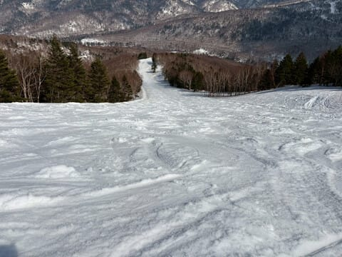

ガラガラでまだ雪がたっぷり残っていて．

そして晴れてストップ雪にならなかった

という，GWとしては結構恵まれた

感じの一日だったようです！！

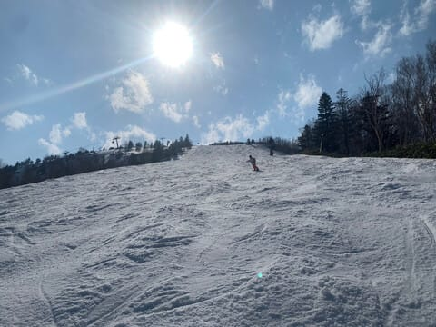

あぁ…滑りたい…

滑りに行きたい…

ただ，明日も志賀高原は一日晴れますが．

明日は今日よりかなり気温が上がるので，

早朝スタート時はゆきがしまってるかも

しれないけど，通常営業開始前から雪が

緩み始め，朝のうちからかなりザブザブ雪に

なって，一部滑りが悪くなる覚悟をして

おいた方が良い感じです…

…そして．

私が滑りに行けないため．

私の怨念で，志賀高原には豚汁やミサイルが

降る可能性もあるので，気を付けて

滑ってください…

## 💬 コメント一覧

### 💬 コメント by (Yoshi)
**タイトル**: Unknown
**投稿日**: 2025-04-27 12:55:08

ウチも息子が大学受験です。

GWどころか、今年は夏休みも出かけにくそうです、涙

それでも、どうにか山行く予定を立てている自分がいますが、笑

### 💬 コメント by (しずろく)
**タイトル**: ブログいつも拝見しています！Swell/Word Pressでのサイト構築ご提案
**投稿日**: 2025-04-27 20:18:15

こんにちは、はじめまして！

しずろくと申します。（南米で細々とブログを書いてます）

ブログ、いつも楽しく読ませてもらってます。

このアルゼンチンの地から日本のゲレンデうらやましいなといつも見ています、、！

突然ですが…

gooブログ閉鎖のニュースを見て、

「こんな素敵なブログが消えてしまうのはもったいない！」と思い、

WordPress＋SWELLで無料サンプルサイトを作るお手伝いを始めました。

もしご興味あれば、ブログをぜひ「形に残す」お手伝いをさせてください😊

（もちろん話だけでも大歓迎です！）

📩：shizuroku10@gmail.com

お気軽にご連絡ください！

（突然のご連絡、失礼しました！これからも応援してます！）

### 💬 コメント by (Skier_S)
**タイトル**: 明日から志賀高原！
**投稿日**: 2025-04-27 23:06:26

＞Yoshiさま

同じ受験生の親として，エールを送ります…

私もこの夏休みどころか，来シーズンの冬が受験真っただ中でスキーに行けない

可能性も高くて…

推薦でどこかに決まればいいのですが，ガチ受験になると来シーズンヤバいです(泣)

＞しずろくさま

ご愛読ありがとうございます…

とりあえず，本文すべては心優しい方がGithubにアーカイブしてくれたので，

とりあえず今後どうするか考えますが…

WordPressとかゆっくりいじる暇が無く，また収益かとかも考えてないので，

どこかのBlogサービスに引っ越すか，あるいはアーカイブに記事を残して

引退するか，ゆるゆると考えています…

### 💬 コメント by (アツシ)
**タイトル**: Unknown
**投稿日**: 2025-04-27 23:43:54

ウチの一人息子は今年が大学受験でした。無事、志望大学に一般入試で合格しましたが、オヤジ(私)は今シーズン、滑走日数過去最多(37日)を更新する勢いです。大丈夫、親が付いてなくても子は自分で進路決めて来ますよ。

### 💬 コメント by (Skier_S)
**タイトル**: ＞アツシさま
**投稿日**: 2025-04-28 19:26:39

合格おめでとうございます…！！

すごい…お子さんの受験シーズンに最高滑走日数更新するとは…

我が家の娘は塾にも何もやっていないので，私が勉強を教えないといけないんです…

その代わり，塾や予備校代金が浮いてるのでスキーにお金が舞わせます(笑)

