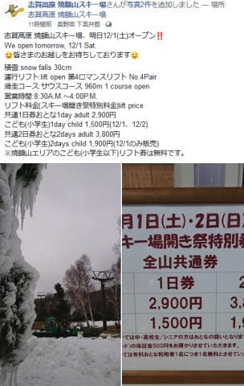

# この週末から毎週志賀高原登場予定！…そして今シーズンも20000mクラブステッカーを希望者へ

📅 投稿日時: 2018-12-01 00:04:00

🏷️ カテゴリ: [日記](cc4b5682fb7b8b144980957a978653fb0.md)

えー．

心配していた明日の焼額ですが．

無事予定通りオープンするようで，

とりあえず，一安心…

（[焼額山FB](https://www.facebook.com/yakebitaiyama/posts/1932906453471358)より）

ってなわけで．

焼額がホームゲレンデと自称する私です

から．←決して焼額が「生息地」ではない

今週からGWまでの毎週，よっぽどの何かがない限り，

毎週志賀高原に現れ，焼額で滑っていると思いますが．

志賀高原といえば…

そうです．

今年も続きますよ～．

20000mクラブステッカー！

Skilineは無くなりましたが，

今シーズンも引き続き．

iSKIや標高差ログ機能のある時計，スマホアプリなどで．

一日滑走標高差が20000mを超えたことを申請してくれれば．

終わっている人の証素晴らしい記録の持ち主の証，

ゴールドステッカーを発行します！

我こそはと思う方は．20000mという，

何の意味もないチャレンジ記録に向かっての

チャレンジをしてみてください！

そして．

20000mは滑れなくても．

志賀高原を愛する皆さんには．

私を発見して，

「シルバーステッカーっ！」

と申請してくれれば．

準会員の印，シルバーステッカーをお渡しします．

ということで．

今シーズンもついに本格シーズンインです～！！←本格というには雪が少なすぎる気がするが（涙）

PS.今シーズン，ウェアが変わった人へ…

私に声をかけてくださっても，誰だか分からずに「？」という

反応をするかもしれません．

ウェアが変わると認識できない可能性がありますので，

その場合は名乗っていただけるとありがたい

です…←ただ単に物覚えが悪いだけという説もあり

## 💬 コメント一覧

### 💬 コメント by (もりや)
**タイトル**: ヤケビオープン
**投稿日**: 2018-12-01 19:18:28

ついにヤケビオープンしましたね。いよいよ明日からヤケビ参戦しますので、ヨロシクお願いします。

### 💬 コメント by (Skier_S)
**タイトル**: もりやさま
**投稿日**: 2018-12-02 00:12:07

娘もお待ちしてます～！

焼額でお会いしましょう！

