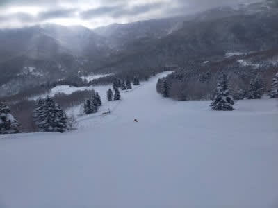
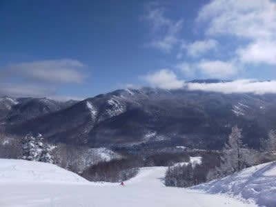
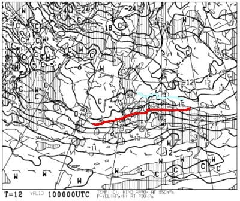
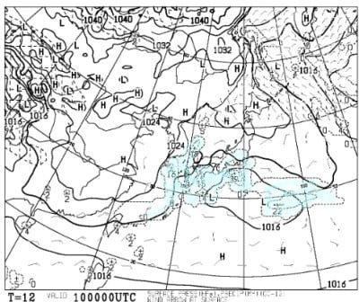
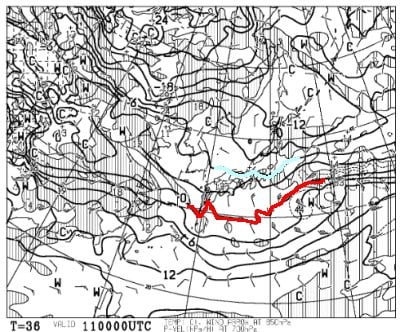
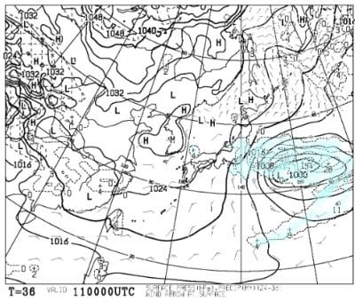
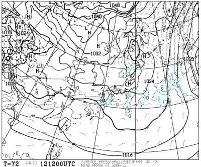
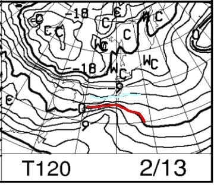
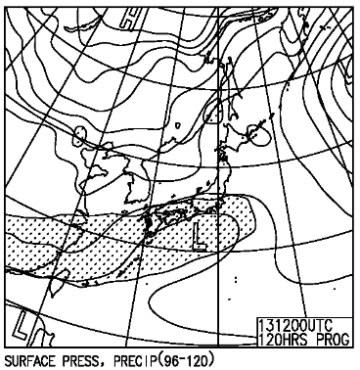

# 2月11，12，13日の3連休の志賀高原スキー場の天気は…11，12日は晴れそう！13日は曇りかな．積雪はなさそう

📅 投稿日時: 2022-02-10 04:35:14

ダメだ…

仕事が終わらない…（涙）

スキーをする時間をとるために，週末に

仕事は残せないのだ…

でも．

今日もこんな時間になりながら更新！

えー．

まず，本日の志賀高原特派員からの

レポートですが．

今日は朝のスタート時は曇りだったものの…

すぐに青空が顔を出し，ほぼ一日

日が射すいい天気だったようです！

あぁ…うらやましい…

そして．この週末は3連休です…っ！！

果たして．

この冷え冷え雪の晴天が3連休まで続くのか？

3連休は晴れてくれるのか？

いつも通り天気図を見てみましょう…

まずは10日(木)の850hpa図ですが．

赤い0℃線が本州太平洋ギリギリまで迫って

来ていて，水色の-6℃線が志賀より北に

上がってる感じなので…

まぁ，昼間もマイナスはキープしてくれそうですが，

ちょっと気温が上がりそう．

この日の地上天気図は，ギリギリ志賀に

水色の降水域がかかっている感じなので．

志賀高原，10日は雪が終日ぱらつきそう．

…それも，結構気温が高い雪が降りそうです(涙)

まぁ，雨よりマシか…

そして，続く11日(金)は，3連休初日です！

この日の850hpa天気図を見ると…

この日も志賀にかかるのは-6℃線なので，

この時期としてはそこまで激寒ではない

ですね…

で，この日の地上天気図は．

うーむ．

志賀に降水域がかかってますが…

この図の降水域は10日夜9時から

11日朝9時までの12時間降水量．

で，志賀高原に雪が降るのは

11日夜までだろうから…

この降水域は10日夜中の降水量ですね．

だもんで，おそらく11時には晴れてそう．

そして，次は12日(土)の850hpa図ですが…

この日は水色の-6℃線は志賀より北に上がって

いるので…

さらに気温は上がりそう．

地上天気図は…

高気圧の真下になるので，志賀は

大体晴れそうかな．

で，ラストの13日(日)の850hpa気温は…

この日も大体水色の-6℃が志賀にかかるレベル．

で，地上天気図は…

うーむ．

ギリギリ降水域の網掛けが志賀にかかるかどうか…

まぁ，昼間は降らなさそうで，降り始めは夕方

あたりかな？

ってな感じで，まとめると．

10日(木)：明け方に雪が降り始め，

　朝はうっすら数cm積雪．

　終日重めの雪がぱらつく．

　朝は気温は-6℃程度かな？

　昼間もマイナスキープ．

　昼間，そこそこ積もりそう．

11日(金)：朝は雲が残ってるかもしれないけど…

　じきに晴れてきそう．

　朝は-8℃程度かな？

　あさイチはいい感じの柔らかシマシマ圧雪．

　昼間もマイナスキープで，終日雪は

　良さそう．

12日(土)：朝から晴れ！

　朝は-8℃程度？

　あさイチは最高シマシマバーン！

　終日晴れの，絶好のスキー日和．

　おそらく終日雪は良さそう．

　

13日(日)：朝は…晴れてるかな？

　朝の気温は-5℃程度．

　あさイチはいい感じの締まり気味な

　シマシマバーン！

　昼に向かって雲が増え，曇り空に．

　昼間の気温は0℃近くまで上がるか？

　午後は曇り，夕方くらいに雪が

　ぱらつきだす．

って感じでしょうか…

基本的に3連休は積雪が無く，

最初2日間は晴れそうで，

コンディションは良さそうかな…

運がよければ最終日日曜も，

昼くらいまでは晴れてくれそう！

スキー日和の3連休になりそうです！！

…ダメだ…

眠い…

もう寝ます

## 💬 コメント一覧

### 💬 コメント by (レインボー74)
**タイトル**: Unknown
**投稿日**: 2022-02-10 14:49:50

木曜日の志賀高原情報

朝の上林-2℃　蓮池-5℃。寒さが続いたので暑く感じる。

昨日ブーツを履くときに腰を傷めたので、今日は遠征せずにやけびをぐるぐる早上がり。

朝から重く湿った小雪が降り続けているけど、とっても滑りやすい。

今日もイチゴンと二高のみなので、のんびりやけびぐるり回りのコースを主に楽しめました。

今日の天気はエス様のお告げがまさにぴったりでしたよ。

### 💬 コメント by (Skier_S)
**タイトル**: ＞レインボー74さま
**投稿日**: 2022-02-10 23:45:47

あら！腰を痛めたんですか！？？

くれぐれもお気を付けください…

今週末もイチゴンと2高だけみたいですね（涙）

ナイターやってくれるのが救いです．

