# 2020/12/20(日)の志賀高原スキー場，速報レポート！…一日激冷え雪降り！朝イチ圧雪コースでも30cmパウダー＆終日パウダーデー

📅 投稿日時: 2020-12-21 00:51:54

ということで．

降りました．

積もりました！！

一晩焼額の駐車場に止まっていた車が

こんなになっちゃうほどで，

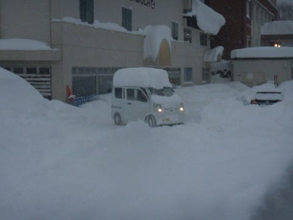

一晩の積雪は50cmくらいあるんじゃないか？

…という日曜日だったわけですが．

今日もラストリフトまでしっかり滑って，

帰宅が遅かったので．

本日のゲレンデ状況，速報モードにて

レポートです！

えー．

まず．

あさイチの気温は-12℃と，

予想通り-10℃以下！

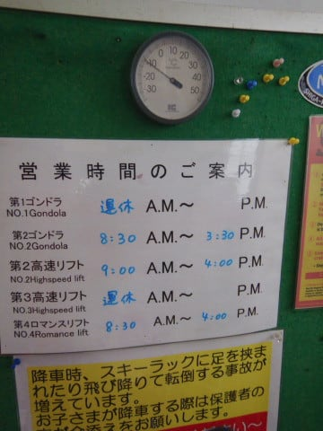

…だけど．

誰か，今日は，

　朝までの積雪，10～20cm程度か…

と予想していた人がいたようですが．

…ゲレンデの様子を見ても，

とても積雪最大20cmには見えませんが？？

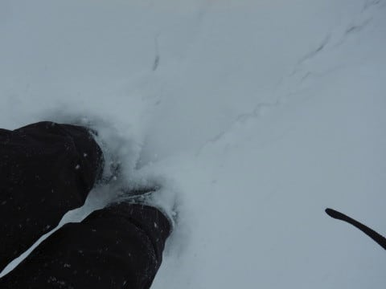

それどころか．

圧雪コース上の，朝に圧雪した後に積もった

雪だけでも30cmを超えているように見えるの

ですが…！？？

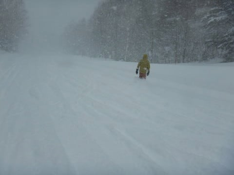

そして．

　終日曇り～雪降り．時折強く降る．

という予想

は当たったというか…

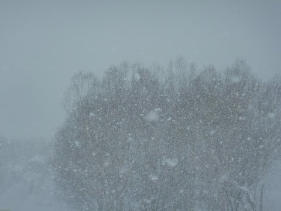

「時折弱まることがある」

と言った方が正解の降りっぷりでは

ないかな？

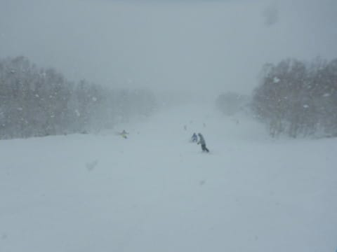

そして…

　昼間も5cmほど積もるか…

という部分．

いや…昼間だけで20cm以上積もったかも？？

…誰か，見事に予想を外した人が

いたようだな…←自分でしょ

とりあえず，この雪のおかげで．

朝は圧雪コースも激軽パウダー！！

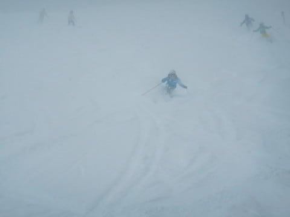

コース上は，午後になっても人が少ないところは

フレッシュパウダーが積もり．

コース上は最後まで柔らかい新雪が

うっすら覆い続け…

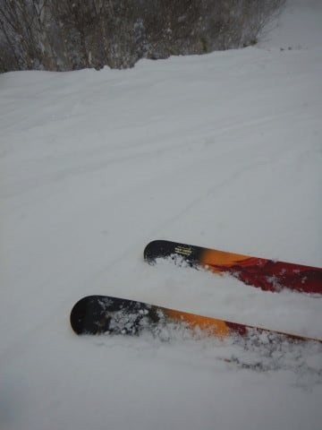

ラストになっても，コース脇は

パフパフ状態！

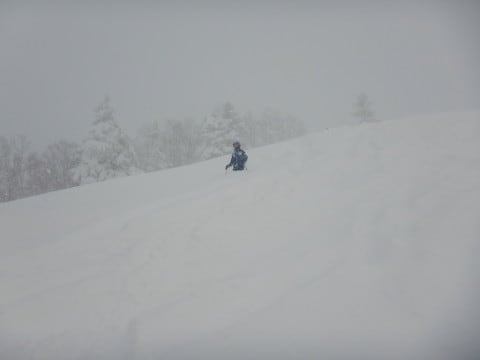

それなのに．

昼間も激烈に寒く，雪も降り続けるという，

根性の無いスキーヤーふるい落とし機能

がフル機能で働いたため．

ゲレンデは最高ふわ軽最高雪なのに，

リフトは飛び乗りだし…

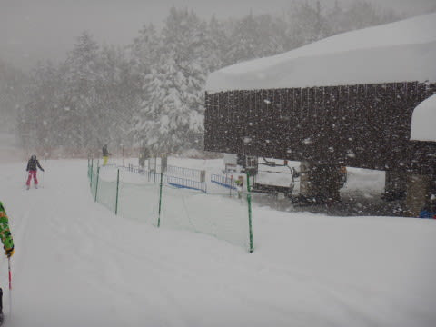

ゴンドラも，午前ピークがこの程度で．

11時を過ぎると搬器2-3個待つかどうか

という程度のガラガラ！

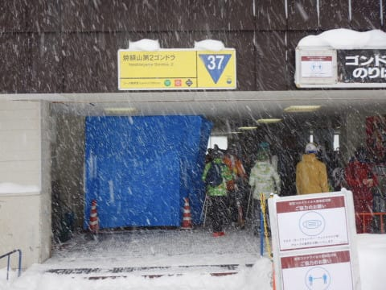

…ってなことで．

予想は外れたものの．

雪がいっぱい積もって，

激烈最高ふわふわ軽パウダーを

堪能でき．

ゴンドラもコースもガラガラで．

太板をラストリフトまで履き続け，

コース脇パウダーをいっぱい楽しめたという．

昨シーズンには1度もなかったのでは…？

という，かなり満足なパウダーデーを過ごせたのでした…

この雪のおかげで，明日から奥志賀ゴンドラも

動き始めるようですし．

この年末年始は雪不足の心配はなさそうです…

また明日，詳細レポートやります～！！

## 💬 コメント一覧

### 💬 コメント by (しんちゃん)
**タイトル**: お世話になりました
**投稿日**: 2020-12-21 01:25:45

今日は、これぞ志賀高原という感じのふわ軽さらっさらの雪でしたね。

しかも冷え冷え。ゴンドラのありがたさが身に沁みました。

Ｓさんがラストまで太板を履いているのは初めて見たかもしれません。めったにない終日パウダーデーでしたし、太板でも傾いていて楽しそうでしたね。

### 💬 コメント by (いか)
**タイトル**: Unknown
**投稿日**: 2020-12-21 07:10:23

昨日はファット日和だったようですね！軽そうな雪で楽しそうです。

私も木曜日(?)にシーズンインしまして、木、土、日と3日滑りましたが、毎日新雪40-70cmで脚が完全に死亡でした(笑) 今年は週末でもリフトが飛び乗り状態で、お昼からでも腰パウが残っていますね、、、

今年も志賀にもお伺いする予定ですので、またよろしくおねがいします〜

### 💬 コメント by (Noname)
**タイトル**: Unknown
**投稿日**: 2020-12-21 07:41:18

「根性の無いスキーヤーふるい落とし機能」に見事にふるい落とされましたwww

### 💬 コメント by (新米パパ)
**タイトル**: Unknown
**投稿日**: 2020-12-21 12:52:29

今週末からシーズンイン予定ですが、この雪だと見事にふるい落とし機能で蹴落とされそうですね。

とりあえず今週末は妙高アライリゾートで、プールもスキーもしつつ、来週から奥志賀に移ろうと思っております。

根性たらんなー、、嫁が。笑

### 💬 コメント by (Northfox)
**タイトル**: Unknown
**投稿日**: 2020-12-21 13:23:30

昨日はわずかな時間でしたがご一緒させて頂きありがとうございました。

ヤケビの雪は良かったです。

一の瀬に戻るバスの都合で中退させて頂きましたが、一の瀬でもしっかりリフト終了まで滑り切りましたよ！

### 💬 コメント by (Skier_S)
**タイトル**: この週末は良かった…
**投稿日**: 2020-12-22 01:34:24

＞しんちゃんさま

いやーー．

最高のぱふぱふパウダーデーでしたね…

もう，太板が最高に楽しい一日でした．

…次にお会いする時は，太板が車に積んであったりするんじゃないですか？（笑）

＞いかさま

最高のファット日和でしたよ！

八方でシーズンインですか？

新雪70cmはすごいですね！

また，志賀高原でお会いしましょう～！

＞Nonameさま

「根性の無いスキーヤーふるい落とし機能」でも生き残れる，

選ばれし民になってください（笑）

＞新米パパさま

お久しぶりです～！

今週末も，土曜は降りそうですが，今のところ日曜は穏やかな天気かも…

今週はARAIですか．

来週以降，志賀高原でお待ちしています～！

＞Northfoxさま

一の瀬で一人終礼されたのですね…

ヤケビ終礼はいつも通り催行されましたが，生き残った民が少なく

寂し目の終礼でした…

今度はヤケビ朝礼にも参加してください（笑）．

### 💬 コメント by (ikkun)
**タイトル**: Unknown
**投稿日**: 2020-12-23 06:23:11

おはようございます  またまたいらっしゃいませ(笑) 我が新潟のゲレンデも大雪～の今シーズン初の青空で富士山も見えたステキな昨日になりましたが……お客様がいない(・・;)「ヤバいなあ」って話です  近隣のお客様には来て講習もお願いしたい私し達ではありますが 気持ちいいゲレンデの二日間でした  ちなみに年末年始の大雪にもはや五回戦目？な雪下ろし予定の今週です(泣)

### 💬 コメント by (Skier_S)
**タイトル**: ＞ikkunさま
**投稿日**: 2020-12-25 03:34:06

年末年始も降りそうですね…

雪下ろし頑張ってください！

