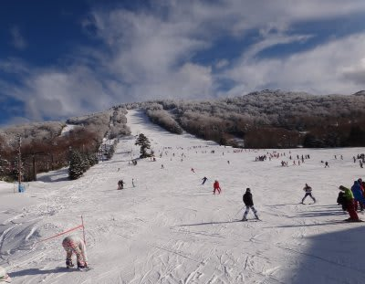

# 12月10日　志賀高原一の瀬スキー場速報

📅 投稿日時: 2011-12-10 22:45:31

🏷️ カテゴリ: [2012スキー滑走日記](cca3a0e9524e0203150f790b1fc3c71ad.md)

今日は一の瀬で滑ってました．

マイホームゲレンデの焼額は，大阪府スキー連盟の

研修会で大混雑だったので，一の瀬で滑ったわけですが．

あー．

朝の志賀高原の上り坂，完全冬道です．

一部凍結してます．

積雪10ｃｍぐらいの完全雪道が上林チェーンベースから

続きます．

しっかりスタッドレス履いていきましょう

で．今日の一の瀬は．

天気予報を完全にはずしてしまい，晴天．

…おかしいなぁ．

どう考えても晴れなさそうだったんだけど．

逆に言ってしまえば．

自然雪の積み増しはまったくありません．

一の瀬は，ほぼ100％完全人工雪．

ゲレンデは固いよ～．

気温が低いので，土が出てくることはなかったけど

雪は薄め．

滑れるのは下のペアリフトだけ．

それも，幅は50ｍ程度かな．

コース全面雪がついているように見えますが，

幅50ｍほどで目じるしのポールがあり，

その外は地雷原です．

んで…

修学旅行生が多く，リフト待ちは修学旅行生と

かちあたると5分くらい

それ以外でも平均3分以上待ったかなぁ…

まぁ，天気もよく，気温も低かったのだけど．

いかんせん，雪が少ない…（涙)

12月第2週の志賀でこんなにコンディションが悪かったのは，

ここ数年なかった気がする…

今晩もまったく雪が降ってません．

明日はコンディション改善しなさそうだなぁ…
