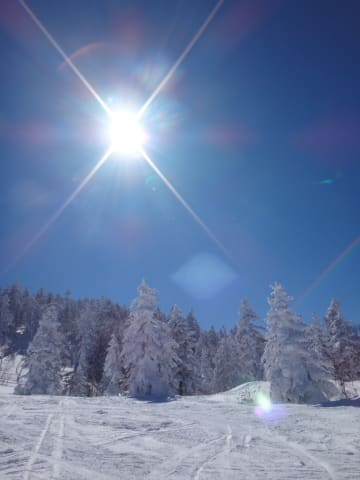
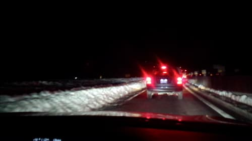
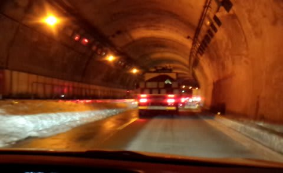
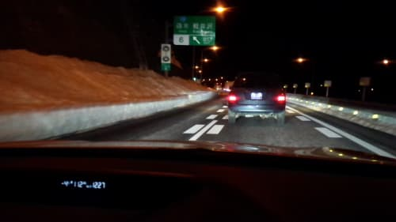

# そして…2月23日の帰宅は…悲惨（涙）．

📅 投稿日時: 2014-02-26 01:19:16

ってことで．

昨日の続きをば…

とりあえず．

晴天で最高の雪質のゲレンデを腹いっぱい堪能した，この日．

リフトストップまで滑ったので．

いざ，帰宅の途に向かうわけですが．

まー，上信越道，雪で片側1車線が塞がれているわけで．

夕方は渋滞するだろうから．

渋滞が解消される頃を狙って，のんびり遅めに移動しようか…

と．

[日帰り温泉](http://www.yudanaka.com/hot_spring/index.htm)に寄って．

スーパーで買い物やら，夕食を済ませたりしていると…

交通情報サイトに表示される所要時間が，佐久－軽井沢間で

70分→20分まで短くなったので．

ぼちぼち行くベー，

ってことで，信州中野のインターに乗ったのが午後8時半．

これは，南関東在住の人間にとって，限界ぎりぎりまで遅めの

出発時間なわけで．

…いくらなんでも，この時間に出れば，もう渋滞してるわけないよね…

と．

今から振り返れば，かなり甘ーい考えをもって，この時間に

出発したわけですね．

んで．

信州中野から坂城まで30分ほど走ると．

…

…

あれ…？

なんだか．

渋滞に行き詰っちゃったんですけど…

上田菅平付近から，雪で1車線になっちゃうところ．

もう，夜9時というのに．

まだ，渋滞終わってなかったのか～．

…って感じで．

まー，もう夜も9時過ぎてるし．

2車線→1車線の合流渋滞だから．

そんなにひどい渋滞しないよね…

と，お気楽に考えていたところ．

うーむ．

どうしたことだっ！

1車線に合流した後も，とろとろ運転が続くんですが…！？

かなり，予想より本格的な渋滞なのですが…っ！！

この渋滞を抜けるのに，30分以上かかってしまったんですが…っ！！（涙）．

まさか，9時過ぎにこんなに渋滞すると…．

交通情報サイトでは，坂城→上田菅平間7分って出てたのに…

大嘘じゃん（泣）．

結局，1車線の登り坂を先頭に渋滞してて．

東部湯の丸通過は，午後10時すぎ．

…この時点で，すでに．

順調に行っても，帰宅が深夜1時を過ぎることが確定…（涙）．

で．東部湯の丸のあたりで，路肩がきれいに除雪されて，再び2車線化．

快適に流れるようになり．

あー，これで快適に走れるなぁ…

と，小諸付近まで走ったところ…．

ぐおおおお～！

また渋滞だぁっ！！

これも，路肩の除雪が間に合わず，再び1車線に狭くなる

ため．この2車線の合流で渋滞しているという…

…なんだか．

ずーっとこういう感じで，1車線のまんまだったら渋滞しない気が

するんですけど…

除雪が終わった部分，ところどころ2車線化しており．

そのたび，2車線→1車線のところで渋滞が繰り返されるという…（泣）．

んで．

何度かの合流渋滞を抜けた後，小諸通過は11時過ぎ…

…うーむ．

順調にいけば，信州中野から1時間もかからないところ．

すでに2時間半経過．1時間半の遅れっ！！！

小諸を通過したあたりから，また順調に流れ始めたけど…

電光掲示板に「この先渋滞」の文字が現れ．

佐久平を過ぎたあたりで．

またまたまた，渋滞最後尾に…（大泣）．

この時点で11時半．

うーむ．

この渋滞を30分で抜けたとしても，0時だなぁ．

軽井沢0時ってことは…

そのあと，順調に行っても．帰宅3時過ぎちゃうんですけど（涙）…

…と，思っていたところ．

なんと．

この渋滞が，一番長かった．

電光掲示板に燦然と輝く「渋滞11km」の文字（泣）．

とても30分程度で抜けられると思えないんですが…（激泣）．

電光掲示板には，渋滞距離は書かれているけど．

掲示板でも，交通情報ラジオでも通過所要時間は示されず．

交通情報サイトの通過時間も，佐久→軽井沢間19分と

ありえない時間が表示されてる始末．

…いや，3km進むのに，もう30分以上かかってるんですけど…

まだ，8km残ってるんですが…

いったい渋滞を抜けるのに何分かかるのか…

もう，本日はずっとアイサイト様にご降臨いただいて．

アイサイト様お任せモード．

発進停止を繰り返す渋滞も，発進以外すべてお任せできるし．

完全に止まっちゃったら，アイサイト様がお告げになる

「先行車発進警告」が出るまで，ドライバーはひと休み…

…霊験あらたかなるアイサイト様がいなけりゃ，死んでたな．

これは…

そして．

渋滞に捕まってから．

1時間以上．

深夜12時半，軽井沢ICを通過．

…しかし．

まだ，渋滞は3kmくらい残ってますが…

もう．なんだか．

いろいろあきらめの境地．

結局，

渋滞を抜けたのは，深夜1時近く（涙）．

1時間半かかったよ…（涙涙涙涙）．

下道使った方が早かった…（涙涙涙涙涙涙涙）．

えーっと．

もう，深夜1時なんですが．

まだ，軽井沢過ぎたところなんですが．

ここから家まで，まだ200kmくらいあるんですが．

なんだか．

去年の[あの悲劇](ed80f77e5a376d604325a240a1df23e93.md)に近い状況に陥りつつある気が…

すでに，運転時間も4時間半を経過．

…これは．

このあとも渋滞あったら，死ぬ．

帰宅は朝5時とかになっちゃって．

間違いなく，死ぬ．

そこからは，かなりの頑張り速度で飛ばし．

幸いなことに，このあとはまったく渋滞はなく．

運転すること，さらに3時間．

4時前に，なんとか帰宅…

…深夜で都内がすいていたのが，せめてもの救い…

明日仕事に行けるかな～．

と，心配しながら．

それでもブログを更新した後に，←ここ突っ込みどころ

死んだように眠ったのでした…

PS.この渋滞．アイサイトがなかったら死んでた．ホントに死んでた．

## 💬 コメント一覧

### 💬 コメント by (megalith)
**タイトル**: Unknown
**投稿日**: 2014-02-26 11:10:58

いやはやすさまじい渋滞のようですね。

相変わらず長野県や山梨県の方では酷道や剣道で地元の方も苦労されたようで。

アイサイト様になにか御礼の奉納をしないと(笑)

うちのBR君も今月に入ってVDCのお世話になりっぱなしです。(^_^;

国道や大きい県道は良いのですが、そこに出るまでの道で陰になる場所で1日アイスバーン状態なので、スベルスベル。(^_^;

前車はVDCなんて付いてなかったので、感謝感謝です。

ちなみに自分は、先週末は諦めて家で大人しくしていて正解でした。

近所の葬式が急に当たりましたので。(T-T)

### 💬 コメント by (れお)
**タイトル**: これは災難でしたね
**投稿日**: 2014-02-26 13:00:42

渋滞情報が誤っているのがツライですね。

これだと、正確な判断ができないと思います。

渋滞の長さだけみて、いつもの二車線通行のつもりで算出してるんですかね。

ところで、Sさんのブログは非常に勉強になります。

アイサイトやスキー板についての過去の記事よませてもらいました。詳しい解説を面白く説明しているがスゴク良いです～。

SX2013とSX2014との比較記事は、本当に面白くってコーヒー吹いちゃいました！（実は、私もSX2013を使ってます。）

今週末に日帰りで志賀行く予定ですが、中央道の利用も考えてます。早く高速道路に残った雪消えないかな～。

今後も、楽しいブログよろしくお願いします。

### 💬 コメント by (aqura)
**タイトル**: ほぼ同じパターンですな
**投稿日**: 2014-02-26 13:46:28

同じですね、日帰りでヘッドのみの行程という事もあったのですが、１車線規制も気になった為、湯田中で温泉をしてファミレスで食事をして、８時過ぎに高速に乗りました。後は同じです。いや、違った、うちにはアイサイトが無かった。走っていても、眠くなるというのに、あの渋滞、何度寝入ったことか、、、。本当に、ずっと１車線の方が、絶対に早いです（怒）。志賀高原降りる時も、渋滞凄かったですね。

でも、スキーそのものは、最高のコンディションで良かったです。

### 💬 コメント by (しらんぷり)
**タイトル**: 23日は途中下道使いました
**投稿日**: 2014-02-26 13:58:53

この日はホントに大変でしたね

渋滞の長さ以上に時間がかかった気がします

更埴から菅平まで1時間以上かかったので菅平でおりました。この時点で18時半

浅間サンラインで軽井沢まで行って、その時点で20時半過ぎ。

21時前に軽井沢から上信越自動車道に再び乗ったような状況でした・・・

http://www.facebook.com/kousokudouro

### 💬 コメント by (Goku)
**タイトル**: Unknown
**投稿日**: 2014-02-26 19:18:47

いやー大変でしたね。

私もあの日の帰りは下道の除雪がイマイチなので珍しく中野～長野を高速移動したのですが、その時既に上田から先は渋滞情報が出ていたので「Ｓさん今日はどうしたかな～？車もなかったから早く切り上げたかな？」なんて思いながら走っていたのですが・・・

でも、アイサイトってこんな時凄い武器になりますね。

### 💬 コメント by (すいませんが‥)
**タイトル**: 単位がわかりまへん。
**投稿日**: 2014-02-26 22:21:32

JISはkmですか？

### 💬 コメント by (ゆうこ)
**タイトル**: 今週末には
**投稿日**: 2014-02-27 00:38:49

今週末には、全区間2車線になりますかね？

私の車にはアイサイトないので、もうあんな渋滞は無理です。

新幹線も視野に入れて、ひとまず板とか大きな荷物だけゆうパックで送りました。

今週末から3週連続で、野沢温泉行くつもりです。野沢温泉は、長野駅からの長電のバスの時間がイマイチなのが嫌なんですよね。

### 💬 コメント by (Skier_S)
**タイトル**: みなさんも苦労したみたいですね…
**投稿日**: 2014-02-27 01:39:53

＞megalithさま

いやーーーー．

ここしばらく．

関越も花園や高坂近辺の拡幅がされてから．

そんなに本格的な渋滞に捕まることがなかったですけど．

今回はなかなかでしたね～（涙）．

去年の1月3連休を思い出しました…

我が家のBR君も，志賀での登り道はVDC効きまくりです．

VDCの介入が自然なのがいいですね～．

＞れおさま

いやー．

渋滞情報が正確なら，下道を使うとか，中央道に

逃げるとか，いろんな手がとれたんですが…

今回はやられました（泣）．

しかし，れおさまもSX使いでしたかっ！

…でも，私はSXX（エスダブルエックス）使いですから（笑）．

今後も役立つ（のか？）情報をいろいろお送りしますので．

ご愛読のほど…

＞aquraさま

あー．8時過ぎに信州中野って，ホントに同じパターンですね…．

あの2車線→1車線攻撃は効きました．

志賀高原の下り坂の渋滞もすごかったですよね…

さすがにあの下り坂は，アイサイト様に頼るのは

ちと怖いので，人力運転でした．

…しかし．

スキー場のコンディションが良かったのがせめてもの

救いでしたね(^^

＞しらんぷりさま

…えーっと．

初めまして，ですよね…

コメントありがとうございます．

報告読ませてもらいましたが，やっぱり下道行った方が

早かったみたいですね．

私は選択を間違えたようで…（涙）．

でも，軽井沢ICって閉鎖してませんでしたっけ？？

とりあえず，今後もご愛読よろしくお願いしますっ！

＞Gokuさま

日曜は，朝10時頃に娘が出動ということで，車で

一の瀬に戻ったんです．

そこから，寺子屋→東館山→ブナ→西舘→タンネと

娘と志賀高原ツアーして，4時50分の一の瀬リフト

ストップまで滑ってました…

まさか，そのあとにあんな渋滞にはまるなんて…

＞すいませんが…の方

うは～っ！

大雪の週末に報告したように．

先週，PCをWin8.1にしたのですが，

このIME，機種依存文字なんか出しやがっていたことに

気づきました…

なんてこどだ～っ！

ちなみに，この機種依存文字はmmです（嘘）．

はい．kmで正解です．

＞ゆうこさま

うーむ．

本日，軽井沢より長野よりはすべて2車線化したようですが…

おそらく，週末までには群馬側もすべて2車線化する…

と，信じています．

いや．個人的願望ですが．

またあんな渋滞があったら耐えられませ～ん！

…でも，今度は志賀じゃなく野沢なんですね．

ぜひ，また志賀高原へ…

