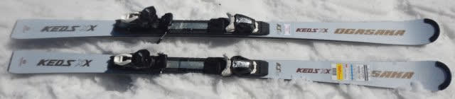
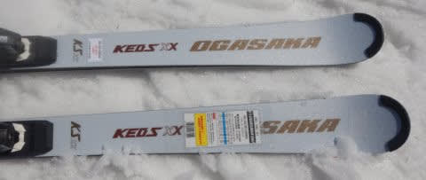
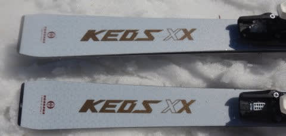
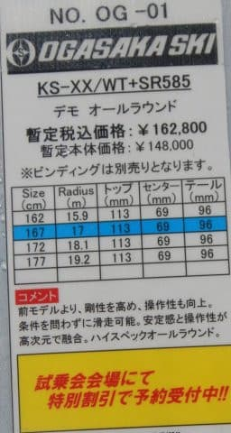

# 2023シーズンモデルのスキー板，試乗レポートその21…OGASAKA KEO'S XX

📅 投稿日時: 2022-07-02 01:02:54

たしか…

今日って6月31日じゃなかったっけ？？

たしか，まだまだ6月が続いて，

明日は6月32日だったような…

という定番のボケをしたくなるくらい，

私が全く気づかぬうちに，この地球上の

ありとあらゆる生きとし生けるもの，

さらに無生物であるあらゆる物質，

はては空間に至るまでの全てが，

7月という月に突入してしまったようです…

7月…

あぁ，7月．

私の記憶が確かなら．

7月って．もう1年の後半戦に突入って

はずなんだけど…

うーん．

そんなバカな．

2022年がもう半分終わってるなんて

わけはないから，記憶が間違ってたかな？？

まだ2022年になったばかりで，2023年は

まだまだ先だと思ってたから…

今年って24月ぐらいまであるんだっけ？

という感じで．

2022年が半分終わってしまった

という事実がいまだに納得できない，

Skier_Sです．

しかし．

もう7月に入ったというのに，

このBlogは相変わらずのスキーネタ．

2023シーズンのスキー板試乗レポート，

今回はオガサカ編です．

では，どうぞ～！

○OGASAKA KEO'S XX + SR585 167cm

基礎大回りベースオールラウンド

長さ172cmだとR=18.2 ,

167cmだとR=17ということで，

大回り板ベースとなるKEO'S XX．

構造は素直なサンドイッチ板です．

大回りベースで167cmは短いかな？？

と思って履いてみたけど．

167cmなのに，175cm以上はあるかと

勘違いするほどの安定感…

重量感と板の硬さがあるので，167cm

の割にはかなりどっしりずっしりした

滑り応えになります．

そして，R=17ということだけど，

この数字よりサイドカーブは大きく感じます．

板が硬くあまりたわまないので，結構

まっすぐ進む板．

だもんで，大回りをやろうと思うと…

すごいきれいに大回りができる！！

これ，167cmの板の大回りじゃない！！

もっと長い板履いてるんじゃないの？？

と勘違いする安定感で，ハイスピード

大回りを決められます．

振動吸収性も良く，167cmの長さでも

全くばたつきが無い，175cm以上の長さに

感じるほどの安定感！！

スピードをガンガン出しても怖くありません．

167cmでこの安定感とは…！

驚きのレベル…

逆に言うと，カービング小回りは難しく．

小回りをする際には，板を動かしていく

小回りになります．

…でも．迎え角を作った中での

コントロール性はバツグンに良いので，

急斜面でズラシでコントロールしていくと，

167cmという長さもあり，気持よーく

小回りを作って行けます．

板の張り，重さがあるから，ズラした時も

キョロキョロするようなズレじゃなく，

しっかり足場がある中で，板に重みを乗せて

板を動かしていけます．

ズラシのコントロール性が，ものすごくいい！！

なので…

167cmなら，切っていけば175cm以上の板と

遜色ない大回りができて．

それでいて，ずらしていけば167cmらしい

小回りができるという，

一粒で二度おいしい板ですね…

うん．

今までにない，不思議な感じの板．

これは，かなり玄人好みの板ですね…

この板の良さが分かる人であれば，

ぜひ乗ってほしい板です．
