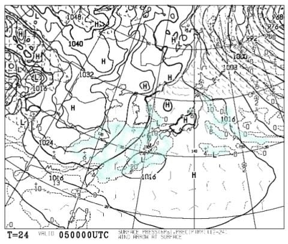
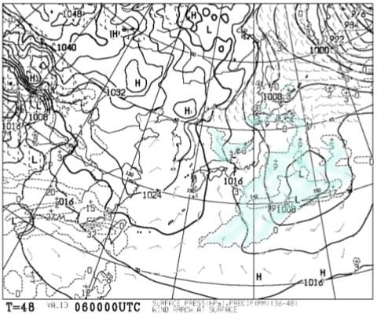
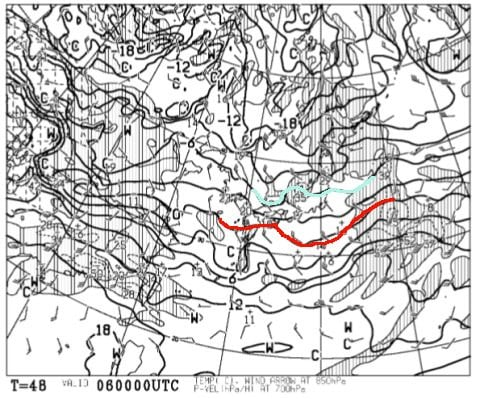
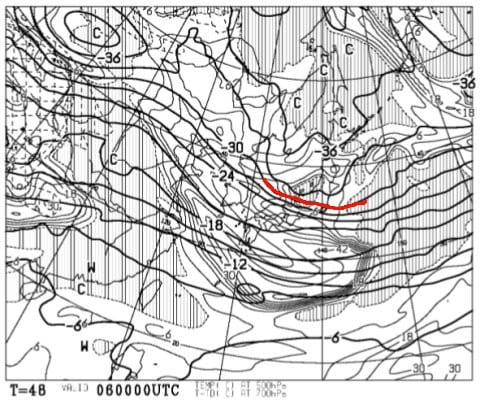
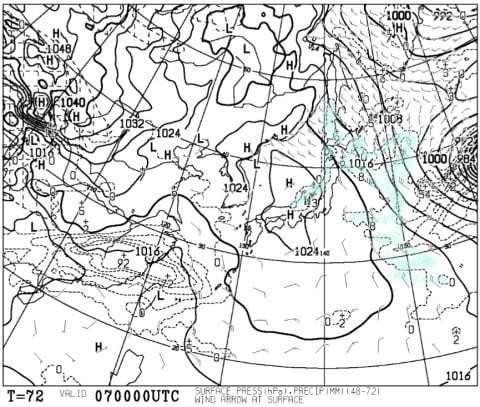
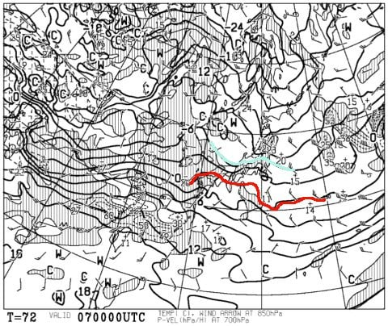
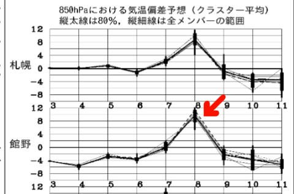
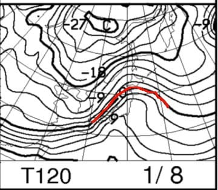

# 1月6，7，8日の3連休の志賀高原スキー場の天気は…6，7日は冷えたいいコンディションだけど，8日は超危険…っ！！

📅 投稿日時: 2018-01-04 21:40:50

🏷️ カテゴリ: [スキー天気予想](c6554f5c3c106093b511a8daae23757e8.md)

ということで．

昨日は深夜に帰宅後，速報モードではなく，

眠い中，意地で詳細レポートを書きましたが…

それは，本日に3連休の天気予想をお送りするため

だったのです…！

…なんて読者のことを考えているんだろう←自画自賛

ってことで．

本日は，3連休の天気予想をお送りします～！

まず，4日の夜～5日の朝ですが．

そこそこの積雪がありそうですね．

明日5日の朝は，また脛パフくらいの積雪で

スタートかな…．

で．3連休の前日，5日の地上天気図を見ると．

水色に塗った降水域は志賀高原にかかっていませんね…

だもんで．

3連休の前日の5日の昼間は，曇りの天気で．

時々日も射すタイミングもありそうな感じなので…

それほどの積雪がなさそうですな．

そして．

3連休初日，6日の地上天気図を見ると，

日本海側に，寒気の吹き出しの雲がたなびいているので…

6日の朝は，積雪はそれほどではないけど．

雪が降る天気で始まるかな？

終日雪が降ったりやんだり，時折強く降るような

天気でしょうか…

そして，6日の850hpa気温図を見ると．

赤く塗った0℃線は日本のはるか南．

そして，水色で塗った-6℃線が志賀高原に

かかってるので．

6日の朝は，-8～9℃程度の冷え込みですか…

昼間は-5℃程度．

昼間も冷え冷えのいい雪になりそう！

さらに．

6日の500hpa気温を見てみると．

うーむ．

赤く塗った，500hpaの-30℃線が志賀高原にかかってます…

500hpaの-30℃線は，そこそこの雪の目安なので．

6日の朝は，また新雪が積もってそうな感じ…

ただ，3日のように太もも～腰パフって程は無く．

ブーツパフ程度ですかね～．

そして次は連休の中日，7日ですが．

地上天気図を見てみると…

水色に塗った降水域が日本海側にかかってますね…

でも，高気圧に覆われてるので．

雪が降るのは朝のうちまで．

昼間は雪は降らなさそうかな～．

ただ，前日からの積雪があるので，

この日も朝は新雪でスタートしそう．

7日の850hpa気温図は…

この日も，-6℃線が志賀高原にかかる程度なので．

気温は6日と同じ感じ．

朝は-8～9℃程度．

昼間は-5℃くらいに上がる感じ．

まぁ，この時期としては平均的な

寒さですね…

朝の新雪が蹴散らされて荒れそうだけど．

午後は晴れそうだし，気温も冷えて．

いい感じかも…？

で．

それで，だ．

連休最終日の8日だ．

8日が問題だ．

まず．これをみただけで…

すでに，かなり危険そうな予感がしますね…（戦慄）

そして．

8日の850hpa気温図を見ると．

なんだーーー！！これは！？？？

赤く印した0℃線，北海道近辺まで北上

するどころか．

志賀高原には+6℃線が！？？？

これは…

志賀でも気温はプラスにまで上がってしまいそう…

危険だ．

これで降れば，固体じゃなく液体になる

可能性が…（恐怖）

恐る恐る，8日の地上天気図を見てみると．

どかーーん．

ダメだ．

日本全域，降水域の網掛けが…

これは．

8日．

昼間に空から液体が降ってくる可能性が…（涙）

恐ろしい．

そして，強烈な南風になりそうなので．

焼額の2ゴン，ヘタすれば奥志賀もゴンドラが

止まりそう…（泣）．

ってことで．

まとめると．

6日：朝は-8～9℃程度．前日から雪がちらつき，朝は

　ブーツパフくらいか？

　天気は雪が降ったりやんだり．時折強く降る．

　午後に向かって雪が増えていくか…？

　昼間の気温は-5℃程度．

　午後のゲレンデは，人が多いコースは

　新雪が蹴散らされたあれたバーンになりそう．

7日：朝は-8～9℃程度．朝は積雪があり，

　ブーツパフ程度に積もるか？

　風向きが北寄りに回れば，脛パフくらいまで行きそう．

　天気は朝は雪降り．

　昼前にはやみ，午後は日も射すかも．

　午後は天気が良く，気温も-5℃程度と冷え冷えで

　雪もいい感じ．

　ただ，朝まで積もった柔らかい雪が蹴散らされた

　凸凹バーンになっていきそう…

8日：危険．強烈な南風が入り，気温が上がる．

　朝は気温が高い曇り空．

　焼額第2ゴンドラ，奥志賀ゴンドラは運休の可能性．

　昼ごろから天気が崩れ出し…

　考えたくないけど，下手をすればこの時期にあるまじき

　液体が空から降ってくるかも…

　

って感じでしょうか．

うーむ．

これまで冷え冷えパウダーデーが続いたけど．

8日は危険です．

ただ，天気が崩れるのが最終日でまだ良かったのかも…

これが連休中日だったりしたら，次の日は

ガリガリに凍った，全面殺人コロコロバーンを

滑らなきゃならないところだった…

ただ．

9，10，11日とまた新雪が積もりそうなので．

8日に雨になったとしても，すぐにゲレンデ状況は

回復しそうなのが救いかな～！

ってことで．

私は3連休の前日，5日からゲレンデ復活の予定です～！

## 💬 コメント一覧

### 💬 コメント by (かず)
**タイトル**: 僕は連休全て仕事にして
**投稿日**: 2018-01-05 13:11:30

来週木金土日予定です　今日からの連休の状況楽しみにしてます　3日ゴーグルレンズ雪まみれで外してる時　後ろから衝突されてしまいました　高額のパウダーボードのサイドウオール2箇所えぐれてしまいましたよ…板に当たったお陰で怪我はなかったかもしれないですけど

### 💬 コメント by (Skier_S)
**タイトル**: かずさま
**投稿日**: 2018-01-05 23:11:18

来週末は，今のままの天気図だと

ゲレンデ状態は良くなりそうですね…

雪が一番積もるのは，9，10，11日

当たりになりそうですが…

しかし，激突されましたか．

ボードに傷着いたのが痛いですね…

