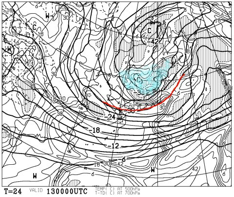
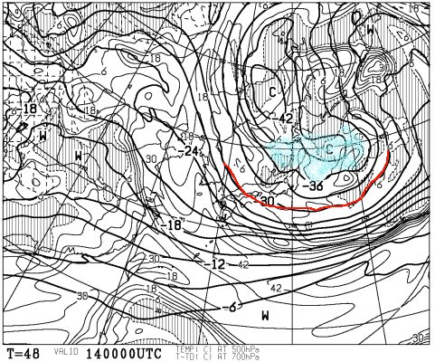
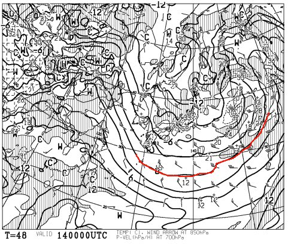
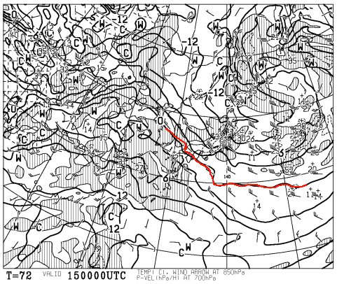
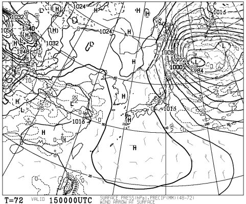

# 11日詳細レポートの前に…今週末の志賀高原の天気は？？

📅 投稿日時: 2015-02-13 01:45:38

えーっと．

本来なら，11日の詳細レポートを，今日やろうと

思っていたんですが．

…よく考えると．

水曜定番の，志賀高原天気予想をやってないじゃないか！！

そーゆー人がいるのかどうかよくわかりませんが．

「週末の天気予想を参考にしていたのにっ！！」

とかいう，天然記念物並みに極めてめずらしい人が

世界に1～2人くらい，いるかもしれないので．

一応，今日は．

この週末の天気予想，やっておきますか…

えーっと．

（ごそごそ）←天気図を読んでいる音

…

…

ふむ．

残念ながら，この週末は．

11日のような最高ピカピカは望めなさそうな気配ですな…

とりあえず．

13日の金曜の500hpa図を見ると…

をを！そこそこの雪の目安の-30℃線が．

太平洋側まで南下してるっ！

それどころか．

青く印した，大雪の目安の-36℃のエリア．

北陸にかかってますね…

これは，13日は結構降りますね．

風向きが西向きなので，ドサドサってほどではなさそうだけど．

そこそこ13日は積もってくれそうな予感…

で．

土曜の14日ですが…

まだ，-36℃のエリアは志賀高原近辺に残ってるので．

ふーむ．

土曜は雪が降り続きそうな予感…

んで，850hpa図を見ると，

0℃線ははるか南どころか，-9℃線も志賀より南まで

下がっちゃってるので…

あれですね．

土曜朝イチ．マイナス15度近くまで冷えるかも？？

で，風もそこそこ出そうなので…

…

…

要するに，吹雪か？？？

ゴンドラは，減速運転になるかも…

うーむ．

夜まで結構雪が積もりそうな天気ですね．

で．

日曜は…

この日も，850hpa図を見ると，志賀高原は-9℃線が

かかっているので，朝は-10℃以下まで下がりそうな，

冷え冷えの一日ですな．

で，地上天気図を見ると…

日本の東側の低気圧，猛烈に発達してますが．

本州から離れていくので．

うーん．

朝のうちは雪が降り続けるけど．

昼ぐらいのタイミングで，止むかな．

…午後遅くには，日も射すかも？？？

ってことで．

まとめると．

土曜日：朝から雪降り．ってか，吹雪？

　　風に弱いゴンドラは減速運転かも…

　　前日からの積雪があるので，朝イチは

　　ブーツパフくらいのパウダーが楽しめるかな？

　　終日雪が降り続く．寒いよ！

　　午後は，積もった雪が荒らされていった

　　荒れたバーンになるのかな…

日曜日：朝まで雪が降り続ける．朝は風が強いか？

　　前日からの積雪があり，この日も朝はパウダーが

　　楽しめそう．

　　…ブーツパフ，うまくいけばひざパフまで行くかな？？

　　で．昼に向かって雪は弱まり，午後は雪も止んで．

　　午後遅くには，晴れ間も広がってくるでしょう．

　　ただ，柔らかい雪が積もっているので，午後はやっぱり

　　凸凹バーンになるかな～．

って感じで．

うーん．

ピカピカシマシマ圧雪はお預けになりそうなこの週末．

朝イチパウダーに期待かなっ！

## 💬 コメント一覧

### 💬 コメント by (れお)
**タイトル**: 私が天然記念物並みに極めてめずらしい人です!!
**投稿日**: 2015-02-13 12:21:50

週末の天気予想を参考にしてますよ♪

ピンポイントで、しかもかなりの高確度ですから!!

一人二人ってことは無いと思いますよ～。

粉雪たくさんなら、日曜日帰りかな～。

まだまだ冬型でどっさり降って欲しいです♪

### 💬 コメント by (はなげ親分)
**タイトル**: スキー天気予想期待してます!!
**投稿日**: 2015-02-13 13:42:46

隠れファンは、相当数おられると思います。

探していただいたようで、ありがとうございます。

実は、最近私はヘルメット着用で、女房は地元のショップでのクリアランスセールにてヘルメット、ウェア下、グローブを新調しまして、様子が変わっていました。

土日、お会いできればこちらからお声かけできればと思います。

今日は、これまでとうって変わって雪とガスの二重苦で、老眼の私は雪面かが良くみえないテンション下がる状況です。

### 💬 コメント by (Skier_S)
**タイトル**: 予想通り，2人は期待している人がいたということで…
**投稿日**: 2015-02-13 22:19:04

＞れおさま

天然記念物並みの期待，ありがとうございます（笑）．

土曜も日曜も，どちらも朝は新雪が積もってそうですが…

…日曜も，晴れるとしても夕方から．

あまりいいコンディションは期待できない感じです…

でも，雪質は良さそうですよ！

＞はなげ親分さま

そして，2人目の天然記念物並みのコメント，

ありがとうございます（＾＾

今日はガスと雪でしたか…

明日も残念ながら，そんな感じの天気です．

…ってか，日曜の午前中までそんな感じです．

やっぱり，水曜が良すぎました…

またあしたから，子連れで滑ってますので～！

