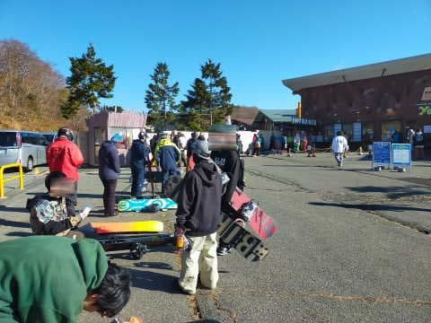

# 2022/11/12(土)のイエティ滑走詳細レポート！…コースの雪の状況はこの時期としてはいいけど，クワッド最大10分待ち

📅 投稿日時: 2022-11-14 02:38:26

えー．

横手山．

今日の夕方から雨が降り始め…

ライブカメラを見ると，午後8時では

硯川の気温が+5℃近くとなっていて，

高温の雨が降ってます（涙）

深夜2:30現在，硯川の気温は

-0.3℃と氷点下にまで下がったので…

明日の朝にかけて，山頂付近は

もしかしたら雪になるのかも？？

…でも．

昨晩も圧雪車をコース全体に入れるのが

難しかったようなゲレンデ状況だった

横手山．今晩の雨で，ゲレンデが無事に

もつのか…

今のところ，明日の営業中止の案内が

出ていませんが，次に人工雪を打てるのが

15日朝になりそうなので，ちょっと心配…

ってなことで，本題へ．

昨日速報したイエティの詳細レポートです！

えー．

まず．

朝9時の営業開始前には，ゲート前に先週より

長い列ができていて…

駐車場も第2はもう満車に近い感じだったので，

既に，先週よりかなり混みそうな気配…

とりあえず，9時ぴったりにゲートオープン！

あさイチのゲレンデに飛び出します！

ふおおおお！！

シマシマだぁ！

ちょっと柔らかくて，板が潜る感じの

コンディションだけど…

人がいないシマシマを滑れる快感！！

今日は混みそうなので，あさイチの

空いているうちの数本を気合を入れて滑る！

天気はあさイチからすっきり快晴で，

気温も先週より高く，ウェアのジャケット

を着ているとちょっと暑いかな…という

くらい．

朝の数本は，人が少ない気持ちいい

ゲレンデを滑れました～！

今年は雨も少なく，雨の日はナイター

営業しないでコース保全してるようで．

コース幅も順調に広がっている感じ

ですね～！

雪の厚みも十分で，コースコンディションと

しては，この時期としては結構いい感じ

じゃないでしょうか？？

…が．

営業開始30分を過ぎると．

だんだんリフト待ちがのびていって…

営業開始から1時間半が過ぎた

10時半ごろには…

リフト待ちが結構伸びてきました（涙）

でも，午前中の混雑は先週と同じ程度で．

クワッドが5分強，

ペアリフトの方はほぼ待ちなしで

乗れたので，午前中はペアで回せば，

リフト待ちのストレスは無かったですね～…

が．

今日は晴天で，明日の日曜が雨の予報と

言うのもあり，土曜の今日に人が

集中したのか．

午後になると，コース上の人口密度は

だんだん増えていって…

コース幅が広がったから，見た目が

この程度で済んでるけど，

実際にコースを滑ると，やはりちょっと

辛い感じ…

さらに，リフト待ちは午前中よりも

ひどくなり．

クワッドは10分待ちを超えることも…

そのせいで，これまでずっと待ちがゼロ

だったペアリフトも…

ついに今シーズン初のリフト待ち発生！（涙）

それもペアリフトなので，列がこの程度

でも2-3分の待ちがあります（泣）

ただ，リフトは待つけど．

コース上の人口は，クワッドとペアで

送り込める人数以上に増えないので，

コースの人口密度がさらにひどくなる…

ってことが無いのがまだ救いかな．

で，雪も十分な厚みがあるので．

今日も午後まで，コースに穴が開く

ところは無く．

コース整備直前の16時まで，比較的

まともなバーン状況をキープして

くれました～！

…しかし，夕方になると．

コース整備用に積み上げる雪山で

コース幅が狭くなるので．

何だか人口密度が上がってきた感が…

結局，午前9:30以降は，コース上の

人口密度が少なくなることはなかったです（泣）

そして．

16時からのコース整備が始まり，一旦コース

クローズとなりますが…

そうです．

これだけ人口密度が高いイエティに来る

最大の楽しみと言えば．

あさイチと，ナイターコース整備直後の

人のいないシマシマを滑ることなのだ！

17時のコース整備終了を待って，

今日2度目のシマシマを満喫するのだ！

ってなことで．

今日もちょいと早め，定刻4分前の

16:56にコースオープン！！！

今日2度目のシマシマをいただきま～す！！

いや…

ホントにYetiには，朝イチとこの1本だけの

ために来ていると言っても過言じゃない…

という1本を終えて．

2本目くらいまではまだ人も少な目で

楽しめましたが…

ナイター3本目からは，人もかなり

増えてきて…

そして，オープンから30分を過ぎた，17:30

過ぎには…

うげげげげ！！

なんだ？？

このリフト待ちは？？？

昼間より長いぞ！！？？

さらに．

ペアリフトも昼間より長い列が…！！！

ナイターの見にくいゲレンデで，

これだけ人口密度が高いと．

ちょっと危険な感じ…

ってなことで．

昼間より長いリフト待ちに耐えかねて．

今日も18時ごろには切り上げたのでした…

（それでも朝9時から8時間滑ってるけど）

うーん．

11月も中盤に入り．

イエティも混むようになってきました…

…これだけ混むなら，いっそ雨でも

降った方が混まなくていいかな？？

と．

危険な発想に流れる，Skier_Sだったのでした…

## 💬 コメント一覧

### 💬 コメント by (ひゃくりん)
**タイトル**: ナイター混んでますね。
**投稿日**: 2022-11-14 19:12:38

土曜日はありがとうございました。

ナイターの混み具合の分かる写真ありがとうございます。

おかげでナイターを滑らずに、気持ちよく帰れます。

朝、リフトの上からSkier_Sさんの滑りを見ていたのですが、

写真撮影がデジカメからスマホに変わったのでしょうか？

### 💬 コメント by (Skier_S)
**タイトル**: ＞ひゃくりんさま
**投稿日**: 2022-11-15 00:32:36

いや…ナイター混みましたよ！！！

昼間より混むとは…ナイター滑らなくて正解です．

スマホで写真撮ってるところ見られてましたか(笑)．

今回デジカメを忘れたので，スマホで撮ってました

