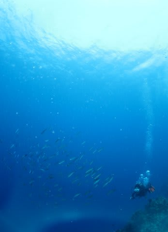

# 2014年8月　オスロブagain…再び，子連れでジンベエザメと泳ぐぞ！　その19

📅 投稿日時: 2014-09-29 03:19:54

🏷️ カテゴリ: [ダイビング日記](ce3a7a8d424d112fce83ee85c81a0e344.md)

って感じで．

ジンベエスイムは終わりましたが．

ここのショップのジンベエツアーの基本は．

ジンベエスイムだけで終わりではなく．

朝イチにまずジンベエスイムorダイビングをしたあとは，

スミロン島近辺へ移動してのシュノーケリングorダイビングがあって，

さらにそれから，スミロン島に上陸してお弁当…

というパターンなので．

ジンベエスイムを終えた後は，スミロン島へ移動です．

ジンベエポイントから15分ほどで，スミロン島へ

着きますが…

うはー．

やっぱりここの海はきれいですね～

透明度がよさそう！

で．

スミロン島では，

『突発性ジンベエを見たくて我慢できない病」が

完治した妻は，娘とのんびりシュノーケリング…

んで，私がダイビング，

ということに相成りまして．

いざ，ダイビングへ！

うほう！

やっぱり，スミロンは透明度いいわ～

サンゴも結構元気だし…

リロアン近辺で潜るより，やっぱりスミロンがいいな！！

おおっと．

カメさん登場！

そして．

フィリピンといえば定番のニチリンダテハゼくん．

カクレクマノミちゃんもいます．

サンゴのきれいな浅瀬で遊んで…

エグジット．

うむ．

昨日のバリカサグは，ギンガメアジの群れが

見ることができて，よかったけど．

それ以外のサンゴの元気さ，透明度の高さでは．

スミロンの方がいいかなっ！！
