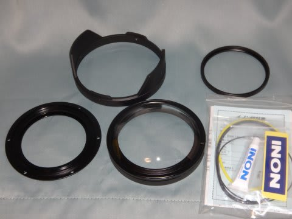
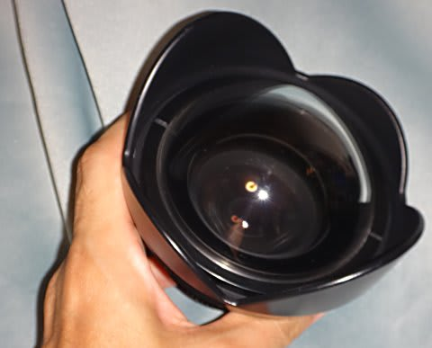

# INONドームレンズユニットII for UWL-H100の組立

📅 投稿日時: 2015-08-10 00:23:58

🏷️ カテゴリ: [PC,カメラ&小物](c0d8caed13e597efe97b661a8ae56bed0.md)

本日．

フィリピン最終日のダイビング，終えてしまいました…（涙）

明日，帰国です（泣）．

今日のダイビングもよかったな～．

帰りたくない…

っつーことで．

明日は帰国のため，かなり早くホテルを発つので．

今日は今から荷物の片づけやらなにやらやらなきゃならないし．

フィリピン詳細レポートは帰国後のお楽しみということで．

今日も，書き溜めておいた記事をば…

長きに渡った水中カメラ買い替え計画の記事．

本日は，番外編．

フィッシュアイレンズの組み立てのレポートです．

では，どうぞ～

----

[先日の記事](ef11ac71ee3b5519e80ea4b1221ba57ee.md)に書いたように，今回のフィッシュアイレンズ．

INONのUWL-H100というワイドコンバージョンレンズに…

INONのドームレンズユニットII for UWL-H100を組み付けて，

ドームレンズ化したわけですが．

今回の記事は，この組み立て工程をば…

まずは，材料を並べて．

こいつが，ガラスドームですね…

ガラスドームをひっくり返して，その内周に

リング状のスペーサを落とし込みます．

そして，ワイドコンバージョンレンズをスペーサ内側に

はめ込み…

こんな感じになったところを…

上から，水密リングで押さえるのですが．

水密リングは，こんな感じの金属リングに，2本のOリングを

はめ込んだものです．

こんな感じで，位置決め用の黒ゴムリングと

水密用の黄色いシリコーンゴムリングをはめ込み…

さっきのワイコンの上からはめ込んで，

六角レンチで締め付けます．

これで，ワイコンのとドームの間の空間が気密状態で固定されて，

完成です．

…うーむ．

締め付け，大丈夫かなぁ…

水漏れしないか，ちょっと心配…

＃フィリピンの3日間は，水没することなく過ごせました

しかし．

このワイコン＋ドームレンズで組み立てられた，

フィッシュアイレンズ．

陸上重量1kgはいいとして．

水中重量500g…

かなりのマイナス浮力．

水中でもったら，結構ズッシリ重いよ…

以前のフィッシュアイは，

陸上440g（軽い！）

さらに，水中では85gしかなかったのに…

以前のS90のカメラシステム，

水中重量1kgくらいあって，これでも重いなぁ…と感じたのに．

このフィッシュアイレンズを付けたS120になったら，

水中重量1.5kgくらいになっちゃう！

スチールタンクでは，いつもウェイトなしで潜る私．

今度のカメラシステムだと，フロートつけないと

スチールタンクで潜ったとき，沈みすぎてマズいかも…？？

PS1

実際にこのフィッシュアイレンズを水中で取り扱ったところ，

まぁ水中重量500gは耐えられない重さではなかったし，

大きさもそれほど気にならなかったです．

PS2

でも．

カメラにフィッシュアイレンズをくっつけたこの状態ならいいけど．

フィッシュアイレンズを使わないで撮影したいなぁ…，と．

アーム上のレンズホルダーにフィッシュアイレンズをくっつけた，

この状態にすると．

上側が重いので，水中でカメラがくるっとひっくり返りそうになりました…

まぁ，それほど気にならず使えましたが．
