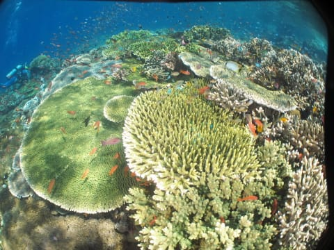
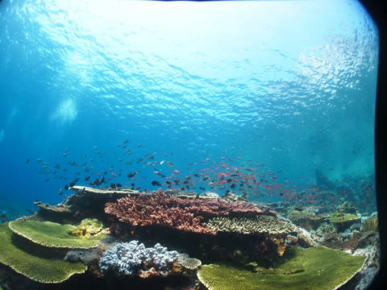
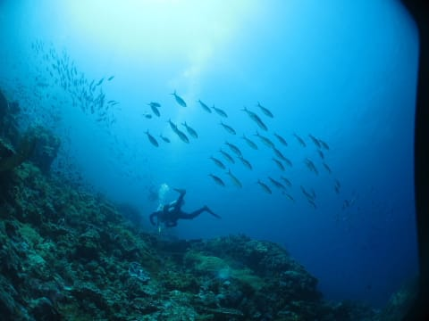

# 子連れコモドダイビングクルーズagain　その30　ついに…コモドのラストダイブ

📅 投稿日時: 2011-10-02 01:32:43

🏷️ カテゴリ: [ダイビング日記](ce3a7a8d424d112fce83ee85c81a0e344.md)

朝イチのダイビングを終えて．本船に戻ると．

置いてきぼりを食らったけど，意外と機嫌よくお迎えしてくれた娘．

でも，その後．

ズーッと母親に

「行かないで」

「ダイビング行かないで」

「行っちゃダメ」

といい続けた娘．

あー．

ごめんね．

やっぱり寂しかったのね．

ということで．

次のダイビングは，さすがに母親は娘とお留守番することに…

1本目終了後．

昨日の朝から1日半を過ごした北エリアとお別れです．

船は2時間近く移動し，2日目に潜ったあたりへ戻ってきてます．

で．

本日2本目…

すなわち．

本クルーズでの最終ダイブです．

ああーーー．

もう，最後のダイブか．

楽しい時が過ぎるのは早いなぁ～っ！

＃おそらく1ヶ月くらい船の上で過ごしても「早いなぁ」って言ってるんだろうな…

で．ポイントは

「Tatawa Kecil」

…私も初めて潜るポイント．

流れが弱まった一瞬じゃないと入れない，レアポイントらしく．

さらに，K村さんがお気に入りのポイントということで，

期待が高まりますねー．

娘に見送られて…

いざ，エントリー．

なんか．

いきなり超一級のサンゴから始まりますね．

どひゃー！

これをきれいと思わない人がいるだろうかっ！

で，サンゴの上を流して，

がけからちょっと降りると…

今度は洞窟っぽいところが．

洞窟の入り口から，ウメイロモドキが流れていくのは見えるし…

んで，ハナタカサゴの群れはズーッと通り過ぎてくし…

透明度はむちゃくちゃいいし…

サンゴの上に戻ってくると，ハナダイ・ハナゴイ類やスズメダイがごっちゃりだし…

カスミアジなんかも，ダイバーを気にせず目の前を通っていくし…

マンタも通り過ぎていくし…

…なんなんだ，このポイントはっ！！！！

かなり盛りだくさん．

とりあえず，透明度30mオーバーで，サンゴとその上を舞う魚たちがこの上なくキレイ…

ってだけで度肝を抜かれるのに．

あまりものキレイさ，透明度の良さ，海のすごさに，

あっという間の50分！

エグジット後．

他のゲスト「このクルーズで，Castelに続くいいダイビングだったかも…」

他のゲスト「Castel1番，ここが2番だな」

…とりあえず．

ラストダイブは終わりましたが．

我が夫婦．

私がクルーズ１番のダイビングを外して．

妻がクルーズ2番のダイビングを外すことになったようです…

＃どちらかが娘の面倒を見ているといいダイビングになるって…

＃やっぱり，娘の呪いか？？
