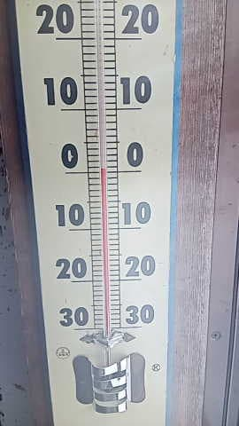
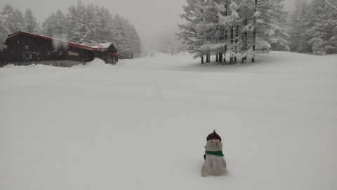
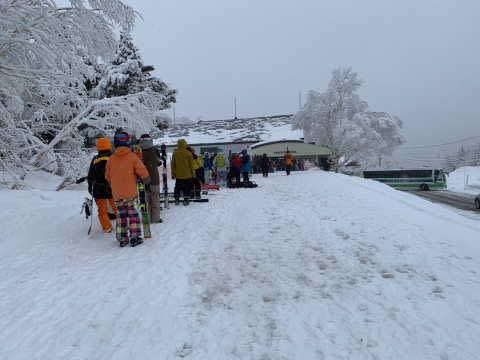
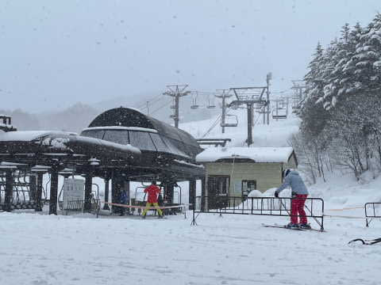
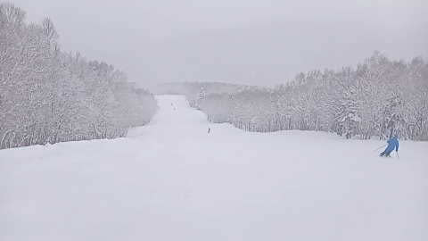
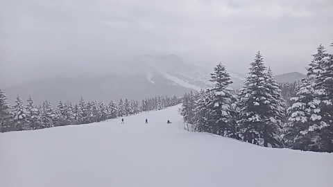

# 2023/3/18(土)の志賀高原スキー場特派員レポート！…終日重い湿った雪降り

📅 投稿日時: 2023-03-19 03:00:42

私の記憶が確かなら．

今日は土曜日のはずなのに…

なぜ志賀高原に行っていないのか…

とりあえず，今日は一日家で泣きながら

仕事をしていたわけですが．

今日も志賀高原に繰り出した特派員の方々

から，写真が送られてきました～！

…きっと．

今日は私の怨念が届いて．

突如発生した台風1号が志賀高原を

襲って，すごいことになっているんじゃ

ないか…

と期待して，写真を見てみると．

…台風の豪雨じゃなくて，

雪が積もったようですね…

積雪は10～15cmほどでしょうか？

朝の気温は山頂でもギリギリ0℃越えと，

雪が降るにしては高めの気温だったこともあり．

積もった雪はかなり重い雪だったみたいで…

圧雪バーンの上も，5cｍほどの積雪が

あったみたいですが，すごい重くて

滑りにくい雪だったみたいです．

でも，こんな天気にもかかわらず．

あさイチの焼額第1ゴンドラはかなり

並んでますね…

そして．

昼間もそこそこの勢いで雪が降ったみたいで．

ゲレンデ上はアイスバーンの上に重い雪が

乗った，滑りにくい状況だったようです．

私が滑れないときにコンディションが良くないと，

精神衛生上良いですね！←心が狭すぎないか？？

昼ごろになっても，ウェアに着くとすぐ

融けるような湿った雪が降り続け…

午後のバーンは，アイスバーンとコブコブに

なっていたらしく．

20000mクラブの猛者をもってして

楽しくないと言わしめるバーン状態で．

私の強烈な怨念が，志賀高原に届いたよう

です…！！←違うから

午後になって降りは弱まったものの，

雪は降り続け．

重い荒れ荒れ雪で，カチカチ下地の

楽しくない状況が終日続いたようです…

うむ．

今日滑っていた人には申し訳ないけど．

週末にも関わらず，家でひたすらPCに向かって

朝から原稿を書き続けていた私にとって．

晴れて最高

という志賀高原レポートが届くより，

精神の平穏を保てた一日だったのでした…

…でも，明日は．

晴れて最高

というレポートが大量に届きそうな気がする…

あぁ…滑りに行きたい…

## 💬 コメント一覧

### 💬 コメント by (m&t m)
**タイトル**: Unknown
**投稿日**: 2023-03-19 12:59:17

アサマ改め高峰MP快晴で、下地は固いものの、エッジかみかみで最高でした⛷

朝イチシマシマを堪能しました😋

### 💬 コメント by (Skier_S)
**タイトル**: ＞m&t mさま
**投稿日**: 2023-03-20 03:30:35

今日は志賀じゃなかったんですね…！

天気図を見ていると，もしかしたら，今日が今シーズン冷え冷え雪を滑れる

最後の週末だったのかも…という気になってきました．

あぁ…滑りに行きたかった…

