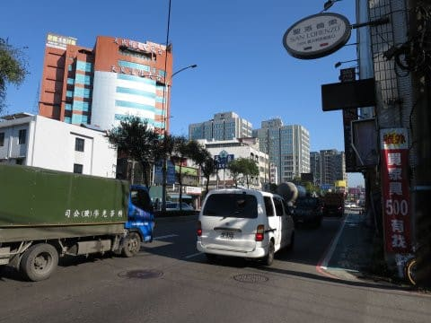
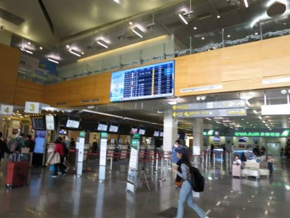
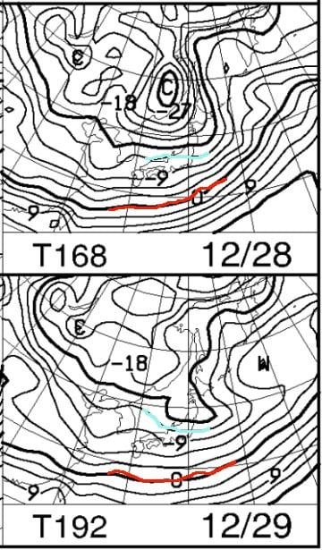
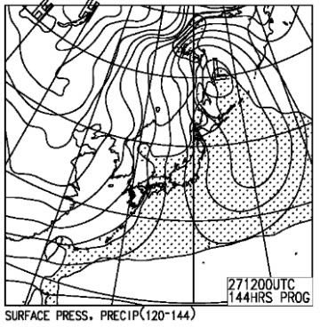
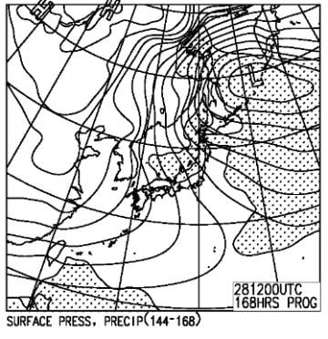
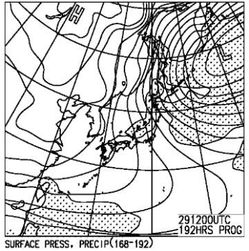
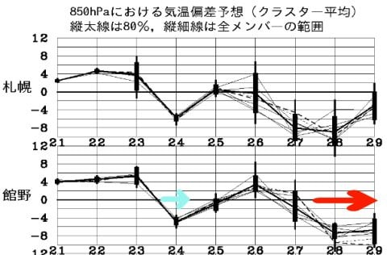

# 明日から志賀高原へ復活！…そして．27日以降の年末寒波はかなりすごいよ…っ！！！年末年始の雪は大丈夫そう

📅 投稿日時: 2018-12-22 23:19:27

ということで．

某国へ弾丸出張へ行ってきていましたが．

ついさっき．

自宅に戻ってきました．

しかし，某国は空港とホテル，打合せ場所の

3か所以外，まったくどこにも行かずじまいの

弾丸出張でした…

ってなわけで．

とりあえず帰国したので．

明日から志賀高原へ復活です！

えー．

どうやら本日の志賀高原．

焼額は1ゴンだけでなく3高も動き，全リフトが

動き始めたようですが．

概ね一日，ガスに悩まされたようですね…

朝は一瞬霧雨っぽかったようですが，

幸い，本降りの雨になることは無く

乗り越えたようで…その点は良かったのかな．

気温は高く，雪は緩んだものの．

高温の雨で雪が壊滅するのに比べれば．

まだかなりマシだったのではないかと…

で，明日の日曜は．

昨日の予想の通りで．

朝はそこそこ冷え込んで，道路は凍って

危険な状態＆朝イチゲレンデは硬めの

気がしますが．

午前中に気温がプラスまで上がり．

午前は日も射すタイミングもあるので．

ちょっと雪が緩んじゃうかな…（涙）

そして．

昼前から雲が増え始め．

夕方には，何かが降ってきます．

降り始めは，液体かも…

運が良ければ，リフト営業終了後の

降りはじめですね．

ただ，降り始めて過ぎに雪になり…

そして，3連休最終日の月曜朝まで

降り積もり．

昨日の予想通り，月曜朝はブーツパフになりそう！

これでゲレンデ状況が改善してくれれば…

そのあとは．

ニュースなんかでやってますが．

来ますよ～．

来ます．

強烈な歓喜寒気が来ますっ！！

こんな感じで．

赤い0℃線ははるか南，ってどころか．

志賀高原に水色の-12℃線が！！

これは…

焼額山頂は，朝は-15度以下のスタートですね！

そして．

地上天気図も…

こんな感じで，27，28，29日と，

3日続けて見事な冬型！

降り続けます．

積もり続けます，3日間！

なんてったって，

この赤矢印でしめす，28，29日．

平年比-6℃～-8℃くらいまで冷えそうですから．

大丈夫です．

志賀高原，28日，遅くとも29日には

全面オープンしそう！

年末寒波で，正月休みには何とか全面滑れるように

なってくれそうです！！

…しかし．

今年は極端に冷えたり温まったり，

極端な天気が続くなぁ…

とりあえず．

明日から志賀高原に復活します～！

## 💬 コメント一覧

### 💬 コメント by (musi)
**タイトル**: 雨
**投稿日**: 2018-12-23 10:24:11

23日は雨の影響で寺子屋オープン中止です。

昨日も奥志賀もエキスパートはまだしもブッシュや小石があるコースもあります。早くドカンと雪欲しいですね。

高天ヶ原、一ノ瀬は修学旅行生が沢山いました。

### 💬 コメント by (Skier_S)
**タイトル**: musiさま
**投稿日**: 2018-12-23 22:56:01

今日も一の瀬は修学旅行生ですごい混雑だったようですね…

今晩，どさっと積もってくれるはずなのですが．

…でも，今のところ全然積もってません（涙）

明日の朝までに，1mくらい積もってくれないかな～←一晩でそんなに積もったらパニックだから

