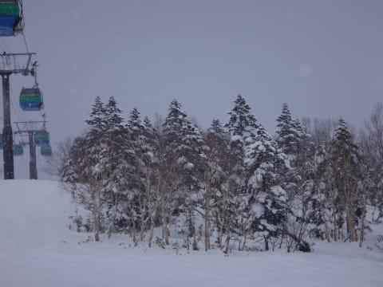
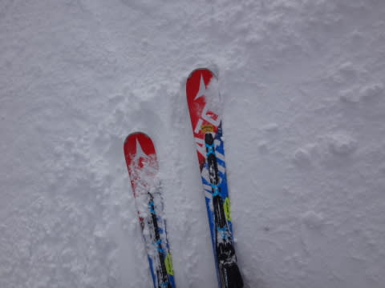

# 2月6日，土曜日の志賀高原…朝は予想通り降ってたけど，午後は晴れてきたよ！

📅 投稿日時: 2016-02-06 23:11:50

木曜に．

「うまくいけば，日曜朝は降るかも？？」

…と，書きましたが．

…ええ．書きましたが．

悲しいことに，ほとんど降らなさそうな感じになりました（涙）

…おかしい．

普通なら大雪レベルの寒気が降りてきてるのに（激涙）

[水曜の天気予想の最初](d20160204.md)に書いたのと同じ，

日本海にポッコリ高気圧君が発生し．

見事に雪雲を蹴散らしてくれてます…（涙）

だもんで．

明日は朝のうちは雲が多めかもしれませんが．

晴れ，時々曇り程度になりそう…

あぁ．

だめだ．

この一週間，まともに雪が積もってない…（泣）

どうやら今度は．

降れ降れ踊りが必要な感じ…←これも一体，どんな踊りなんだ？？

ってことで．

本日土曜日の志賀高原レポートですが．

…朝，志賀高原に上る道は，ほとんど積雪がなく…

うーむ．

予想通り，昨晩からの積雪はほとんどなかったようですね（涙）．

雪がかぶっておらず，氷のツルツル滑りやすい路面なので．

明日上ってくる方は，ご注意を…

で．

朝イチのゲレンデに出ると．

山頂の気温は-9℃．

ふむ．予想は-10℃だったけど．

ほぼ予想どおりだな．

そして…

朝の天気も．

雪がちらつく，予想通りの天気．

ゲレンデの雪質も，やわらかい圧雪の上にうっすら新雪で．

うはは！見よ！

・前日からの積雪がなく

・朝は-10℃近くて，

・そして朝から雪になり

・朝イチはやわらかい圧雪にうっすら積雪

…ここまでは，大変ぴったり当てたぞ．

素晴らしい，わが天気予想っ！！！

そして，ゲレンデもやわらかい圧雪で，

かなり気持ちいいよっ！！！

朝イチは，人も少なくて，快適かっ飛ばし放題っ！！

チョー気持ちいいっ！！

…そして．

雲の中からも，時折日が差すタイミングが！

いやー！

雪質もよくて．

人が少なくて．

時折雪がひどく降ることもあるけど…

日が差すタイミングがあって．

…これは，意外と気持ちいい！！

…でも．私の予想では，これから雪が結構降るはず！

雪がフラットな今のうちに，ガンガン飛ばすのだ！！

…と，焼額第1ゴンドラをグルグルしていると．

さすが，10時ごろにはGSコースの人がちと増えてきましたな…

でも，今日のゴンドラの最高の列の長さはこの程度で．

ゲートから人があふれることはほとんど無し．

そして…

急斜面のオリンピックコースは，終日ガラガラ！

2月に入っても，こんなに人が少ないとはっ！！

＃まぁ，事故やらなにやら，いろいろあった影響なのかな…

とりあえず．

人が少ないガラガラだし．

雪が降らないうちに，ガンガン滑ってしまえ…！

…

…

って…あれ？

あれれれ？

予想した雪が…

雪が，午前中ちょっと降っただけで．

午後はごくたまにパラつく以外．

曇ったり晴れたりで…

ほとんど降らないのですが？？

ってか，結構晴れ間が多いんですが？？？

がーーーん．

天気予想．

「終日雪，昼間で10㎝くらい積もる」

の部分は外したか…っ！！

く，悔しい…

雪が積もらないので，コース上はところどころ，

硬い下地の雪が出てきており…

オリンピックコースなんかは，全面硬めの

バーンになっちゃいました…（涙）

でも．

人が少なく，雪も積もらなかったので．

ゲレンデがひどくもさもさに荒れてしまうことはなく．

夕方でも，この程度．

ってことで．

今日は一日，予想外に，

日が差すタイミングも多く．

そして，人が少なくガラガラで．

バーンも多少硬いところはあったとはいえ，

夕方まで荒れることなく．

まぁ，今シーズンでは．

結構コンディション良いほうだったかも？？？

と，ここで終わりそうな感じですが．

…

…そうです．

終わりませんよ．

まだ，ナイターがありますよ！

今日は，いつものダイヤモンドナイターではなく．

焼額ナイター！

焼額ナイターも，ナイター開始の6時には

ぴかぴか圧雪！！！

うはははっはははは．

一日2度も，焼額クオリティのぴかぴか圧雪バーンを

滑れるのだ！

リフトもフード付きで，距離も長いし…

ああ…

シアワセ…っ！！！

…ってことで．

今日は昼間は焼額第1ゴンドラのみ，

ナイターは焼額第3高速のみ，と．

朝から晩までで，2種類のリフトにしか乗らないという．

私にとって幸せな，大変偏った一日を過ごしたのでした．

あーーーー．満足！！←それで満足って…満足なの？？（常人に理解できない世界）
