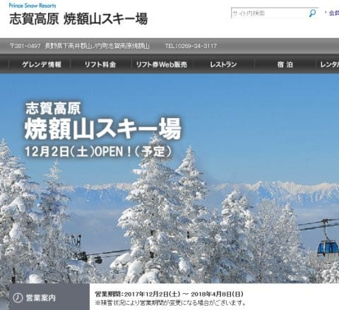
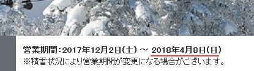
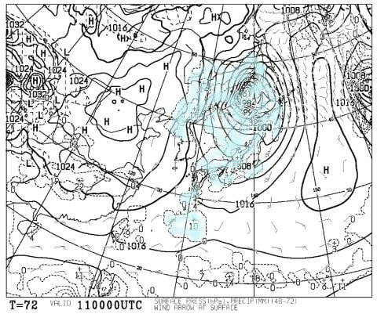
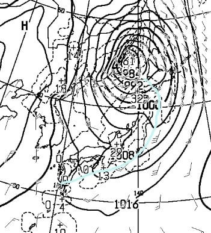
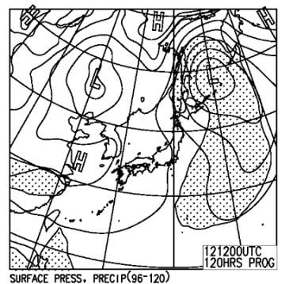
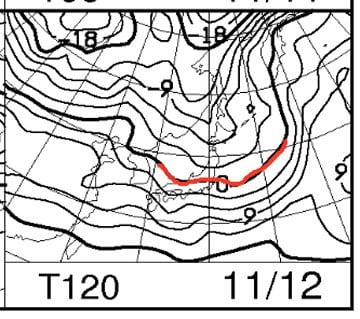

# 今週末，11月11，12日のイエティの天気は…土曜一瞬崩れるけど，その後は晴れて冷えそう…

📅 投稿日時: 2017-11-09 00:48:18

えー．

本日．

焼額山のウェブページを見ると…

うむ？？

え，

ええっええええっ～っ！！？？

営業期間が…

営業期間が，4月8日までになってるっ！！！

同じことを，[GokuさんのBlog](http://red.ap.teacup.com/gokurakuskier/778.html)でも指摘されてましたが…

これ，また，誤植？？

誤植だよね…っ！！！？？？

…もしかしたら，誤植じゃなくて．

今シーズンはGWまでやるというアナウンスが，実は

焼額の早割シーズン券を買わせるためのトラップで．

実際は4月8日に終わっちゃう

という，陰謀か…？？

とか思っちゃう，今日この頃．

とりあえず，誤植であってほしい…（懇願）．

ってことで．本題．

水曜深夜定番の，今週末のYetiの天気予想をば…

えー．

まず．

11日土曜の地上天気図ですが…

…

なんだ，これは！

980hpa級の，かなーり発達した低気圧が！

そして，関東近辺も水色の降水域が…（涙）．

…これは…

心眼で見ると，この図の水色線のような感じで

寒冷前線がいるのが見えるわけで．

…この前線通過時，関東近辺も，風が強まって

ザーッと雨が降りそう…

ただ，前線が通過してしまえば，冬型になって

関東は晴れるんですけどね～．

…前線通過が何時になるか，今は正確には予想不可能です…

運が良ければ朝早く．

運が悪ければ，昼ごろ…

そして，12日日曜の地上天気図は．

低気圧が通過してしまってるので…

降水域の網掛けは日本にかかってませんね．

これは，晴れそう！

ただ，日曜の850hpa気温図を見ると…

うむ．

0℃線は志賀高原の近くまでかかってるので…

結構冷えるよ！

また，山の方では雪の便りが聞けそう…

ってことで．

まとめると．

11日土曜：低気圧が接近するので…

　朝は風が強く，雨．

　前線が通過すると，雨は止み，すっきり晴れ始める．

　朝早くに止むか，朝から降り出し昼ごろに止むか…

　まだ，前線通過タイミングが読めないので，

　正確な時間は未定．

　前線通過後は気温が冷えるので，かなり寒く感じる．

12日日曜：この日は朝から晴れ！

　時折雲が流れてくるかもしれないけど，

　雨の心配は無し！

　気温はかなり冷えるでしょう．

って感じでしょうか…

…ただ．

私は，今週末イエティに行けるのか．

微妙になってきました…（涙）．

うーむ．

いろいろあって，

土曜に晴れてくれれば用事をこなせて，

日曜にYetiに行けるんだけど．

土曜朝が雨だったら，ちょっとヤバいかも？？

土曜朝に晴れてくれれば行けるのに，

なぜここを狙ったかのように雨になりそう

なのか…←あなたの日ごろの行いの悪さが出てるのでは？？

とりあえず．

土曜の朝は雨にならないよう，必死に祈っておこう…（祈）．

## 💬 コメント一覧

### 💬 コメント by (olaf2125)
**タイトル**: 一大事です…
**投稿日**: 2017-11-09 08:07:39

20000mに遠く及びませんが、これが事実ならショックです。

### 💬 コメント by (しんちゃん)
**タイトル**: びっくりしましたが･･･
**投稿日**: 2017-11-09 22:41:38

Ｓ様

誤植だと思います。

 下記のプレミアムシーズンチケットのヤケビの営業期間には2017年12月2日（土）～2018年5月6日（日）って書いていましたよ。

http://www.princehotels.co.jp/ski/premium_season_ticket/

### 💬 コメント by (olaf2125)
**タイトル**: 追記
**投稿日**: 2017-11-09 23:10:47

SkiLine事務局に問い合わせてみました。

http://blog.goo.ne.jp/olaf2125/e/27a560f1ec1e4d59400812fd829b66cf

### 💬 コメント by (Skier_S)
**タイトル**: がーーーん！！Skiline終了って…なんで！？？？
**投稿日**: 2017-11-10 02:45:13

＞olaf2015さま

なんと！！！

終わっちゃったんですね…志賀高原のSkiline．

なんとも悲しい…

貴重なBlogネタだったし．

20000mな人たち，今日は何m滑ったのかな…

というのを見るのが結構楽しみだったんですが．

これで，20000mゴールドステッカーが

発行できなくなるのかな～．

あるいは，スマホアプリとかで，標高差20000mが

確認できればOKとかいうルールにするのか…

とりあえず，残念です（涙）．

＞しんちゃんさま

いや～．

私もそのページを見て，相変わらずGWまでに

なってるなぁ…

どっちが正しいんだろう？？

と不思議に思ってます．

まぁ，4月の方が誤植だと思うのですが…

