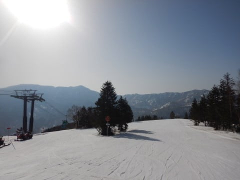
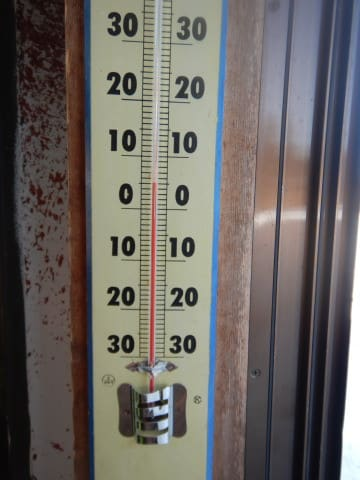
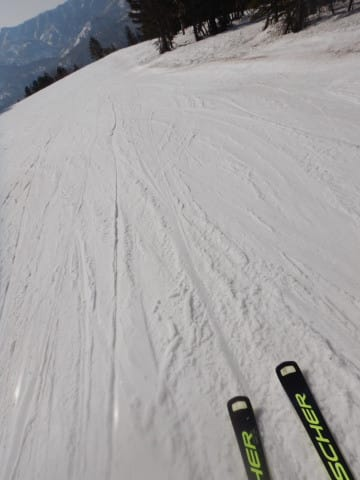
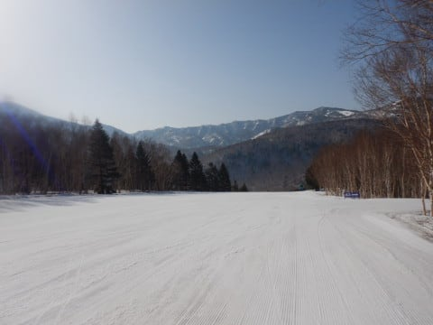
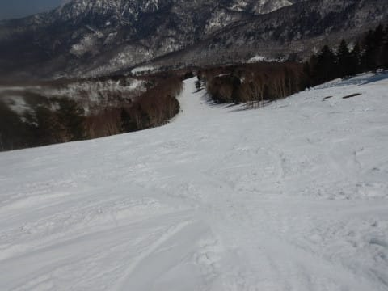
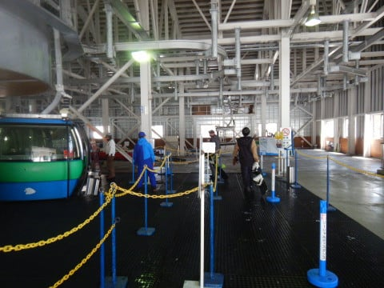
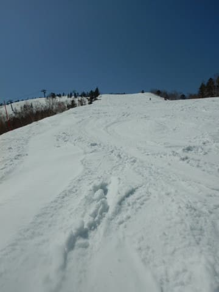
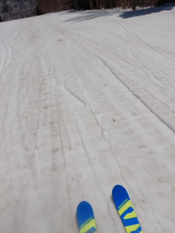
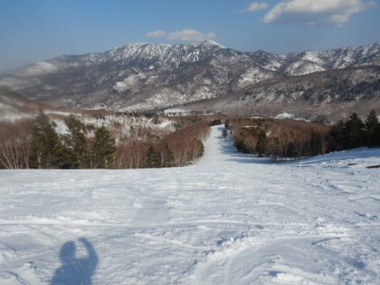
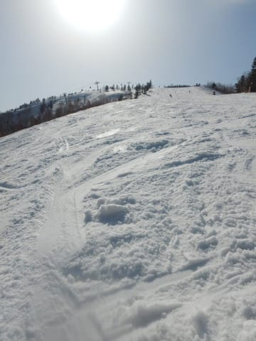

# 2022/4/10(日)の志賀高原スキー場速報レポート！…晴天，昼間+10℃突破で暑かったけど，雪は滑ったしガラガラで良かったよ

📅 投稿日時: 2022-04-11 00:57:02

🏷️ カテゴリ: [2022スキー滑走日記](cc9cb73e4320f6a97af6fccc37587a61a.md)

今シーズンの志賀高原，

1，2月に大量に積もってくれたし．

3月4月は気温が高かったものの，

雨が少なかったので，雪がまだまだ

いっぱいあります！

まだまだ焼額のオリンピックコースが

全面滑れるという，かなり恵まれた

コンディションですよ～！

ってなことで．

土曜は3時過ぎに家を出て7:30から滑り，

そしてなぜか深夜1時まで飲んでいたという，

睡眠2時間ちょいにもかかわらず22時間

起きていたというヘビーな一日だったわけ

ですが．

（おかげでBlog更新遅れました…すみません）

…さらにその翌日の今日．

早朝営業開始には間に合わなかったものの，

朝ちゃんと起きて，7:30から滑り始めた

自分をほめてあげたい…←そこ，ほめるところじゃないから

そして，今日も7:30からリフトストップまで

きっちり滑り．

帰宅は夜11時過ぎ…

だもんで．

いつもの速報モードにて！←最近，Blogを書く時間が少なくて，

記事が速報モード的なモノばっかりになってないか？

まず．

今日も朝からすっきり晴天！！

…そして．

朝7:30の時点で，すでに気温は+5℃（涙）

この時期に朝からプラス気温ってなにごと！？？

予想していたとはいえ，GWより暖かいよ…

というか，早朝からもう暑いくらい（泣）

とはいえ．

7:30の時点では，まだ硬い下地が

残っていて．

表面が数cm緩んでエッジが食い込む

いい感じのバーン！！

やっぱりこの時期は，早朝営業がいいよね～！！

…そして，これが焼額エリア限定券なら，

一日券などでも滑れるというのが素晴らしい！！

気温は昼間で最高+12℃まで上がり，

日差しも強かったので雪はさすがに

緩んだけど．

そこまでひどいザブザブにならず，

意外と板が滑る雪で．

ゴンドラ待ちも，最長でもゲート内に

おさまる程度．

午後になれば，もうほとんど飛び乗りの

ガラガラになって…

バーンはほぼ無人状態！！

午後は雪の表面に汚れが浮いてくる，

いかにも春の終わりっぽい感じになる

ところもあり．

さすがに夕方はちょっと荒れ気味

になったものの…

人が少ないので，コブコブになっちゃう

こともなく，

第2ゴンドラ側のパノラマコースは，

最後まで大回り板で飛ばせる

コンディションで…

夕方ラストまで，板が走る滑走性の

いい雪だったので．

結構楽しめた一日でした！！

…しかし．

さすがに今日の朝はかなりしんどくて．

眠くて疲れてるから途中で休憩もして，

そして早めに帰ろう…

と思っていたのに．

やっぱりリフトストップの最後まで

滑ってしまった自分に，

「やっぱりな…」

と自分でさえ思った，Skier_Sだったのでした…

## 💬 コメント一覧

### 💬 コメント by (レインボー74)
**タイトル**: Unknown
**投稿日**: 2022-04-11 04:49:03

やっぱりな！

### 💬 コメント by (northfox)
**タイトル**: Unknown
**投稿日**: 2022-04-11 10:07:58

やっぱり、と言うより、S様はリフトストップ前に切り上げたことってありましたっけ？？

### 💬 コメント by (さち)
**タイトル**: Unknown
**投稿日**: 2022-04-11 14:21:13

ごめんなさい、春雪がしんどくて帰った人です。

14時頃にやけびにおじゃましましたが、ガラガラでしたね！

ゆるぼこバーンでなけなしの脚力のHPが0になってしまったので、1本で退散してしまいました･･･

ご挨拶できず残念すみません！

これにて今シーズンあがります！

### 💬 コメント by (レインボー74)
**タイトル**: Unknown
**投稿日**: 2022-04-11 15:14:22

月曜日の志賀高原情報

朝の上林+12℃　蓮池+11℃。ここは南国か！？

イチゴンから、GSとオリンピックを12周。朝一は柔らかめだけど快適勘違いバーン。

最後には荒れたけど、まあ満足な一日(午前中)でした。明日も同じような感じかなあ。

昼の蓮池は+16℃　上林はなんと+21℃でしたよ。

### 💬 コメント by (Skier_S)
**タイトル**: 眠い…
**投稿日**: 2022-04-12 01:30:22

＞レインボー74さま

やっぱりですよね！

＞northfoxさま

…あります．

実は，リフトストップ前に帰ったこともあるんです！！

えーっと．

何シーズン前だったかな…（その次元で探さないといけないレベル）

＞さちさま

あの重い雪は，ボーダーにはつらいでしょうね…

お疲れ様でした！

でも，今シーズンもうおしまいですか．

お会いできずに残念…

またオフ会とかでお会いしましょう！

