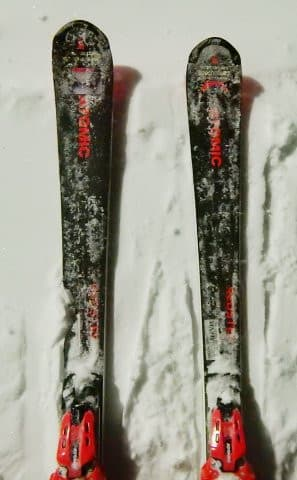

# ATOMICの2018シーズンモデル，S9i Proを履いてみた

📅 投稿日時: 2018-02-28 01:10:50

えー．

この1月．

某20000mクラブの大御所な方に．

ATOMICのS9i proをお借りして履いてみたので．

今回は，この板の試乗インプレッションをば…

えー．

この板は，カタログ外の限定モデルで．

スラローム競技用のS9 FISのコアを，

S9iとかと同じ軽量カルバコアに

入れ替えたということらしい，この板．

ビンディングもS9iのTLビンディングと違い．

S9 FISと同じVARビンディングになるこのモデル．

履いてみた感じは…

これは，ほぼスラローム競技用の板ですね．

でも，異常に軽いスラローム板！！

S9iより反応は早く，しっかりしています．

…これは…VARビンディングの効果かな？？

ただ，SXと比べると．

メタルの強く反発するばね感は弱く．

小回りすると，メタルが粘って圧が溜まって，

ビュンと戻ってくる感じより，

圧が溜まり切る前に，強い張りの板の

サイドカーブに乗って板が回っていく

感じですか…

2017シーズンモデルで言えば，SXより

SL Proに近い感じですかね．

トップロッカーが入ったSXと比べると，

谷回りからいきなり板が回り始める感じは弱く．

板が動かしやすいので．

谷回りの自由度はSXより高いです…．

でも，山回りでテールを使えばすっと板が抜けて，

反対のターンがオートマチックに始まるので．

基本的にSX同様，やっぱりテール気味を

抑えて行く板に感じます．

山回りでしっかり板をたわませていくと．

気持ちいいくらい小さく回って，板が

左右にすっ飛んでいきます．

この山回りでの板の反動は，S9iよりいいなぁ…

VARビンディングの効果かな？？

で．板自体の張りが強いので，

大回りも行けなくはないです．

ただ，絶対的グリップはSXの方が高い感じがします…

ってなわけで．

S9i Pro．

SXのような麻薬性は低いものの，

S9iよりしっかりした板で，高速耐性も強いし．

スラローム競技用板っぽい感じでしっかり

グリップして曲がるけど，異常に軽いし．

ある程度の体力がある人なら．

そこそこの大回りも行けるオールラウンド用としては，

板もすごく軽くて扱いやすいので，よいかも？？

## 💬 コメント一覧

### 💬 コメント by (seeker_NT)
**タイトル**: 実は
**投稿日**: 2018-02-28 12:14:49

遠目にお見かけするだけで、最近すれ違いでお会いできていませんでした。。まぁ、ベースが奥志賀エキスパなので。。

実は、スキーに行けなかった1月14日、大人の事情を処理した帰りに、Skier-S様御用達の神田K本店でS様を真似てビン無しでS9i Proを購入しちゃいました。当日は年始セールでくじ引きがあり、なんと20%引きのくじを当ててしまい、７万円そこそこでGet。ビンは14SXの黄色のビンを持ち込んでサービスで取り付けてもらいました。スキーに行けなくても良いことはあるのですね。

・・・でも、今も主力は17SXと16Volkl SWをメインに滑ってます。

### 💬 コメント by (いか)
**タイトル**: Unknown
**投稿日**: 2018-03-01 00:30:39

やはり麻薬性が足りないですよねぇ。SXのグリップに慣れてしまうと、なかなか抜けられないような気がします。日曜日に久しぶりに整地で練習しましたが、SXは170でも大回りで攻めた傾きが出せました(*^^)v 

あと八方では重要なのですが、SXは非圧雪地帯の突破力が浮力含めて断然高いです。これは今年モデルが軽量化、スリム化したことで出せなくなってしまったのだと思います…

S9i Proには小回り専用機になってもらうことにしますかね、、、ネガティブばっかり書いているように見えますが、小回りがダメダメな私でもコントロールしやすいのはすごいと思います。

### 💬 コメント by (Skier_S)
**タイトル**: そうなんです．麻薬性が足りない…
**投稿日**: 2018-03-01 00:43:05

＞seeker_NTさま

私も最近奥志賀へ行ってないのですが，

ここしばらく奥志賀が止まることが多かったので，

もしかしたら焼額で滑っているのでは…

と，思いながら滑っていたんですが．

しかし，S9i Pro買っちゃいましたか！

安く買えたようでうらやましいです…

S9i Proに黄色のビンディングつけてる人は

そうそう居ないだろうから，目立ちそうですね．

＞いかさま

そうなんですよ…

いい板なんですが，優等生っぽくて

麻薬性に欠けます（笑）．

SXの麻薬性に慣れると，ちょいと物足りなくて…

小回りのキレも良く，いい板なんですが．

私はまだ未使用のSXが2台残っているので，

もうしばらく麻薬漬けの時期を過ごせそうです…（^^；

