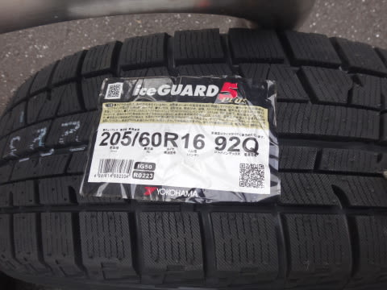
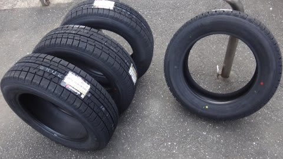
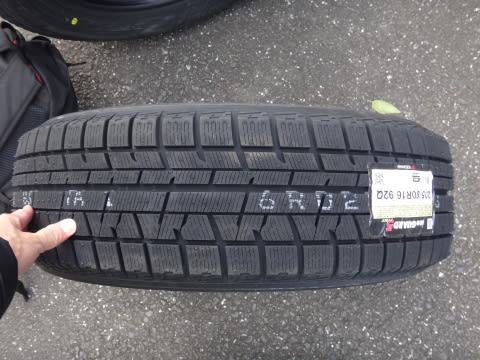
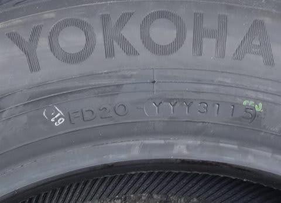

# そろそろスタッドレスのシーズン…今シーズンは，YOKOHAMA iG5 PLUSだ！

📅 投稿日時: 2015-12-02 01:54:03

🏷️ カテゴリ: [車](cba0e8330b3f2ded7c1addfacc75d4547.md)

残念なお知らせですが．

…2日から3日の朝にかけて…

…ダメです．ダメダメです．

2日は気温がぐぐぐぐぐぐっっと上がり．

日本のスキー場で，人工降雪機を打てるところはありません（涙）．

2日の深夜は…雨です．降り始めは，雨です．

3日の朝まで，標高が低いところは雨です（泣）．

…でも．

来ます．来ますよ～！

そのあと，また寒気が来ますっ！！！

3日昼間から，ドサドサ降ります．

4日金曜まで，日本海側は終日降りそう！

…でも．志賀をはじめとする信州は，

風向きが悪くてそんなに積もらないかな…（残念）

だけど．

3日午後から5日にかけて，人工雪がガンガン打てるはず！

この週末は，行ける！（と，強く信じる）

という，天気予想をしたところで，本題へ．

…そろそろ雪の便りも聞こえてくるころなので．

先週，タイヤをスタッドレスに替えたわけですが…

貧乏金なしの我が家．

通販で安いタイヤを探していると…

なに？

YOKOHAMAの今シーズンの新モデル，iG5PLUS．

これが，一本12400円だとっ！？？？

新モデルなのに，4本買っても，5万円しないじゃないですかっ！

お店では，4本で12万近くするというのに，半額以下っ！

…ってことで．

ついついポチってしまい．

やってきました，YOKOHAMAの最新タイヤ．

iceGUARD 5 PLUS．

ここ3回，BLIZZAK REVO2，REVO2，REVO GZと

立て続けにBRIDGESTONEのスタッドレスばかりだったので．

YOKOHAMAのスタッドレスは，その前にiG20を履いて

以来ですな～．

…10年近い昔のiG20は，タイヤの剛性が低くて，

夏タイヤと比べるとかなりグニョグニョしたハンドリングになり，

アスファルト路面で横Gを掛けるのがかなり厳しいタイヤ

だったなぁ…

その次に買った，BLIZZAK REVO2を履いて，

結構しっかりしたケース剛性・トレッド部の剛性を感じ．

スタッドレスも進化したなぁ…と思ったものよ…．

今回，2009年に発売されたREVO-GZからの履き替えなわけで．

さてさて．2015年発売のiG5 PLUS．6年間の進歩は

いかほど…？？

というのは，楽しみなところ．

とりあえず，製造刻印を確認すると…

今シーズン新発売モデルなので，当然今年の製造．

2015年31週製造なので…8月ごろの製造になるのかな？

…しかし．

通販でタイヤを買った際に問題になるのが．

…どこで，ホイールに組んでもらうのか，考えないと…

（続く）

## 💬 コメント一覧

### 💬 コメント by (まいる)
**タイトル**: YOKOHAMA
**投稿日**: 2015-12-02 06:58:33

スタッドレス、YOKOHAMA効きがよいようですよー。私は2シーズン目のBS

雪がやばいですね。箕輪は10cm。なくなったりして・・(--;)

### 💬 コメント by (いか)
**タイトル**: Unknown
**投稿日**: 2015-12-02 11:31:44

木曜日夜からもさもさ積もってくれることに期待です…

土曜日は今期初パウダーデイ！

### 💬 コメント by (miya)
**タイトル**: Unknown
**投稿日**: 2015-12-02 15:59:53

ごぶさたですー。

私のBRのスタッドレスもネットで買いましたよ。

DSX-2で11,000円くらいだったような。。

（3年前かな？）

16インチは安いんですよねー。

ヨコハマは高くなったので、最近履いてませんが。

### 💬 コメント by (Skier_S)
**タイトル**: スタッドレス
**投稿日**: 2015-12-03 00:33:12

＞まいるさま

YOKOHAMAは，10年前のiG20のころは

「こんなもんかな」って感じの効きでしたが…

最近のは効くようになったらしくて大期待です．

しかし，雪がない…（涙）．

>いかさま

明日の夜から降るはず！積もるはずなのだっ！！

…信州はだめかもしれないけど（涙）

人工降雪機，頑張れっ！！

＞miwaさま

私は今回初めてネットで買いました…

最近の車はみんな17インチやら18インチ

ですが，2シーズンごとにスタッドレスが

死んでしまう我が家では，16インチ，

15インチでもいいくらいです…

デカいホイールサイズのタイヤ，

高くて嫌なんです…

