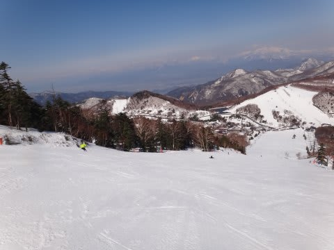

# 4月24日の志賀高原スキー場は，Goodコンディション！

📅 投稿日時: 2011-04-25 03:55:52

🏷️ カテゴリ: [2011スキー滑走日記](ca488c98cfb9169941c3e73770dcefb56.md)

あー．

というわけで．

一日中雨という，悲しい土曜日が終わり．

あけて日曜．

天気予報どおり，見事な晴天！！

それも…土曜の夜から，[ここ](e0dd604711d354ad223ba5abfca8241e8.md)で予想したとおり，

雪が降りました．

霙っぽい雪じゃなく，結構本格的な雪が，10cmくらい．

この時期にこんなに雪が積もるとは！

しかし，この時期にうかつに雪が降ると，張り付くような湿った

雪だったりしますが，今日の雪はそんなことはなく，

結構雪質が良い感じ．

うーーん．

4月下旬の雪面の写真とは思えない…

まぁ，雪が薄いのですぐ下地のアイスバーンが出てきて，

一の瀬のメインバーン上は，朝のうちほぼ全面アイスバーン

チックでしたが…でも，やわらかい雪で上が表面コート

されていて，ちょっと滑りやすかったかな．

天気も良く，雪もよく，人は先週より多かったですね～．

それでも，リフト待ちがあるわけでなく，一の瀬の

上のバーンで大回りが問題なくできるほどの人の量．

そして．

天気が良いのに，朝に雪が降るほど気温が冷えているので．

朝10時過ぎまでは，アイスバーン的な固めの斜面で．

昼ごろになってもドボドボに緩んでしまうこともなく．

驚いたことに，この日は午後まで，コースが荒れたり

小回り道ができたりすることなく，一の瀬メインバーンは

快適な大回り斜面であり続けました…

うーん．晴れて日が差している4月下旬と考えると，

良すぎるコンディション．

昼近くでも，こんなにいい雪のまま…

さらにさらに．

驚くことに．

2時ごろには，雪が降り始めました．

それも，結構本格的に降ってます．

うーん．

4月下旬の昼間にこんな雪になるとは！

とりあえず．

この日曜は，

天気よし，雪よし，混雑なし，と．

4月下旬とすれば，恵まれすぎた超Goodコンディションで

スキーを楽しめました．

雪の量は，GW以降も営業しようと思えば余裕で営業できる

くらいに感じられますね…

んで．

高速の渋滞は，完全に地震前のレベルに戻りました．

経済活動が戻ってきたということは，嬉しいことでもある

わけだけれども．

関越道25km渋滞はちょっといただけないなあ…
