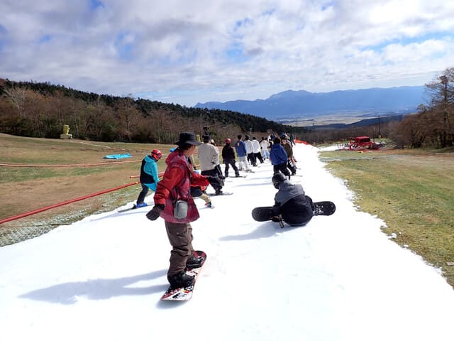

# 2024年11月9日(土)のイエティで滑ってきたよ！…11日間の営業中止後の再オープン翌日のコース状況の動画

📅 投稿日時: 2024-11-10 00:45:48

ってなわけで．

11日間の長きに渡ったゲレンデコンディション

悪化による営業中止を乗り越えて，

金曜に再オープンしたイエティ．

再開翌日の土曜日に，早速滑って

きましたよ～！

天気は晴れ～薄曇りで，強い日差しが

降り注ぎ続けなかったため，雪は

そこまで緩まず．

雨で雪が全部融けちゃったことにかなり

反省（？）したのか，

コース幅を狭めにして，その代わり雪を

厚くした感じ…

今日は予想以上に滑りに来ている人は

少なく，終日リフト待ちほぼ無しで滑れ，

コース幅は狭いけど，リフト待ちは少な

かったのが良かったです…

リフト乗り場にほとんど人がいないのが

分かるかと．

ときおり，コーススタートのコントロールを

していたけど．

スタート待ちはせいぜいこのくらいで．

コース上の人口密度も割と少なめで，

いつものこの時期のYetiよりは恵まれて

いた感じですね～！！

ただ…

コース最後の急斜面手前での一時停止が

今日も実施されていて．

そのせいで，一時停止待ちに時折行列が

できてました…（ちょい涙）

とりあえず，午後2時ごろのコース動画を

上げておきます…

今日は臨時で13時過ぎにコース整備が

入りましたが．

コース整備直後の14時ごろの動画で．

この時間はスタート制限はないものの，

途中の一時停止待ちがあり．

その代わり，リフトがガラガラだったのが

分かると思います…
