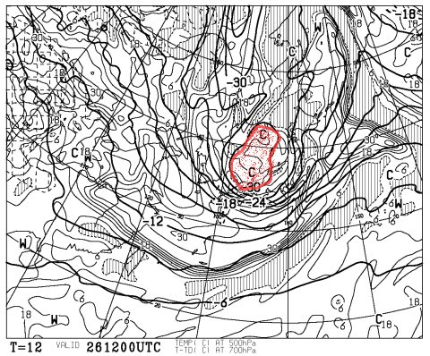
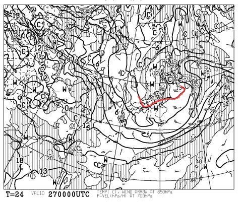
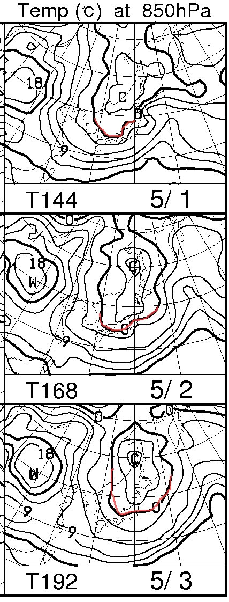
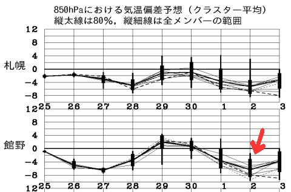

# うむ？このGWは冷えるっ！GW後半も雪はもちそう！

📅 投稿日時: 2013-04-26 21:06:28

🏷️ カテゴリ: [スキー天気予想](c6554f5c3c106093b511a8daae23757e8.md)

えーーー．

志賀高原．

本日，雪が降ったようですね～．

で．志賀草津道，オープンしたばかりというのに，現在通行止めみたいです．

明日朝，志賀草津道は引き続き通行止めだと思いますので，

あしたから志賀へ行く方は，信州中野経由で行きましょう～！

で．

この3連休の天気ですが．

な…なんということだっ！

今晩，この時期にありえない500hpaでー30度の寒気が…っ！！！

赤くマークしたのがいわゆる「5000m上空の寒気」とかニュースでやるやつですが．

-30度の寒気が入ってます…

信じられない…

…ってことで．今晩から明日の朝にかけて，雪ですよ～！

積もりますよ～！

んで．基本的に3連休初日，27日は終日冷えます！

こんな感じで，27日の850hpaの0度線，志賀高原より南ですので．

昼でも氷点下に近いです！

結構寒いよ！

んで，終日曇り～雪がちらちら降る天気で…

それほど緩まない，しっかり締まった雪を一日中滑れるでしょう！

土曜はかなりGoodですよ～！

28日は，朝は冷え込んで，そこそこ締まった雪っぽいですが．

晴れて日差しが降り注ぐので，午前早い段階から雪が緩んでいく感じでしょう…

ってことで．

この日は朝イチはいいけど，それ以降は暖かく雪がドボドボな，典型的な春スキー

の一日になりそう．

29日は…

この日も朝から晴れ．

気温がぐんぐんぐんぐん上がって，プラス10度を超えそう…

日差しとあいまって，暑い一日．

もう雪はザブザブで張り付く感じでしょう．

で．

で．

GW後半なんですが．

むむ？？

なんだ，この0度線の位置は…

特に，5月2，3日の0度線は志賀より南．

つまり，志賀高原は氷点下まで冷え込みそう．

…5月に志賀より南まで下がっていて良いのか？？？？

…この矢印部分の低温は，何だ？？？

…ということで．29，30日は気温が上がるものの．

それ以降，またかなりの冷え込みがやってきます．

GW後半まで，十分雪はもちそうです！！

GW4連休も，最初はコンディション比較的よさそうですよ～！

うはははは．

私の日ごろの行いがよかったからなのだっ！←だから，違うって…

＃道路は凍結する可能性もあるので，このGWはスタッドレスを履いていった方がよさそう…

## 💬 コメント一覧

### 💬 コメント by (いか)
**タイトル**: Unknown
**投稿日**: 2013-04-26 22:18:25

もうGWだし、Tシャツで滑るのもいいなー♪と思っていたのですが、ちゃんとウェアを着ていくことにしました(笑)

春のどぼどぼコブが楽しみだったのですが、整地を楽しむことにします^ - ^

### 💬 コメント by (Skier_S)
**タイトル**: いかさま
**投稿日**: 2013-04-27 17:07:57

いやーーーー．

今日Tシャツは自殺行為でしたよ～．

今日はかなりの積雪で，気温も氷点下．

道路も完全雪道で，トップシーズンの用意をしていかないと

スキー場にもたどりつけなかった感じで…

2週連続，なんだか恵まれた週末です！

