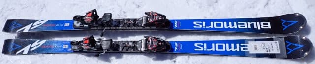
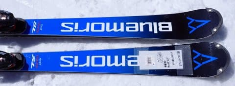
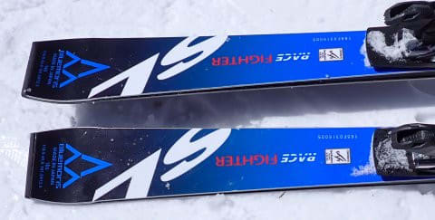
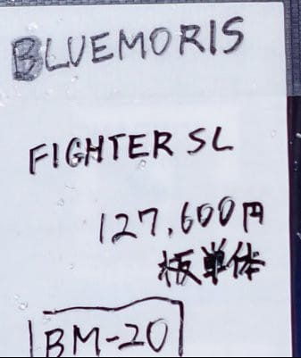
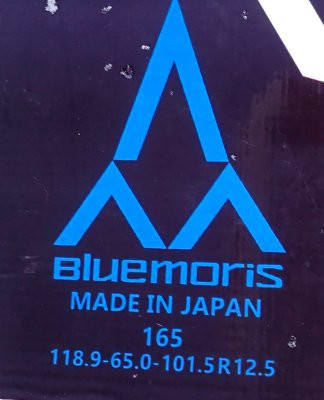
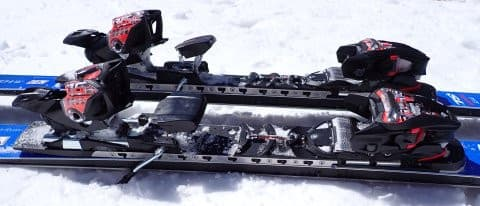

# 2024シーズンモデルのスキー板，試乗レポートその33…BLUEMORIS FIGHTER SL

📅 投稿日時: 2023-08-02 02:52:00

🏷️ カテゴリ: [スキー板試乗](c0bd8048615710cee890e403a36cc9a2b.md)

8月ですか…

私の許可なく，8月になってしまいましたか…

早すぎる…

早くも最後に月山で滑ってから，

一か月以上たつんだなぁ…

でも．

くそ暑い夏真っ盛りですが，今日はまだスキーネタ！

2024シーズンモデルの試乗レポートは，

これが最後になります…

ラストを飾るのは，ブルーモーリス．

いや．これ，かなりいい板でした…！！

ということで，試乗レポートです！

〇BLUEMORIS FIGHTER SL　165㎝

SL競技用

BLUEMORISのFISマーク付きの，

ガチの競技SL用です．

ビンディングは別売りですが…

試乗板は，MARKERのX COMP16に

WORLD CUP PC Interfaceという，

結構がっつりしたプレートの組み合わせ．

そのせいで，手に持つとずっしり重さを感じます…

さて．

BLUEMORISの実力やいかに？？

と，履いてみると…

うおおおおおお！！！

これはすごい！

ものすごい安定感！！

そして，鬼グリップ！！！

この板の試乗コンディションは，かなり固めに

締まったガチガチフラット整地と，表面が緩んで

重い春雪になったザクザク斜面の両方が

混ざった感じでしたが…

硬くしまったフラット斜面では，鬼のように

グリップして，めちゃくちゃ傾ける！！

1ミクロンもずれる気配がないから，

安心して板を倒して圧をかけていけるので…

硬い斜面を切り裂いて，すごい深回りが

できます！！

硬い斜面にトップとテールががっつり

食いついて，板がクッとステアリングするように

回っていきます！

そして，板の返りも絶妙！！

山回りの仕上げから板がすっと抜けるように

走っていき…自然に次のターンの谷回りの

ポジションに板が進んでいくので，

そのまま踏んで行けば，谷回りのものすごい

早い段階から雪面を捉えられ，

板に圧をかけていけます！！

もう，勝手に板が切り替えをしてくれて，

谷回りに入ったすぐから板が勝手に

雪面を捉えてくれて，

うおおおお！

ってターンができる感じ．

（語彙力低下中）

そして，重い春雪に突っ込んでも…

板の重さがあるからか，まったく板がぶれる

気配もなく．

重い春雪でも，谷回りの早い段階から板を

返して安心して踏んでいけるので，

斜面の上の人にソールを見せられるような

ターンをかますことができます！！

4月の春の重い雪の荒れ荒れバーンでも，

一緒に滑っていた人がちょっと引くくらいの，

攻め攻めターンができます！！

そして，どこまでもスピードを出したくなる，

限界の見えない板のポテンシャルの高さ…

初めて履いた板なのに，板をものすごく信頼して

滑ることができます…

これ，すごいよ…

ってなことで．

私にしては珍しく，2回試乗してみたのですが．

いやーーー．

SL競技用のくせに，午後の荒れ荒れドボドボ雪でも

安心して攻めていけるし．

この板，すごいわ…

Skier_S的には，かなり衝撃を受けた，

この試乗でぴか一の板でした！！！

いや．

いいよ，この板…
